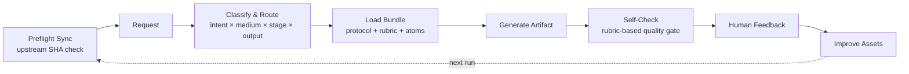

<h1 align="center">How to Make Script</h1>

<p align="center">
  Open-source screenwriting knowledge infrastructure for writers and agents.<br/>
  Route, generate, review, and orchestrate narrative, branded, and interactive scripts.
</p>

<p align="center">
  <a href="https://github.com/XucroYuri/how-to-make-script/actions/workflows/ci.yml">
    
  </a>
  <a href="./LICENSE">
    
  </a>
  <a href="https://github.com/XucroYuri/how-to-make-script/discussions">
    
  </a>
  <a href="./CONTRIBUTING.md">
    
  </a>
  <a href="./README.md">
    
  </a>
  <a href="./README_zh.md">
    
  </a>
</p>

> Not a prompt dump. Not a single-method gospel. Not a UI-first product.
> Durable creative infrastructure for screenplay work: routable knowledge, clear workflow contracts, reusable review logic, and community-driven correction loops.

---

## Quick Example

**Request**

```text
Turn this idea into a feature-film beat sheet:
"A journalist who has spent years avoiding the truth behind her father's death
is forced back to her mining hometown to investigate an old case."
```

**Selected route** → [`skill.structure-beat`](./skills/structure-beat/SKILL.md) + [`wp.structure-beat-outline`](./knowledge/20-workflows/wp-structure-beat-outline.md)

**Artifact excerpt**

```text
## Beat List
- Opening imbalance: She avoids every mining story that crosses her desk.
- Lock-in: A fragment from her father's case file forces her back home.
- Midpoint turn: She learns her own silence helped protect the cover-up.
```

Full chain: [request](./examples/golden/feature-drama/request.md) · [artifact](./examples/golden/feature-drama/artifact.md) · [more examples](./examples/agent/quickstart.json)

---

## What This Is

This repository isn't a prompt library or a single-method writing course. It's durable, composable screenwriting infrastructure built for both humans and LLM agents.

It classifies your request by **intent, medium, stage, and desired output**, then loads only the relevant knowledge — protocol, rubric, and reference atoms — to produce a structured artifact. It self-checks before handing you the result. When you push back, your feedback becomes better assets for the next run.

If you're a writer: it's a structured development and review toolkit. If you're building agent workflows: it's explicit routing logic with bounded loading and machine-readable contracts.

---

## How It Works

<p align="center">
  
</p>



---

## Install & Use

```bash
git clone https://github.com/XucroYuri/how-to-make-script.git ~/.local/share/how-to-make-script
# Updates: git -C ~/.local/share/how-to-make-script pull --ff-only
```

<details>
<summary>Claude Code</summary>

```bash
mkdir -p ~/.claude/skills
ln -sfn ~/.local/share/how-to-make-script ~/.claude/skills/how-to-make-script
```
</details>

<details>
<summary>Codex</summary>

```toml
[[skills.config]]
path = "/Users/<you>/.local/share/how-to-make-script"
enabled = true
```
</details>

Other platforms (Gemini CLI, OpenCode, OpenClaw): same pattern — clone locally, point your tool at the checkout. See [`SKILL.md`](./SKILL.md) for the root entrypoint.

---

## What's Inside

| Surface | Count |
| --- | --- |
| Sub-skills | 29 in [`skills/`](./skills) |
| Output types | 30 in [`supported-outputs.md`](./references/supported-outputs.md) |
| Knowledge atoms | 114 in [`knowledge/`](./knowledge) |
| Workflow protocols | 33 in [`knowledge/20-workflows/`](./knowledge/20-workflows) |
| Evaluation rubrics | 31 in [`knowledge/60-rubrics/`](./knowledge/60-rubrics) |
| Route fixtures | 119 in [`fixtures.json`](./examples/agent/fixtures.json) |
| Knowledge .md files | 189 in [`knowledge/`](./knowledge) |
| Validation scripts | 19 in [`scripts/`](./scripts) |
| Test modules | 19 in [`tests/`](./tests) |
| Golden examples | 10 flows in [`examples/golden/`](./examples/golden) |
| Reference packs | 10 in [`examples/reference-packs/`](./examples/reference-packs) |
| Bilingual docs | 17 pairs in [`docs/`](./docs) |

**Writing & development** — logline, premise, beat sheet, outline, scene draft, screenplay draft, dialogue polish

**Review & correction** — rewrite diagnosis, quality gates, scope correction, boundary maps

**Platform-specific** — commercial scripts, branded film scripts, interactive branch maps

**Expression & downstream** — voice style guides, visual language packs, screenplay-to-video briefs

**Team & system** — team workflow blueprints, expert subagent casting, handoff protocols

---

## Where to Go Next

**For writers** — [golden examples](./examples/golden) · [supported outputs](./references/supported-outputs.md) · [narrative reference pack](./examples/reference-packs/narrative-pattern-pack.md) · [adaptive quality checking](./docs/adaptive-quality-checking.md)

**For agent builders** — [`SKILL.md`](./SKILL.md) (root orchestration) · [router matrix](./references/router-matrix.json) · [routing policy](./references/routing-policy.md) · [context loading policy](./docs/context-loading-policy.md) · [content model](./docs/content-model.md)

**For contributors** — [contributing guide](./CONTRIBUTING.md) · [support ladder](./SUPPORT.md) · [changelog](./CHANGELOG.md)

---

## Community & Status

This project grows through high-signal disagreement.

| Channel | Use for |
| --- | --- |
| [Discussions](https://github.com/XucroYuri/how-to-make-script/discussions) | Questions, rebuttals, field notes, rival paths |
| [Issues](./.github/ISSUE_TEMPLATE) | Concrete route, rubric, or asset changes |
| [Security](./SECURITY.md) | Private vulnerability reporting |

**Current:** Usable research-first screenplay monorepo. Strong routing, loading, and quality-gating infrastructure. Broad narrative/commercial/interactive coverage.

**Open gaps:** Runtime execution not yet implemented. Bundle-planner enforcement incomplete. Edge-case fixture depth uneven. Some genre/stage-specific knowledge still thin. Discussion-to-asset conversion remains manual.

Good first contributions: challenge an overly broad claim, add a counterexample, improve a doc path, or turn a route mismatch into a fixture.

---

## Standards & Metadata

[Contributing](./CONTRIBUTING.md) · [Code of Conduct](./CODE_OF_CONDUCT.md) · [Support](./SUPPORT.md) · [Security](./SECURITY.md) · [Citation](./CITATION.cff) · [License](./LICENSE)

## Star History

[](https://star-history.com/#XucroYuri/how-to-make-script&Date)

