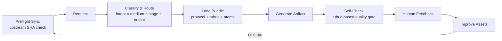

<p align="center">
  
</p>

<h1 align="center">How to Make Script</h1>

<p align="center">
  Open-source screenwriting knowledge infrastructure for writers and agents.<br/>
  Route, generate, review, and orchestrate narrative, branded, and interactive scripts.
</p>

<p align="center">
  <a href="https://github.com/XucroYuri/how-to-make-script/actions/workflows/ci.yml">
    
  </a>
  <a href="./LICENSE">
    
  </a>
  <a href="https://github.com/XucroYuri/how-to-make-script/discussions">
    
  </a>
  <a href="./CONTRIBUTING.md">
    
  </a>
  <a href="./README.md">
    
  </a>
  <a href="./README_zh.md">
    
  </a>
</p>

<p align="center">
  <code>screenwriting</code>
  <code>agent skill</code>
  <code>workflow protocols</code>
  <code>quality gates</code>
  <code>human-in-the-loop</code>
</p>

<p align="center">
  <a href="#60-second-example">See an Example</a> &bull;
  <a href="#quick-start">Install as a Skill</a> &bull;
  <a href="#docs-by-goal">Browse by Goal</a> &bull;
  <a href="https://github.com/XucroYuri/how-to-make-script/discussions">Challenge a Claim</a>
</p>

> Not a prompt dump. Not a single-method gospel. Not a UI-first product.
> Durable creative infrastructure for screenplay work: routable knowledge, clear workflow contracts, reusable review logic, and community-driven correction loops.

---

## 60-Second Example

**Request**

```text
Turn this idea into a feature-film premise, a beat sheet, and one key scene draft:
"A journalist who has spent years avoiding the truth behind her father's death
is forced back to her mining hometown to investigate an old case."
```

**Selected route**

| Layer | Selection |
| --- | --- |
| Skill | [`skill.logline-premise`](./skills/logline-premise/SKILL.md) |
| Protocol | [`wp.logline-premise`](./knowledge/20-workflows/wp-logline-premise.md) + downstream scene drafting |
| Review | premise / beat / scene rubrics + optional [`quality_gate_report`](./knowledge/20-workflows/wp-quality-gate-report.md) |

**Artifact excerpt**

> A journalist who fled her mining hometown years ago must return to stop a buried disaster from disappearing forever, only to discover that her own silence helped keep the truth underground.

Full example chain:

- [Request](./examples/golden/feature-drama/request.md)
- [Artifact](./examples/golden/feature-drama/artifact.md)
- [Quick route examples](./examples/agent/quickstart.json)

## What Makes It Different

| Principle | How it works |
| --- | --- |
| **`route-first`** | Primary route anchored by `intent x medium x stage x output`; `constraints` refine tie-breaks and loading |
| **`research-first`** | Stable knowledge lives in versioned assets, not hidden chat memory |
| **`bounded-loading`** | Agents load the smallest useful bundle instead of the whole repository |
| **`challenge-friendly`** | Counterexamples, objections, and field reports are first-class improvement inputs |
| **`multi-surface`** | Covers writing artifacts, review, team orchestration, project surfaces, and downstream handoff |

## What It Helps You Do

- Turn a vague idea into concrete artifacts: `logline`, `premise`, `beat_sheet`, `outline`, `scene_draft`, `commercial_script`
- Route each request to the right protocol, rubric, and minimal knowledge bundle
- Compare multiple viable creative directions instead of locking into one method
- Diagnose drafts with `rewrite_report`, `quality_gate_report`, `boundary_map`, or `scope_correction`
- Handle broad theory and long-form continuity with `research_background_map` and `story_memory_checkpoint`
- Bridge into voice calibration, multilingual visual language, and screen-to-video handoff
- Design multi-agent or writers' room workflows with defined casts, dispatch plans, and handoff contracts

## Who It Is For

**Good fit**

| Audience | What you get |
| --- | --- |
| Writers and story developers | Durable reference, structure, and self-check instead of loose prompt fragments |
| Agent builders | Explicit routing, bounded loading, reusable contracts, and machine-readable registries |
| Script reviewers and educators | Rubrics, failure contrasts, and challengeable heuristics instead of vague taste judgments |
| Multi-agent workflow designers | Team modes, dispatch patterns, handoff packets, and role-aware orchestration |

**Not the best fit**

| Audience | Why |
| --- | --- |
| People looking for one magic prompt | This repo optimizes for reusable systems, not shortcut prompt hacks |
| People who want one absolute method | The design assumes screenplay work is plural, unstable, and context-bound |
| People who only want a polished app UI | This is a repo-first knowledge and skill system, not a hosted product |

---

## Quick Start

### 1. Browse a real example

- [Feature drama golden request](./examples/golden/feature-drama/request.md)
- [Feature drama golden artifact](./examples/golden/feature-drama/artifact.md)
- [Narrative reference pack](./examples/reference-packs/narrative-pattern-pack.md)
- [Commercial reference pack](./examples/reference-packs/commercial-pattern-pack.md)

### 2. Install as a skill

<details>
<summary>Codex</summary>

```toml
[[skills.config]]
path = "/absolute/path/to/how-to-make-script"
enabled = true
```
</details>

<details>
<summary>Claude Code</summary>

```bash
mkdir -p ~/.claude/skills
ln -s /absolute/path/to/how-to-make-script ~/.claude/skills/how-to-make-script
```
</details>

<details>
<summary>OpenCode</summary>

```bash
mkdir -p ~/.config/opencode/skills
ln -s /absolute/path/to/how-to-make-script ~/.config/opencode/skills/how-to-make-script
```
</details>

<details>
<summary>Gemini CLI</summary>

Install as a local extension or clone it under a shared skills directory recognized by your setup.
</details>

<details>
<summary>OpenClaw</summary>

Link or clone the repository into the skill directory your OpenClaw setup resolves, then point the runtime at the repo root so `SKILL.md` stays the entrypoint.
</details>

### 3. Verify repository health

<details>
<summary>Run validation locally</summary>

```bash
python3 scripts/validate_assets.py
python3 scripts/check_semantic_consistency.py
python3 scripts/check_background_bundles.py
python3 scripts/check_routes.py
python3 scripts/check_route_overlaps.py
python3 scripts/check_subagent_registries.py
python3 scripts/check_community_surfaces.py
python3 scripts/check_links.py
python3 scripts/check_forbidden_paths.py
python3 scripts/check_question_todos.py
python3 scripts/run_fixture_suite.py
python3 -m unittest discover -s tests -v
```
</details>

## How The System Works



## Calling From Another Agent

- Start at [`SKILL.md`](./SKILL.md) for the root orchestration contract.
- Use [`references/supported-outputs.md`](./references/supported-outputs.md) to choose the smallest appropriate output instead of inventing a blended artifact.
- Use [`references/router-matrix.json`](./references/router-matrix.json) and [`references/routing-policy.md`](./references/routing-policy.md) to understand route selection and constraint signals.
- Use `research_background_map` for broad "how to create a screenplay" or theory-support requests.
- Use `story_memory_checkpoint` when the real need is resumable continuity or handoff-safe state.
- Use `project_surface_map` when the real need is long-running workflow design or packet/export governance.

---

## Find Your Entry Point

### Writers and reviewers

1. [Narrative Pattern Pack](./examples/reference-packs/narrative-pattern-pack.md)
2. [Adaptive Quality Checking](./docs/adaptive-quality-checking.md)
3. [Supported Outputs](./references/supported-outputs.md)

### Agent and workflow developers

1. [Architecture](./docs/architecture.md)
2. [Content Model](./docs/content-model.md)
3. [Routing Policy](./references/routing-policy.md) + [Router Matrix](./references/router-matrix.json)
4. [Supported Outputs](./references/supported-outputs.md) + [Context Loading Policy](./docs/context-loading-policy.md)

### Broad or theory-heavy questions

1. [How To Create A Screenplay Research](./docs/how-to-create-a-screenplay-research.md)
2. [Research Background Workflow](./knowledge/20-workflows/wp-research-background-map.md)
3. Narrow into the next output route instead of staying in survey mode

### Pause, resume, or hand off long-form work

1. [Story Memory Checkpoint](./knowledge/20-workflows/wp-story-memory-checkpoint.md)
2. [Project Surface Architecture](./docs/project-surface-architecture.md) if the problem is really long-horizon design

### Challenge or improve the repo

1. [Community Operations](./docs/community-operations.md)
2. [Contributing](./CONTRIBUTING.md)
3. Open the lightest useful thread in [GitHub Discussions](https://github.com/XucroYuri/how-to-make-script/discussions)

## Repository At A Glance

| Surface | Scope |
| --- | --- |
| Root skill | [`SKILL.md`](./SKILL.md) — routing, loading, and output discipline |
| Output contracts | `30` routeable outputs in [`supported-outputs.md`](./references/supported-outputs.md) |
| Skill folders | `29` folders in [`skills/`](./skills) |
| Structured assets | `97` atoms + `28` protocols + `27` rubrics |
| Route fixtures | `93` fixtures in [`fixtures.json`](./examples/agent/fixtures.json) |
| Knowledge base | `165` Markdown files in [`knowledge/`](./knowledge) |
| Examples | `24` files across golden flows, fixtures, and reference packs |
| Validation | `14` scripts in [`scripts/`](./scripts) |
| Tests | `12` modules in [`tests/`](./tests) |

## Capability Surface

**Writing and development** — narrative screenwriting, commercial/branded scripting, interactive/branching narrative, premise through rewrite

**Review and correction** — rewrite diagnosis, quality gates, targeted recheck, boundary maps, scope correction

**Research and continuity** — broad theory support, resumable story-memory checkpoints, bounded loading, route-aware research bundles

**Expression and downstream** — character/IP/brand voice calibration, multilingual visual language, screenplay-to-video bridge

**Team and system design** — writers' room blueprints, expert subagent casting, dispatch topology, handoff design, project-surface architecture

## Quality Guarantees

- Schemas, registries, routes, and fixtures validated before completeness claims
- Routes tested for correct output contracts and overlap risk
- Fixtures exercise narrative, commercial, interactive, and systems workflows
- Community surfaces checked so issue and discussion routing stays fresh
- Forbidden local workspace leakage blocked in index and history (denylist in [`.gitignore`](./.gitignore) + [`check_forbidden_paths.py`](./scripts/check_forbidden_paths.py))
- Human disagreement treated as a source of regression tests, rubrics, and scope corrections

---

## Docs By Goal

**For writers**

- [Scenario Atlas](./docs/scenario-atlas.md)
- [Adaptive Quality Checking](./docs/adaptive-quality-checking.md)
- [Pattern Reference Packs](./examples/reference-packs)
- [Voice Pattern Pack](./examples/reference-packs/voice-pattern-pack.md)

**For agent builders**

- [Architecture](./docs/architecture.md)
- [Content Model](./docs/content-model.md)
- [Context Loading Policy](./docs/context-loading-policy.md)
- [Project Surface Architecture](./docs/project-surface-architecture.md)
- [Multi-Agent Screenplay Architecture](./docs/multi-agent-screenplay-architecture.md)

**For contributors**

- [Contributing Guide](./CONTRIBUTING.md)
- [Community Operations](./docs/community-operations.md)
- [Support Ladder](./SUPPORT.md)
- [Roadmap](./docs/roadmap.md)
- [Changelog](./CHANGELOG.md)

## Community

This project grows through high-signal disagreement.

| Channel | Use for |
| --- | --- |
| [Discussions](https://github.com/XucroYuri/how-to-make-script/discussions) | Questions, rebuttals, rival paths, field notes |
| [Issue forms](./.github/ISSUE_TEMPLATE) | Concrete route, rubric, asset, or governance changes |
| [Support](./SUPPORT.md) | Support ladder |
| [Security](./SECURITY.md) | Private vulnerability reporting |

Good first contributions:

- Challenge one claim that feels too broad
- Add one counterexample or field note that changes scope
- Improve one example, rubric explanation, or doc path
- Reproduce one route mismatch and turn it into a fixture

## Project Status

The repository is a usable research-first, agent-ready screenplay monorepo.

**Current emphasis:** narrative, commercial, and interactive screenplay work; research and continuity layers; voice/visual/video layers; team orchestration and project surfaces; adaptive quality gating with human-in-the-loop iteration.

**Open gaps:**

- Collaboration blueprints are mature, but live runtime execution is not yet implemented
- Bounded loading is well documented, but bundle-planner enforcement is incomplete
- Route coverage is broad, but edge-case fixture depth is uneven across similar outputs
- Knowledge coverage is broad, but genre-specific and stage-level depth is thin in several areas
- Community intake exists, but discussion-to-asset conversion still relies on manual effort

**Next-stage roadmap:** executable runtime planning; stricter router governance; deeper genre/medium/case-study layers; stronger quality presets and cross-artifact checks; systematic human-in-the-loop conversion; bilingual maturity.

Detailed TODO list: [Roadmap](./docs/roadmap.md)

---

## Standards And Metadata

[Contributing](./CONTRIBUTING.md) &bull; [Code of Conduct](./CODE_OF_CONDUCT.md) &bull; [Support](./SUPPORT.md) &bull; [Security](./SECURITY.md) &bull; [Citation](./CITATION.cff) &bull; [License](./LICENSE)
