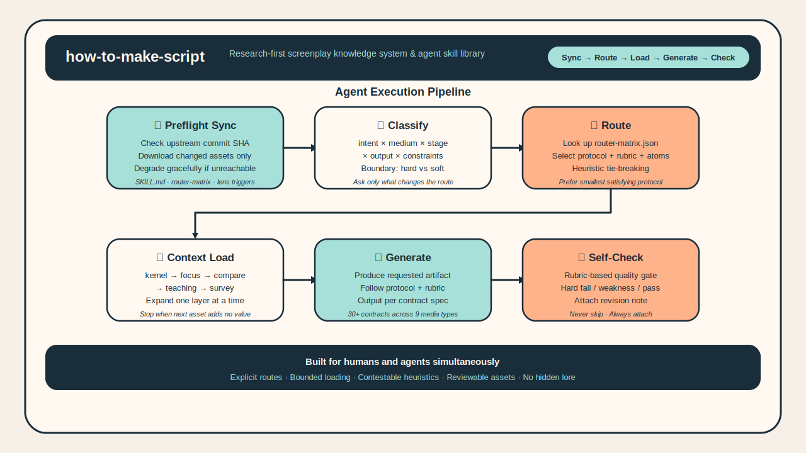
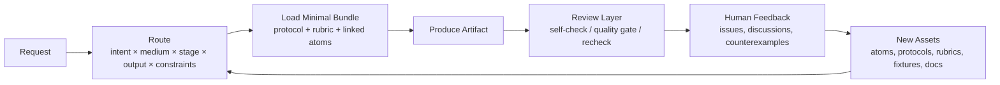

[中文专业版](./README_zh.md)

<p align="center">
  
</p>

<h1 align="center">how-to-make-script</h1>

<p align="center">
  Open-source screenwriting knowledge infrastructure for writers and agents: route, generate, review, and orchestrate narrative, branded, and interactive scripts.
</p>

<p align="center">
  <a href="https://github.com/XucroYuri/how-to-make-script/actions/workflows/ci.yml">
    
  </a>
  <a href="./LICENSE">
    
  </a>
  <a href="https://github.com/XucroYuri/how-to-make-script/discussions">
    
  </a>
  <a href="./CONTRIBUTING.md">
    
  </a>
  <a href="./README_zh.md">
    
  </a>
</p>

<p align="center">
  <code>screenwriting</code>
  <code>agent skill</code>
  <code>workflow protocols</code>
  <code>quality gates</code>
  <code>human-in-the-loop</code>
</p>

<p align="center">
  <a href="#60-second-example">Read an Example</a> •
  <a href="#quick-start">Install as a Skill</a> •
  <a href="#docs-by-goal">Browse by Goal</a> •
  <a href="https://github.com/XucroYuri/how-to-make-script/discussions">Challenge a Claim</a>
</p>

> Not a prompt dump. Not a single-method gospel. Not a UI-first product.
> This repository is durable creative infrastructure for screenplay work: routable knowledge, clear workflow contracts, reusable review logic, and community-driven correction loops.

## What This Repo Helps You Do

- Turn a vague idea into concrete screenplay artifacts such as `logline`, `premise`, `beat_sheet`, `outline`, `scene_draft`, or `commercial_script`.
- Route a request to the right protocol, rubric, and minimal knowledge bundle instead of stuffing the whole repo into context.
- Compare multiple viable creative directions without pretending there is one universal method.
- Diagnose drafts with `rewrite_report`, `quality_gate_report`, `boundary_map`, or `scope_correction`.
- Handle broad screenplay theory and long-form continuity with `research_background_map` and `story_memory_checkpoint`.
- Bridge screenplay work into voice calibration, multilingual visual language, and screen-to-video handoff.
- Design multi-agent or writers' room style workflows with well-defined casts, dispatch plans, and handoff contracts.

## 60-Second Example

**Request**

```text
Turn this idea into a feature-film premise, a beat sheet, and one key scene draft:
"A journalist who has spent years avoiding the truth behind her father's death is forced back to her mining hometown to investigate an old case."
```

**Selected route**

- Skill: [`skill.logline-premise`](./skills/logline-premise/SKILL.md)
- Protocol family: [`wp.logline-premise`](./knowledge/20-workflows/wp-logline-premise.md) + downstream scene drafting
- Review layer: premise / beat / scene rubrics plus optional [`quality_gate_report`](./knowledge/20-workflows/wp-quality-gate-report.md)

**Artifact excerpt**

> A journalist who fled her mining hometown years ago must return to stop a buried disaster from disappearing forever, only to discover that her own silence helped keep the truth underground.

Full example chain:

- [Request](./examples/golden/feature-drama/request.md)
- [Artifact](./examples/golden/feature-drama/artifact.md)
- [Quick route examples](./examples/agent/quickstart.json)

## Who It Is For

| Good fit | Why |
| --- | --- |
| Writers and story developers | You want durable reference, structure, and self-check instead of loose prompt fragments. |
| Agent builders | You need explicit routing, bounded loading, reusable contracts, and machine-readable registries. |
| Script reviewers and educators | You want rubrics, failure contrasts, and challengeable heuristics instead of vague taste judgments. |
| Multi-agent workflow designers | You need team modes, dispatch patterns, handoff packets, and role-aware orchestration. |

| Not the best fit | Why |
| --- | --- |
| People looking for one magic prompt | This repo optimizes for reusable systems, not shortcut prompt hacks. |
| People who want one absolute correct method | The design assumes screenplay work is plural, unstable, and context-bound. |
| People who only want a polished app UI | This is a repo-first knowledge and skill system, not a hosted product. |

## Why It Is Different

- `route-first`: the primary route is anchored by `intent x medium x stage x output`, then `constraints` refine tie-breaks and loading.
- `research-first`: stable knowledge lives in versioned assets, not hidden chat memory.
- `bounded-loading`: agents load the smallest useful bundle instead of the whole repository.
- `challenge-friendly`: counterexamples, objections, and field reports are first-class improvement inputs.
- `multi-surface`: the repo covers writing artifacts, review artifacts, team orchestration, project surfaces, and downstream handoff layers.

## If You Are Calling This From Another Agent

- Start at [`SKILL.md`](./SKILL.md) for the root orchestration contract.
- Use [`references/supported-outputs.md`](./references/supported-outputs.md) to choose the smallest appropriate output instead of inventing a blended artifact.
- Use [`references/router-matrix.json`](./references/router-matrix.json) and [`references/routing-policy.md`](./references/routing-policy.md) to understand route selection and constraint signals.
- Use `research_background_map` for broad “how to create a screenplay” or theory-support requests.
- Use `story_memory_checkpoint` when the real need is resumable continuity or handoff-safe state, not a broader context bundle.
- Use `project_surface_map` when the real need is long-running workflow design, source-of-truth separation, or packet/export governance.

## Start With The Path That Fits You

### If you are a writer or reviewer

- Start with [Narrative Pattern Pack](./examples/reference-packs/narrative-pattern-pack.md)
- Then read [Adaptive Quality Checking](./docs/adaptive-quality-checking.md)
- Then browse [Supported Outputs](./references/supported-outputs.md)

### If you are building an agent or workflow

- Start with [Architecture](./docs/architecture.md)
- Then read [Content Model](./docs/content-model.md)
- Then inspect [Routing Policy](./references/routing-policy.md) and [Router Matrix](./references/router-matrix.json)
- Then inspect [Supported Outputs](./references/supported-outputs.md) and [Context Loading Policy](./docs/context-loading-policy.md)

### If your question is broad or theory-heavy

- Start with [How To Create A Screenplay Research](./docs/how-to-create-a-screenplay-research.md)
- Then inspect [Research Background Workflow](./knowledge/20-workflows/wp-research-background-map.md)
- Then narrow into the next output route instead of staying in survey mode

### If you need to pause, resume, or hand off long-form work

- Start with [Story Memory Checkpoint Workflow](./knowledge/20-workflows/wp-story-memory-checkpoint.md)
- Then inspect [Project Surface Architecture](./docs/project-surface-architecture.md) if the problem is really long-horizon workflow design

### If you want to challenge or improve the repo

- Start with [Community Operations](./docs/community-operations.md)
- Then read [Contributing](./CONTRIBUTING.md)
- Then open the lightest useful thread in [GitHub Discussions](https://github.com/XucroYuri/how-to-make-script/discussions)

## Quick Start

### 1. Browse a real example

- [Feature drama golden request](./examples/golden/feature-drama/request.md)
- [Feature drama golden artifact](./examples/golden/feature-drama/artifact.md)
- [Narrative reference pack](./examples/reference-packs/narrative-pattern-pack.md)
- [Commercial reference pack](./examples/reference-packs/commercial-pattern-pack.md)

### 2. Install as a skill

<details>
<summary>Codex</summary>

```toml
[[skills.config]]
path = "/absolute/path/to/how-to-make-script"
enabled = true
```
</details>

<details>
<summary>Claude Code</summary>

```bash
mkdir -p ~/.claude/skills
ln -s /absolute/path/to/how-to-make-script ~/.claude/skills/how-to-make-script
```
</details>

<details>
<summary>OpenCode</summary>

```bash
mkdir -p ~/.config/opencode/skills
ln -s /absolute/path/to/how-to-make-script ~/.config/opencode/skills/how-to-make-script
```
</details>

<details>
<summary>Gemini CLI</summary>

Install as a local extension or clone it under a shared skills directory recognized by your setup.
</details>

<details>
<summary>OpenClaw</summary>

Link or clone the repository into the skill directory your OpenClaw setup resolves, then point the runtime at the repo root so `SKILL.md` stays the entrypoint.
</details>

### 3. Verify repository health

<details>
<summary>Run validation locally</summary>

```bash
python3 scripts/validate_assets.py
python3 scripts/check_semantic_consistency.py
python3 scripts/check_background_bundles.py
python3 scripts/check_routes.py
python3 scripts/check_route_overlaps.py
python3 scripts/check_subagent_registries.py
python3 scripts/check_community_surfaces.py
python3 scripts/check_links.py
python3 scripts/check_forbidden_paths.py
python3 scripts/check_question_todos.py
python3 scripts/run_fixture_suite.py
python3 -m unittest discover -s tests -v
```
</details>

## How The System Works



## Repository At A Glance

| Surface | Current scope |
| --- | --- |
| Root skill | [`SKILL.md`](./SKILL.md) orchestrates routing, loading, and output discipline |
| Public output contracts | `30` routeable outputs in [`references/supported-outputs.md`](./references/supported-outputs.md) |
| Skill folders | `29` skill folders in [`skills/`](./skills) |
| Structured assets | `97` atoms + `28` protocols + `27` rubrics |
| Route fixtures | `93` fixtures in [`examples/agent/fixtures.json`](./examples/agent/fixtures.json) |
| Knowledge base | `165` Markdown files in [`knowledge/`](./knowledge) |
| Examples | `24` example files across golden flows, fixtures, and reference packs |
| Validation tooling | `14` Python scripts in [`scripts/`](./scripts) |
| Test coverage | `12` test modules in [`tests/`](./tests) |

## Capability Surface

### Writing and development

- narrative screenwriting
- commercial and branded scripting
- interactive and branching narrative
- premise, outline, beat, scene, and rewrite work

### Review and correction

- rewrite diagnosis
- quality gates and targeted recheck
- route failures, boundary maps, and scope correction

### Research and continuity

- broad screenplay theory and background maps
- resumable story-memory checkpoints
- bounded loading and route-aware research bundles

### Expression and downstream translation

- character / IP / brand voice calibration
- multilingual visual language
- screenplay-to-video bridge design

### Team and system design

- writers' room and multi-agent blueprints
- expert subagent casting
- dispatch topology and handoff design
- project-surface architecture

## Quality Guarantees

- Schemas and registries are validated before claims of completeness.
- Routes are tested for correct output contracts and overlap risk.
- Fixtures exercise narrative, commercial, interactive, and systems workflows.
- Community surfaces are checked so issue and discussion routing does not become stale.
- Forbidden local workspace leakage is blocked in both index and history checks; the canonical denylist lives in [`.gitignore`](./.gitignore) and [`scripts/check_forbidden_paths.py`](./scripts/check_forbidden_paths.py).
- Human disagreement is treated as a source of regression tests, rubrics, and scope corrections.

## Docs By Goal

### For writers

- [Scenario Atlas](./docs/scenario-atlas.md)
- [Adaptive Quality Checking](./docs/adaptive-quality-checking.md)
- [Pattern Reference Packs](./examples/reference-packs)
- [Voice Pattern Pack](./examples/reference-packs/voice-pattern-pack.md)

### For agent builders

- [Architecture](./docs/architecture.md)
- [Content Model](./docs/content-model.md)
- [Context Loading Policy](./docs/context-loading-policy.md)
- [Project Surface Architecture](./docs/project-surface-architecture.md)
- [Multi-Agent Screenplay Architecture](./docs/multi-agent-screenplay-architecture.md)

### For contributors

- [Contributing Guide](./CONTRIBUTING.md)
- [Community Operations](./docs/community-operations.md)
- [Support Ladder](./SUPPORT.md)
- [Roadmap](./docs/roadmap.md)
- [Changelog](./CHANGELOG.md)

## Community

This project is designed to grow through high-signal disagreement.

Use the right surface:

- [Discussions](https://github.com/XucroYuri/how-to-make-script/discussions) for questions, rebuttals, rival paths, and field notes.
- [Issue forms](./.github/ISSUE_TEMPLATE) for concrete route, rubric, asset, or governance changes.
- [Support](./SUPPORT.md) for the support ladder.
- [Security](./SECURITY.md) for private vulnerability reporting.

Good first contributions:

- challenge one claim that feels too broad;
- add one counterexample or field note that changes scope;
- improve one example, rubric explanation, or doc path;
- reproduce one route mismatch and turn it into a fixture.

## Project Status

The repository is already usable as a research-first, agent-ready screenplay monorepo.

Current emphasis:

- narrative, commercial, and interactive screenplay work
- broad research support and resumable continuity checkpoints
- voice, visual-language, and screen-to-video layers
- team orchestration, subagent casting, dispatch design, and project surfaces
- adaptive quality gating and human-in-the-loop community iteration

Main development gaps still open:

- collaboration blueprints are mature, but live runtime execution is not yet implemented;
- bounded loading is well documented, but bundle-planner enforcement is still incomplete;
- route coverage is broad, but edge-case fixture depth is still uneven across similar outputs;
- knowledge coverage is broad, but genre-specific, case-study, and stage-level depth is still thin in several areas;
- community intake exists, but turning discussions into assets still relies too much on manual effort.

Next-stage roadmap:

- executable runtime planning and resumable orchestration
- stricter router and retrieval governance and richer registry validation
- deeper genre, medium, case-study, and dialogue-character knowledge layers
- stronger quality presets, cross-artifact checks, and regression depth
- more systematic human-in-the-loop conversion workflows and bilingual maturity

Detailed TODO list:

- [Roadmap](./docs/roadmap.md)

## Standards And Metadata

- [Contributing](./CONTRIBUTING.md)
- [Code of Conduct](./CODE_OF_CONDUCT.md)
- [Support](./SUPPORT.md)
- [Security](./SECURITY.md)
- [Citation](./CITATION.cff)
- [License](./LICENSE)

## Why Star Or Watch

If this repository is useful to you, starring or watching it helps in two practical ways:

- it makes the project easier for working writers, researchers, and agent builders to discover;
- it increases the volume of objections, examples, and field reports that can improve the knowledge base.
