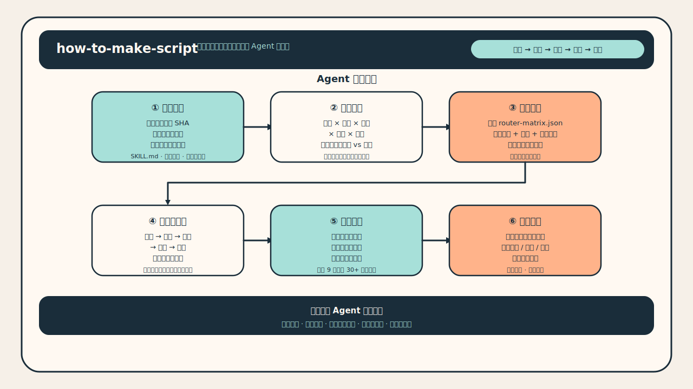
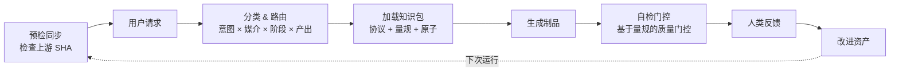

<p align="center">
  
</p>

<h1 align="center">how-to-make-script</h1>

<p align="center">
  开源剧本研发基础设施，面向编剧与 Agent。<br/>
  路由、生成、审查、编排——覆盖叙事、商业和互动剧本。
</p>

<p align="center">
  <a href="https://github.com/XucroYuri/how-to-make-script/actions/workflows/ci.yml">
    
  </a>
  <a href="./LICENSE">
    
  </a>
  <a href="https://github.com/XucroYuri/how-to-make-script/discussions">
    
  </a>
  <a href="./CONTRIBUTING.md">
    
  </a>
  <a href="./README.md">
    
  </a>
  <a href="./README_zh.md">
    
  </a>
</p>

<p align="center">
  <code>编剧</code>
  <code>Agent 技能</code>
  <code>工作流协议</code>
  <code>质量门控</code>
  <code>人机协作</code>
</p>

<p align="center">
  <a href="#30-秒看懂它怎么工作">看案例</a> &bull;
  <a href="#快速开始">装成 Skill</a> &bull;
  <a href="#按目标查找文档">按目标找文档</a> &bull;
  <a href="https://github.com/XucroYuri/how-to-make-script/discussions">提反驳或问题</a>
</p>

> 这不是提示词模板仓库，不是唯一真理式教学，也不是 UI-first 产品。
> 它是一套可持续积累的剧本研发基础设施：可路由的知识资产、清晰的协议合约、可复用的审查逻辑、社区驱动的纠偏闭环。

---

## 30 秒看懂它怎么工作

**你给它的请求**

```text
把这个想法做成电影 premise、beat sheet 和一场关键 scene draft：
"一个多年逃避父亲死亡真相的女记者，被迫回到矿区家乡调查旧案。"
```

**系统选择的路径**

| 层 | 选择 |
| --- | --- |
| 技能 | [`skill.logline-premise`](./skills/logline-premise/SKILL.md) |
| 协议 | [`wp.logline-premise`](./knowledge/20-workflows/wp-logline-premise.md) + 下游场景草稿 |
| 审查 | premise / beat / scene 量规 + 可选 [`quality_gate_report`](./knowledge/20-workflows/wp-quality-gate-report.md) |

**产物片段**

> 一名多年逃离矿区家乡的女记者，为了阻止矿难周年前被掩埋的真相再次沉没，不得不回到父亲死去的井口调查旧案，却在越接近真相时越发现自己当年选择沉默也参与了这场掩盖。

完整示例入口：

- [golden request](./examples/golden/feature-drama/request.md)
- [golden artifact](./examples/golden/feature-drama/artifact.md)
- [quick route examples](./examples/agent/quickstart.json)

## 它和普通剧本仓库最大的区别

| 原则 | 具体做法 |
| --- | --- |
| **`route-first`** | 主路由由 `intent × medium × stage × output` 确定，`constraints` 做优先级判定和加载控制 |
| **`research-first`** | 知识积累在版本化资产里，而不是散在聊天记录里 |
| **`bounded-loading`** | 只加载最小有效知识包，避免上下文退化 |
| **`challenge-friendly`** | 反驳、反例、field report、专业质疑都是改进系统的输入 |
| **`multi-surface`** | 不只管"写文本"，也管审查、协作、项目视图和下游对接 |

## 这个仓库能直接帮你做什么

- 把模糊的想法提炼为 `logline`、`premise`、`beat_sheet`、`outline`、`scene_draft`、`commercial_script` 等具体输出物
- 在不同媒介和阶段下，为 Agent 提供精确的协议、评分标准和最小知识包
- 在多个可行方案之间做比较，避免一开始就被限定在单一方案中
- 用 `rewrite_report`、`quality_gate_report`、`boundary_map`、`scope_correction` 排查问题、限定边界、做复查
- 用 `research_background_map` 和 `story_memory_checkpoint` 处理宏观理论问题、长篇连续性压缩和安全续写
- 对接角色声纹、品牌表达、多语种视觉语言和 screen-to-video brief
- 把 writers' room、多智能体协作、subagent 阵容、handoff 纪律做成明确的设计

## 它适合谁

**适合的人**

| 读者 | 你会得到什么 |
| --- | --- |
| 编剧 / 策划 / 剧本开发 | 可复用的开发和诊断方法，不只是"写点东西" |
| 剧本医生 / 审稿人 / 教学者 | 明确的常见失败模式、评分标准和对照参考 |
| Agent builder / workflow designer | 明确的路由机制、bounded loading、可复用 contract、可校验 registry |
| 多智能体创作流程设计者 | 团队模式、专家 cast、dispatch、handoff、surface 设计 |

**不太适合的人**

| 读者 | 原因 |
| --- | --- |
| 只想要一条万能提示词 | 这个仓库偏系统化方法论，不提供捷径 |
| 想找唯一标准答案 | 剧本创作没有唯一正确答案 |
| 只想看成品 UI | 这是一个知识系统仓库，不是在线产品 |

---

## 快速开始

### 1. 先看真实例子

- [feature drama golden request](./examples/golden/feature-drama/request.md)
- [feature drama golden artifact](./examples/golden/feature-drama/artifact.md)
- [叙事参考包](./examples/reference-packs/narrative-pattern-pack.md)
- [商业参考包](./examples/reference-packs/commercial-pattern-pack.md)

### 2. 安装成 Skill

<details>
<summary>Codex</summary>

```toml
[[skills.config]]
path = "/absolute/path/to/how-to-make-script"
enabled = true
```
</details>

<details>
<summary>Claude Code</summary>

```bash
mkdir -p ~/.claude/skills
ln -s /absolute/path/to/how-to-make-script ~/.claude/skills/how-to-make-script
```
</details>

<details>
<summary>OpenCode</summary>

```bash
mkdir -p ~/.config/opencode/skills
ln -s /absolute/path/to/how-to-make-script ~/.config/opencode/skills/how-to-make-script
```
</details>

<details>
<summary>Gemini CLI</summary>

按你的本地扩展机制把仓库挂进可识别的 skills 目录即可。
</details>

<details>
<summary>OpenClaw</summary>

把仓库链接或克隆到 OpenClaw 当前配置会扫描的 skills 目录，并让入口仍然指向仓库根目录下的 `SKILL.md`。
</details>

### 3. 本地校验仓库健康

<details>
<summary>运行校验命令</summary>

```bash
python3 scripts/validate_assets.py
python3 scripts/check_semantic_consistency.py
python3 scripts/check_background_bundles.py
python3 scripts/check_routes.py
python3 scripts/check_route_overlaps.py
python3 scripts/check_subagent_registries.py
python3 scripts/check_community_surfaces.py
python3 scripts/check_links.py
python3 scripts/check_forbidden_paths.py
python3 scripts/check_question_todos.py
python3 scripts/run_fixture_suite.py
python3 -m unittest discover -s tests -v
```
</details>

## 系统运行流程



## 如果你是从另一个 Agent / 工作流里调用它

- 先从 [`SKILL.md`](./SKILL.md) 看核心控制契约
- 用 [`references/supported-outputs.md`](./references/supported-outputs.md) 选择最小可用输出，不要自己发明模糊的输出类型
- 用 [`references/router-matrix.json`](./references/router-matrix.json) 和 [`references/routing-policy.md`](./references/routing-policy.md) 查看 route 和 constraint 信号
- 用户问"如何创作剧本"等宽泛问题时，使用 `research_background_map`，不要硬塞成某个具体写作产物
- 实际需求是"下次还能安全续写"或"要交接当前状态"时，优先使用 `story_memory_checkpoint`，不要扩大上下文包
- 实际需求是长期项目如何划分来源、运行状态、数据包时，优先使用 `project_surface_map`

---

## 根据你的角色选择入口

### 编剧、策划或审稿人

1. [叙事参考包](./examples/reference-packs/narrative-pattern-pack.md)
2. [自适应质检](./docs/adaptive-quality-checking-zh.md)
3. [支持的输出契约](./references/supported-outputs.md)

### Agent / 工作流开发者

1. [架构说明](./docs/architecture-zh.md)
2. [内容模型](./docs/content-model-zh.md)
3. [路由策略](./references/routing-policy.md) + [router matrix](./references/router-matrix.json)
4. [输出契约](./references/supported-outputs.md) + [上下文加载策略](./docs/context-loading-policy-zh.md)

### 问题比较宏观、偏理论或偏背景研究

1. [如何创作剧本研究总览](./docs/how-to-create-a-screenplay-research-zh.md)
2. [research background 协议](./knowledge/20-workflows/wp-research-background-map.md)
3. 确定下一步该往哪个更具体的 output route 收敛

### 需要暂停写作、续写或交接长篇状态

1. [story memory checkpoint 协议](./knowledge/20-workflows/wp-story-memory-checkpoint.md)
2. 如果问题其实是长期项目视图设计，再看 [project surface 架构](./docs/project-surface-architecture-zh.md)

### 想提问题、提反驳、改仓库

1. [社区运营策略](./docs/community-operations-zh.md)
2. [贡献说明](./CONTRIBUTING.md)
3. 去 [Discussions](https://github.com/XucroYuri/how-to-make-script/discussions) 选合适入口

## 仓库当前规模

| 模块 | 规模 |
| --- | --- |
| 根 skill | [`SKILL.md`](./SKILL.md) — 总控路由和加载纪律 |
| 公共输出契约 | `30` 个可路由输出（[`supported-outputs.md`](./references/supported-outputs.md)） |
| skill 目录 | `29` 个能力型目录（[`skills/`](./skills)） |
| 结构化资产 | `97` 个 atom + `28` 个 protocol + `27` 个 rubric |
| route fixtures | `93` 条（[`fixtures.json`](./examples/agent/fixtures.json)） |
| 知识资产 | `165` 份 Markdown（[`knowledge/`](./knowledge)） |
| 示例材料 | `24` 份示例 / fixture / reference pack |
| 校验脚本 | `14` 个 Python 脚本（[`scripts/`](./scripts)） |
| 测试模块 | `12` 个测试文件（[`tests/`](./tests)） |

## 核心功能

**创作与开发** — 叙事剧本、商业/品牌脚本、互动/分支叙事、premise 到 rewrite 全阶段

**诊断与纠偏** — 改稿诊断、质量门控、定向复查、路由失败排查、边界映射、范围纠正

**研究与连续性** — 宏观理论支撑、可恢复的 story-memory checkpoint、有界加载、研究资源包

**表达与下游对接** — 角色/IP/品牌表达风格校准、多语种视觉语言、剧本到视频执行桥接

**团队与系统** — writers' room / multi-agent 蓝图、专家 subagent 阵容、dispatch / handoff 设计、project surface 架构

## 质量保障

- schema、registry、route、fixture 都有脚本校验
- 检查 route overlap，避免 skill 边界逐渐模糊
- narrative / commercial / interactive 都有样例和 fixture
- community surface 有专项检查，避免入口失效
- 本地工具痕迹被禁止进入 index 和历史（denylist 在 [`.gitignore`](./.gitignore) + [`check_forbidden_paths.py`](./scripts/check_forbidden_paths.py)）
- 人类反驳不是噪音，而是后续 rubric、fixture、scope correction 的来源

---

## 按目标查找文档

**面向编剧 / 策划**

- [场景图谱](./docs/scenario-atlas-zh.md)
- [自适应质检架构](./docs/adaptive-quality-checking-zh.md)
- [参考包目录](./examples/reference-packs)
- [表达风格参考包](./examples/reference-packs/voice-pattern-pack.md)

**面向 Agent builder**

- [架构说明](./docs/architecture-zh.md)
- [内容模型](./docs/content-model-zh.md)
- [上下文加载策略](./docs/context-loading-policy-zh.md)
- [项目视图架构](./docs/project-surface-architecture-zh.md)
- [多智能体剧本架构](./docs/multi-agent-screenplay-architecture-zh.md)

**面向贡献者**

- [贡献说明](./CONTRIBUTING.md)
- [社区运营策略](./docs/community-operations-zh.md)
- [支持入口梯度](./SUPPORT.md)
- [Roadmap](./docs/roadmap-zh.md)
- [Changelog](./CHANGELOG.md)

## 社区协作

这个项目通过高质量反驳来成长。

| 渠道 | 用途 |
| --- | --- |
| [Discussions](https://github.com/XucroYuri/how-to-make-script/discussions) | 问题澄清、开放反驳、替代路径、field note |
| [Issue Forms](./.github/ISSUE_TEMPLATE) | 能指出具体文件、具体结论、具体 route、具体 rubric 的情况 |
| [Support](./SUPPORT.md) | 支持入口梯度 |
| [Security](./SECURITY.md) | 处理私密安全问题 |

适合先做的第一批贡献：

- 挑一条你觉得适用范围过宽的判断，指出它在什么场景下会失效
- 补充一个真实案例或反例，让某条指导原则需要缩小适用范围
- 改进一个示例、一个 rubric 解释、一个文档入口
- 复现一次 route mismatch，并将它记录为 fixture

## 当前状态

这个仓库是一套可运行的 research-first screenplay monorepo。

**当前重点：** 叙事 / 商业 / 互动剧本；研究和连续性层；声纹/视觉/视频层；团队编排和项目视图；自适应质量门控和人机协作迭代。

**还明显不足的地方：**

- 协作 blueprint 已经很多，但实时 runtime execution 还未实现
- bounded loading 在规则层面很强，但 bundle planner 层还不够完善
- route 覆盖范围很大，但相邻输出之间的对抗性 fixture 还不够深入
- 知识范围已经比较广，但 genre / case study / stage-specific depth 仍然有不少空白
- 社区入口已经有了，但 discussion → asset 的转化链仍然依赖人工

**下一阶段方向：** 可执行 runtime planning；更严格的 router 治理；更深入的 genre/medium/case-study 知识层；更强的 quality preset 和跨工件检查；更成熟的人类反馈转资产机制；双语文档完善度。

高细粒度 TODO：[Roadmap](./docs/roadmap-zh.md)

---

## 仓库标准与元信息

[贡献说明](./CONTRIBUTING.md) &bull; [行为准则](./CODE_OF_CONDUCT.md) &bull; [支持入口](./SUPPORT.md) &bull; [安全问题](./SECURITY.md) &bull; [引用格式](./CITATION.cff) &bull; [许可证](./LICENSE)
