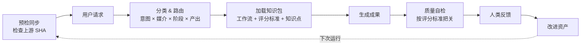

<h1 align="center">How to Make Script（如何写剧本）</h1>

<p align="center">
  开源剧本研发基础设施，面向编剧与 Agent。<br/>
  路由分派、内容生成、质量审查、流程编排——覆盖叙事、商业和互动剧本。
</p>

<p align="center">
  <a href="https://github.com/XucroYuri/how-to-make-script/actions/workflows/ci.yml">
    
  </a>
  <a href="./LICENSE">
    
  </a>
  <a href="https://github.com/XucroYuri/how-to-make-script/discussions">
    
  </a>
  <a href="./CONTRIBUTING.md">
    
  </a>
  <a href="./README.md">
    
  </a>
  <a href="./README_zh.md">
    
  </a>
</p>

<p align="center">
  <code>编剧</code>
  <code>Agent 技能</code>
  <code>工作流协议</code>
  <code>质量把关</code>
  <code>人机协作</code>
</p>

<p align="center">
  <a href="#30-秒看懂它怎么工作">看案例</a> &bull;
  <a href="#快速开始">装成 Skill</a> &bull;
  <a href="#按目标查找文档">按目标找文档</a> &bull;
  <a href="https://github.com/XucroYuri/how-to-make-script/discussions">提反驳或问题</a>
</p>

> 这不是提示词模板仓库，不是唯一真理式教学，也不是 UI-first 产品。
> 它是一套可持续积累的剧本研发基础设施：按需匹配的知识资产、清晰的工作流合约、可复用的审查逻辑、社区驱动的纠偏闭环。

---

## 30 秒看懂它怎么工作

**你给它的请求**

```text
把这个想法做成电影 beat sheet：
"一个多年逃避父亲死亡真相的女记者，被迫回到矿区家乡调查旧案。"
```

**系统选择的路径**

| 层 | 选择 |
| --- | --- |
| 技能 | [`skill.structure-beat`](./skills/structure-beat/SKILL.md) |
| 协议 | [`wp.structure-beat-outline`](./knowledge/20-workflows/wp-structure-beat-outline.md) |
| 审查 | [`rb.outline`](./knowledge/60-rubrics/rb-outline.md) + 可选 [`quality_gate_report`](./knowledge/20-workflows/wp-quality-gate-report.md) |

**产物片段**

```text
## Beat List
- Opening imbalance: 她在外地做调查记者，却始终回避任何与矿区有关的报道。
- Lock-in: 一页父亲旧案残档逼她回乡。
- Midpoint turn: 她发现自己当年的沉默也是掩盖的一部分。
```

完整示例入口：

- [golden request](./examples/golden/feature-drama/request.md)
- [golden artifact](./examples/golden/feature-drama/artifact.md)
- [quick route examples](./examples/agent/quickstart.json)

---

## 它和普通剧本仓库最大的区别

普通剧本仓库大多是「写完拿出来」，放着一堆成品或范本，让你自己去挑。

这个仓库不一样，它在「写之前」就开始管事了。

它先会搞清楚你到底要做什么：是叙事长片还是品牌短片？是前期打骨架还是后期改稿？是写成文本、输出 JSON 还是生成视频 Brief？把这些判断清楚之后，它再决定给你什么工具、什么框架、什么检验标准。

写到一半卡住了怎么办？它不会只盯着「你现在打出来的这几段字」，而是会留意你整个创作的状态——你是初次探索，还是已有清晰方向？注意力集中在哪里？它会据此调整帮你的方式，决定要不要给你更松的空间，或者更精准的约束。

而且它不是你一个人在用。Agent、团队、后续流程都能接得上。每个人看到的、拿到的、检验的标准，都能在同一个框架里对上号。

关键是，它不是要把你框死。它留了余地。真实创作里永远有意外，它的设计就是为了让这些意外发生，而不是防止意外。

---

## 这个仓库能直接帮你做什么

每个编剧都遇到过这些时刻：

**「我有个感觉，但还说不清楚」**

一个模糊的点子、一个人物的影子、一段想要表达的情绪。你不确定这是个故事，还是只是个氛围。这时候可以让它帮你把「感觉」变成 logline、premise，或者先打出几条可能的走向。不是给你一个答案，而是给你几个可比较的方向。

**「我写了一场戏，但总觉得哪里不对」**

场景写完了，自己也说不上哪不对劲。节奏？信息密度？人物的动作？还是整体的戏剧张力？把它交给 audience proxy，它会模拟几个不同类型的观众来「看」这场戏，给出真诚的体验反馈，而不是外交辞令式的打分。你能看到「耐心开始流失」「人物动机不透明」「情感距离太远」这类具体的感受，而不是笼统的「需要改进」。

**「我需要从 logline 推进到场景草稿」**

你知道故事大概是什么，但不知道该怎么结构化地展开。系统会按你选择的媒介和阶段，给你对应的 beat sheet 框架、outline 协议、场景生成指引——不是死板的模板，而是可调整的工具。你可以在多个方案之间切换，看哪条路更适合你的素材。

**「我想打破 LLM 老爱写的那一套」**

你用过各种工具，但发现输出总是太安全、太可预测。系统里准备了碰撞模板和涌现条件配置，能给你制造一点「结构性的压力」，让场景不那么容易滑向熟悉的套路。不是保证惊艳，而是增加一点不可预测的空间。

**「我写完以后想知道它到底有没有问题」**

稿子写出来了，但你不确定是「能用」还是「真的好」。你可以让它做质量自检——按角色声音、叙事连贯性、商业可行性、互动逻辑等不同维度来检查，输出明确的边界图、范围修正建议。出了问题能定位到具体哪一层，而不是「整体需要改」。

**「我想停下来，下次还能接得住」**

长篇写作里，中间歇笔是常态。但歇太久，状态就断了。你可以用 story memory checkpoint，把当前的状态、关键的未解问题、人物关系、情绪基调都记下来。下次回来能快速恢复，而不是从头再读一遍。

---

## 它适合谁

**适合的人**

如果你是编剧、策划或者剧本医生，你会得到一套可复用的开发和诊断方法——不是「写点东西」，而是知道在哪个阶段该用什么框架、什么标准来判断。所有人都能在同一个系统里对上话。

如果你是 Agent builder 或者工作流设计师，这里有清晰的路由机制、受控的知识加载策略、可复用的合约定义和可校验的注册表。你不用自己从零造轮子。

如果你在设计多智能体创作流程，这里有团队模式的模板、专家角色的配置、分派和交接的规范、不同表面的设计——writers' room、subagent 阵容、handoff 协议，都能找到落地的样子。

**不太适合的人**

如果你只想要一条万能提示词，这里帮不了你。它偏向系统化方法论，提供了不同路径和可组合的工具，但不会给你「复制粘贴就能用」的捷径。

如果你期待找到唯一正确的标准答案，这里也没有。剧本创作本来就没有唯一解。系统能给你框架、检查点、比较用的参照，但最终的选择还是在你。

如果你只想看成品 UI，这里也不是。这是一个知识系统仓库，提供了底层的能力和协议。如果你需要的是开箱即用的在线产品，可以找其他工具来配合。

---

## 快速开始

### 1. 先看真实例子

- [feature drama golden request](./examples/golden/feature-drama/request.md)
- [feature drama golden artifact](./examples/golden/feature-drama/artifact.md)
- [叙事参考包](./examples/reference-packs/narrative-pattern-pack.md)
- [商业参考包](./examples/reference-packs/commercial-pattern-pack.md)

### 2. 安装成 Skill

先从 GitHub 拉取最新版本到本机，再把这个本地仓库接入你的 skill 目录或配置：

```bash
git clone https://github.com/XucroYuri/how-to-make-script.git ~/.local/share/how-to-make-script
# 后续更新：
git -C ~/.local/share/how-to-make-script pull --ff-only
```

<details>
<summary>Codex</summary>

把配置里的路径替换成你刚刚克隆下来的仓库绝对路径，例如 `/Users/<you>/.local/share/how-to-make-script`。

```toml
[[skills.config]]
path = "/Users/<you>/.local/share/how-to-make-script"
enabled = true
```
</details>

<details>
<summary>Claude Code</summary>

```bash
mkdir -p ~/.claude/skills
ln -sfn ~/.local/share/how-to-make-script ~/.claude/skills/how-to-make-script
```
</details>

<details>
<summary>OpenCode</summary>

```bash
mkdir -p ~/.config/opencode/skills
ln -sfn ~/.local/share/how-to-make-script ~/.config/opencode/skills/how-to-make-script
```
</details>

<details>
<summary>Gemini CLI</summary>

把 `https://github.com/XucroYuri/how-to-make-script.git` 克隆到 Gemini CLI 当前可识别的共享 skills 目录里，再把这个本地仓库注册成扩展根目录即可。
</details>

<details>
<summary>OpenClaw</summary>

把 `https://github.com/XucroYuri/how-to-make-script.git` 克隆到 OpenClaw 当前配置会扫描的 skills 目录，或者把 `~/.local/share/how-to-make-script` 软链进去，并让入口仍然指向仓库根目录下的 `SKILL.md`。
</details>

### 3. 本地校验仓库健康

<details>
<summary>运行校验命令</summary>

```bash
python3 scripts/validate_assets.py
python3 scripts/check_semantic_consistency.py
python3 scripts/check_background_bundles.py
python3 scripts/check_routes.py
python3 scripts/check_route_overlaps.py
python3 scripts/check_subagent_registries.py
python3 scripts/check_community_surfaces.py
python3 scripts/check_links.py
python3 scripts/check_forbidden_paths.py
python3 scripts/check_canonical_terms.py
python3 scripts/check_question_todos.py
python3 scripts/check_golden_artifact_formats.py
python3 scripts/run_fixture_suite.py
python3 -m unittest discover -s tests -v
```
</details>

---

## 系统运行流程

下面这张图是仓库路由和持续改进闭环的架构总览。

<p align="center">
  
</p>



简单来说，它的工作方式是：

当你提出一个请求，系统会先检查上游是否需要同步，然后把你的请求按「意图 × 媒介 × 阶段 × 想要的产出」这几个维度来分类，决定走哪条路径。

分类清楚以后，它会加载对应的知识包——工作流协议、评分标准、必要的知识点。不是一股脑全扔给你，而是只加载最相关的部分。

生成完成果以后，它会按照之前定义的评分标准做一次自检，看看有没有明显的问题。然后把成果交给你，由你来决定是接受、修改，还是指出哪里不对。

你的反馈不会白费。系统会把这些人类输入收集起来，作为下一次迭代改进的素材——rubric 可以更精准，fixture 可以更丰富，边界可以更清晰。

---

## 如果你是从另一个 Agent / 工作流里调用它

- 先从 [`SKILL.md`](./SKILL.md) 看核心控制契约
- 用 [`references/supported-outputs.md`](./references/supported-outputs.md) 选择最小可用输出，不要自己发明模糊的输出类型
- 需要看 golden 示例的最小 Markdown 交付形状时，用 [`references/output-format-contracts.md`](./references/output-format-contracts.md)
- 用 [`references/router-matrix.json`](./references/router-matrix.json) 和 [`references/routing-policy.md`](./references/routing-policy.md) 查看 route 和 constraint 信号
- 用户问「如何创作剧本」等宽泛问题时，使用 `research_background_map`，不要硬塞成某个具体写作产物
- 实际需求是「下次还能安全续写」或「要交接当前状态」时，优先使用 `story_memory_checkpoint`，不要扩大上下文包
- 实际需求是长期项目如何划分来源、运行状态、数据包时，优先使用 `project_surface_map`

---

## 根据你的角色选择入口

### 编剧、策划或审稿人

1. [叙事参考包](./examples/reference-packs/narrative-pattern-pack.md)
2. [自适应质检](./docs/adaptive-quality-checking-zh.md)
3. [支持的输出契约](./references/supported-outputs.md)

### Agent / 工作流开发者

1. [架构说明](./docs/architecture-zh.md)
2. [内容模型](./docs/content-model-zh.md)
3. [路由策略](./references/routing-policy.md) + [router matrix](./references/router-matrix.json)
4. [输出契约](./references/supported-outputs.md) + [上下文加载策略](./docs/context-loading-policy-zh.md)

### 问题比较宏观、偏理论或偏背景研究

1. [如何创作剧本研究总览](./docs/how-to-create-a-screenplay-research-zh.md)
2. [research background 协议](./knowledge/20-workflows/wp-research-background-map.md)
3. 确定下一步该往哪个更具体的 output route 收敛

### 需要暂停写作、续写或交接长篇状态

1. [story memory checkpoint 协议](./knowledge/20-workflows/wp-story-memory-checkpoint.md)
2. 如果问题其实是长期项目视图设计，再看 [project surface 架构](./docs/project-surface-architecture-zh.md)

### 想提问题、提反驳、改仓库

1. [社区运营策略](./docs/shared/community-operations-zh.md)
2. [贡献说明](./CONTRIBUTING.md)
3. 去 [Discussions](https://github.com/XucroYuri/how-to-make-script/discussions) 选合适入口

---

## 仓库当前规模

| 模块 | 规模 |
| --- | --- |
| 根 skill | [`SKILL.md`](./SKILL.md) — 总控路由和加载策略 |
| 公共输出契约 | `31` 个可路由输出（[`supported-outputs.md`](./references/supported-outputs.md)） |
| skill 目录 | `29` 个能力型目录（[`skills/`](./skills)） |
| 结构化资产 | `69` 个 atom + `28` 个 protocol + `28` 个 rubric |
| route fixtures | `95` 条（[`fixtures.json`](./examples/agent/fixtures.json)） |
| 知识资产 | `168` 份 Markdown（[`knowledge/`](./knowledge)） |
| 示例材料 | `38` 份示例 / fixture / reference pack |
| 校验脚本 | `18` 个 Python 脚本（[`scripts/`](./scripts)） |
| 测试模块 | `17` 个测试文件（[`tests/`](./tests)） |

---

## 核心功能

**创作与开发** — 叙事剧本、商业/品牌脚本、互动/分支叙事、premise 到 rewrite 全阶段

**诊断与纠偏** — 改稿诊断、质量把关、定向复查、路由失败排查、边界映射、范围纠正

**研究与连续性** — 宏观理论支撑、可恢复的 story-memory checkpoint、按需加载、研究资源包

**表达与下游对接** — 角色/IP/品牌表达风格校准、多语种视觉语言、剧本到视频执行桥接

**团队与系统** — writers' room / multi-agent 蓝图、专家 subagent 阵容、dispatch / handoff 设计、project surface 架构

---

## 质量保障

- schema、registry、route、fixture 都有脚本校验
- 检查 route overlap，避免 skill 边界逐渐模糊
- narrative / commercial / interactive 都有样例和 fixture
- community surface 有专项检查，避免入口失效
- 本地工具痕迹被禁止进入 index 和历史（denylist 在 [`.gitignore`](./.gitignore) + [`check_forbidden_paths.py`](./scripts/check_forbidden_paths.py)）
- 人类反驳不是噪音，而是后续 rubric、fixture、scope correction 的来源

---

## 按目标查找文档

**面向编剧 / 策划**

- [场景图谱](./docs/scenario-atlas-zh.md)
- [自适应质检架构](./docs/adaptive-quality-checking-zh.md)
- [参考包目录](./examples/reference-packs)
- [角色声音参考包](./examples/reference-packs/character-voice-reference-pack.md)

**面向 Agent builder**

- [架构说明](./docs/architecture-zh.md)
- [内容模型](./docs/content-model-zh.md)
- [上下文加载策略](./docs/context-loading-policy-zh.md)
- [项目视图架构](./docs/project-surface-architecture-zh.md)
- [多智能体剧本架构](./docs/multi-agent-screenplay-architecture-zh.md)

**面向贡献者**

- [贡献说明](./CONTRIBUTING.md)
- [Canonical 术语治理策略](./docs/shared/canonical-term-policy-zh.md)
- [社区运营策略](./docs/shared/community-operations-zh.md)
- [支持入口梯度](./SUPPORT.md)
- [Changelog](./CHANGELOG.md)

---

## 社区协作

这个项目通过高质量反驳来成长。

| 渠道 | 用途 |
| --- | --- |
| [Discussions](https://github.com/XucroYuri/how-to-make-script/discussions) | 问题澄清、开放反驳、替代路径、field note |
| [Issue Forms](./.github/ISSUE_TEMPLATE) | 能指出具体文件、具体结论、具体 route、具体 rubric 的情况 |
| [Support](./SUPPORT.md) | 支持入口梯度 |
| [Security](./SECURITY.md) | 处理私密安全问题 |

适合先做的第一批贡献：

- 挑一条你觉得适用范围过宽的判断，指出它在什么场景下会失效
- 补充一个真实案例或反例，让某条指导原则需要缩小适用范围
- 改进一个示例、一个 rubric 解释、一个文档入口
- 复现一次 route mismatch，并将它记录为 fixture

---

## 当前状态

这个仓库是一套可运行的 research-first screenplay monorepo。

**当前重点：** 叙事 / 商业 / 互动剧本；研究和连续性层；表达/视觉/视频层；团队编排和项目视图；自适应质量把关和人机协作迭代。

**还明显不足的地方：**

- 协作 blueprint 已经很多，但实时 runtime execution 还未实现
- bounded loading 在规则层面很强，但 bundle planner 层还不够完善
- route 覆盖范围很大，但相邻输出之间的对抗性 fixture 还不够深入
- 知识范围已经比较广，但 genre / case study / stage-specific depth 仍然有不少空白
- 社区入口已经有了，但 discussion → asset 的转化链仍然依赖人工

**下一阶段方向：** 可执行 runtime planning；更严格的 router 治理；更深入的 genre/medium/case-study 知识层；更强的 quality preset 和跨工件检查；更成熟的人类反馈转资产机制；双语文档完善度。

高细粒度 TODO：详见 `docs/shared/` 维护者文档。

---

## 仓库标准与元信息

[贡献说明](./CONTRIBUTING.md) &bull; [行为准则](./CODE_OF_CONDUCT.md) &bull; [支持入口](./SUPPORT.md) &bull; [安全问题](./SECURITY.md) &bull; [引用格式](./CITATION.cff) &bull; [许可证](./LICENSE)