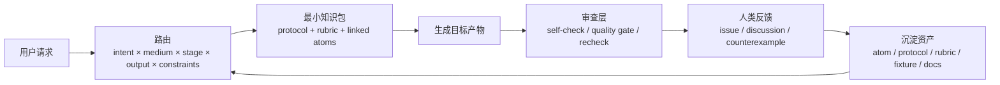

[English landing](./README.md)

<p align="center">
  
</p>

# how-to-make-script

这不是提示词模板仓库，而是一套给编剧、策划、剧本医生、内容团队和 Agent builder 用的剧本研发基础设施。

它试图把“怎么写剧本”这件事拆成四层能长期积累的东西：

- 能持续沉淀的知识资产
- 能解释为什么这样做的工作流协议
- 能做预检、验收、复查的质量标准
- 能按场景选路的 Agent Skill 能力层

`screenwriting` `agent skill` `workflow protocol` `quality gate` `human-in-the-loop`

[先看案例](#30-秒看懂它怎么工作) • [按角色找入口](#按你现在的角色开始) • [安装成-skill](#快速开始) • [去提反驳或问题](https://github.com/XucroYuri/how-to-make-script/discussions)

> 这个仓库不追求“唯一真理式剧本教学”。
> 它更像一个开放的剧本研发底座：把创作、诊断、审查、协作、交付桥接都做成可调用、可争论、可升级的系统。

## 这个仓库能直接帮你做什么

- 把模糊点子压成 `logline`、`premise`、`beat_sheet`、`outline`、`scene_draft`、`commercial_script` 这类具体产物。
- 在不同媒介和不同阶段下，给 Agent 一个更准确的协议、rubric 和最小知识包，而不是把整个仓库都塞进上下文。
- 在多个可行方案之间做比较，避免一上来就被单一路径绑死。
- 用 `rewrite_report`、`quality_gate_report`、`boundary_map`、`scope_correction` 去查问题、缩边界、做复查。
- 用 `research_background_map` 和 `story_memory_checkpoint` 处理宽理论问题、长篇连续性压缩和安全续写。
- 把剧本继续桥接到角色声纹、品牌表达、多语种视觉语言和 screen-to-video brief。
- 把 writers' room、多智能体协作、subagent 阵容、handoff 纪律做成显式设计，而不是“多开几个 agent 试试”。

## 30 秒看懂它怎么工作

**你给它的请求**

```text
把这个想法做成电影 premise、beat sheet 和一场关键 scene draft：
“一个多年逃避父亲死亡真相的女记者，被迫回到矿区家乡调查旧案。”
```

**系统会做的事**

- 先判断这是 narrative / feature / development + drafting 的组合问题
- 再装配对应 protocol、rubric 和最小知识包
- 最后产出 premise、beat、scene，并视需要追加 quality gate

**产物片段**

> 一名多年逃离矿区家乡的女记者，为了阻止矿难周年前被掩埋的真相再次沉没，不得不回到父亲死去的井口调查旧案，却在越接近真相时越发现自己当年选择沉默也参与了这场掩盖。

完整示例入口：

- [golden request](./examples/golden/feature-drama/request.md)
- [golden artifact](./examples/golden/feature-drama/artifact.md)
- [quick route examples](./examples/agent/quickstart.json)

## 它适合谁，不适合谁

| 适合的人 | 你会得到什么 |
| --- | --- |
| 编剧 / 策划 / 剧本开发 | 不只是“写点东西”，而是可复用的开发和诊断结构 |
| 剧本医生 / 审稿人 / 教学者 | 更明确的 failure mode、rubric 和对照参考 |
| Agent builder / workflow designer | 显式路由、bounded loading、可复用 contract、可校验 registry |
| 想做多智能体创作流程的人 | 团队模式、专家 cast、dispatch、handoff、surface 设计 |

| 不太适合的人 | 原因 |
| --- | --- |
| 只想要一条万能提示词的人 | 这个仓库更偏系统化资产，不偏捷径 |
| 想找唯一标准答案的人 | 剧本创作不是稳定单解问题 |
| 只想看一个成品 UI 的人 | 这是 repo-first 的知识系统，不是在线产品 |

## 它和普通剧本仓库最不一样的地方

- `route-first`：主 route 先由 `intent x medium x stage x output` 锚定，再由 `constraints` 做 tie-break 和加载控制
- `research-first`：知识沉淀在版本化资产里，而不是散在聊天记录里
- `bounded-loading`：尽量只加载最小有效知识包，避免 context 腐化
- `challenge-friendly`：反驳、反例、field report、专业质疑都被当成升级输入
- `multi-surface`：不只管“写文本”，也管审查、协作、项目表面层和下游桥接

## 如果你是从另一个 Agent / 工作流里调用它

- 先从 [`SKILL.md`](./SKILL.md) 看根总控契约。
- 再从 [`references/supported-outputs.md`](./references/supported-outputs.md) 里选最小可用输出，不要自己发明一类含糊产物。
- 用 [`references/router-matrix.json`](./references/router-matrix.json) 和 [`references/routing-policy.md`](./references/routing-policy.md) 看 route 和 constraint signals。
- 如果用户问的是“如何创作剧本”这类宽问题，用 `research_background_map`，不要硬塞成某个具体写作产物。
- 如果真正问题是“下次还能安全继续写”或“要把当前状态交接给别人”，优先用 `story_memory_checkpoint`，不要扩大上下文包。
- 如果真正问题是长期项目该怎么分真源、运行态、packet、review / export 面，优先用 `project_surface_map`。

## 按你现在的角色开始

### 如果你是编剧、策划或审稿人

- 先看 [叙事参考包](./examples/reference-packs/narrative-pattern-pack.md)
- 再看 [自适应质检](./docs/adaptive-quality-checking-zh.md)
- 然后浏览 [支持的输出契约](./references/supported-outputs.md)

### 如果你是 Agent / 工作流开发者

- 先看 [架构说明](./docs/architecture-zh.md)
- 再看 [内容模型](./docs/content-model-zh.md)
- 然后看 [路由策略](./references/routing-policy.md) 和 [router matrix](./references/router-matrix.json)
- 再看 [支持的输出契约](./references/supported-outputs.md) 和 [上下文加载策略](./docs/context-loading-policy-zh.md)

### 如果你的问题本身很宽、偏理论或偏背景研究

- 先看 [如何创作剧本研究总览](./docs/how-to-create-a-screenplay-research-zh.md)
- 再看 [research background 协议](./knowledge/20-workflows/wp-research-background-map.md)
- 再决定下一步该往哪个更窄的 output route 收敛

### 如果你需要暂停、续写或把长篇状态交接出去

- 先看 [story memory checkpoint 协议](./knowledge/20-workflows/wp-story-memory-checkpoint.md)
- 如果问题其实是长期项目表面层设计，再看 [project surface 架构](./docs/project-surface-architecture-zh.md)

### 如果你想提问题、提反驳、改仓库

- 先看 [社区运营策略](./docs/community-operations-zh.md)
- 再看 [贡献说明](./CONTRIBUTING.md)
- 然后去 [Discussions](https://github.com/XucroYuri/how-to-make-script/discussions) 选合适入口

## 快速开始

### 1. 先看真实例子

- [feature drama golden request](./examples/golden/feature-drama/request.md)
- [feature drama golden artifact](./examples/golden/feature-drama/artifact.md)
- [叙事参考包](./examples/reference-packs/narrative-pattern-pack.md)
- [商业参考包](./examples/reference-packs/commercial-pattern-pack.md)

### 2. 安装成 Skill

<details>
<summary>Codex</summary>

```toml
[[skills.config]]
path = "/absolute/path/to/how-to-make-script"
enabled = true
```
</details>

<details>
<summary>Claude Code</summary>

```bash
mkdir -p ~/.claude/skills
ln -s /absolute/path/to/how-to-make-script ~/.claude/skills/how-to-make-script
```
</details>

<details>
<summary>OpenCode</summary>

```bash
mkdir -p ~/.config/opencode/skills
ln -s /absolute/path/to/how-to-make-script ~/.config/opencode/skills/how-to-make-script
```
</details>

<details>
<summary>Gemini CLI</summary>

按你的本地扩展机制把仓库挂进可识别的 skills 目录即可。
</details>

<details>
<summary>OpenClaw</summary>

把仓库链接或克隆到 OpenClaw 当前配置会扫描的 skills 目录，并让入口仍然指向仓库根目录下的 `SKILL.md`。
</details>

### 3. 本地校验仓库健康

<details>
<summary>运行校验命令</summary>

```bash
python3 scripts/validate_assets.py
python3 scripts/check_semantic_consistency.py
python3 scripts/check_background_bundles.py
python3 scripts/check_routes.py
python3 scripts/check_route_overlaps.py
python3 scripts/check_subagent_registries.py
python3 scripts/check_community_surfaces.py
python3 scripts/check_links.py
python3 scripts/check_forbidden_paths.py
python3 scripts/check_question_todos.py
python3 scripts/run_fixture_suite.py
python3 -m unittest discover -s tests -v
```
</details>

## 这个系统怎么跑起来



## 仓库当前规模一眼看懂

| 模块 | 当前规模 |
| --- | --- |
| 根 skill | [`SKILL.md`](./SKILL.md) 负责总控路由和加载纪律 |
| 公共输出契约 | [`references/supported-outputs.md`](./references/supported-outputs.md) 中 `30` 个可路由输出 |
| skill 目录 | [`skills/`](./skills) 下 `29` 个能力型目录 |
| 结构化资产 | `97` 个 atom + `28` 个 protocol + `27` 个 rubric |
| route fixtures | [`examples/agent/fixtures.json`](./examples/agent/fixtures.json) 中 `93` 条 |
| 知识资产 | [`knowledge/`](./knowledge) 下 `165` 份 Markdown |
| 示例材料 | [`examples/`](./examples) 下 `24` 份示例 / fixture / reference pack |
| 校验脚本 | [`scripts/`](./scripts) 下 `14` 个 Python 脚本 |
| 测试模块 | [`tests/`](./tests) 下 `12` 个测试文件 |

## 核心能力面

### 创作与开发

- 叙事剧本
- 商业 / 品牌脚本
- 互动 / 分支叙事
- premise / beat / outline / scene / rewrite

### 诊断与纠偏

- 改稿诊断
- 质量门槛与定向复查
- route failure、boundary map、scope correction

### 研究与连续性

- 宽问题理论支撑
- 可恢复的 story-memory checkpoint
- bounded loading 和 research bundle

### 表达与下游桥接

- 角色 / IP / 品牌表达校准
- 多语种视觉语言
- 剧本到视频执行桥接

### 团队与系统

- writers' room / multi-agent 蓝图
- 专家 subagent cast
- dispatch / handoff 设计
- project surface 架构

## 它靠什么保证质量

- schema、registry、route、fixture 都有脚本校验
- 会检查 route overlap，避免 skill 边界越来越糊
- narrative / commercial / interactive 都有样例和 fixture
- community surface 有专项检查，避免 issue / discussion 入口失效
- 本地工具痕迹被明确禁止进入 index 和历史；以 [`.gitignore`](./.gitignore) 和 [`scripts/check_forbidden_paths.py`](./scripts/check_forbidden_paths.py) 里的 canonical denylist 为准
- 人类反驳不是噪音，而是后续 rubric、fixture、scope correction 的来源

## 按目标找文档

### 面向编剧 / 策划

- [场景图谱](./docs/scenario-atlas-zh.md)
- [自适应质检架构](./docs/adaptive-quality-checking-zh.md)
- [参考包目录](./examples/reference-packs)
- [表达风格参考包](./examples/reference-packs/voice-pattern-pack.md)

### 面向 Agent builder

- [架构说明](./docs/architecture-zh.md)
- [内容模型](./docs/content-model-zh.md)
- [上下文加载策略](./docs/context-loading-policy-zh.md)
- [项目表面层架构](./docs/project-surface-architecture-zh.md)
- [多智能体剧本架构](./docs/multi-agent-screenplay-architecture-zh.md)

### 面向贡献者

- [贡献说明](./CONTRIBUTING.md)
- [社区运营策略](./docs/community-operations-zh.md)
- [支持入口梯度](./SUPPORT.md)
- [Roadmap](./docs/roadmap-zh.md)
- [Changelog](./CHANGELOG.md)

## 社区协作

这个项目希望形成的不是“点赞型社区”，而是“高质量反驳型社区”。

优先使用合适入口：

- [Discussions](https://github.com/XucroYuri/how-to-make-script/discussions)：问题澄清、开放反驳、替代路径、field note
- [Issue Forms](./.github/ISSUE_TEMPLATE)：已经能指出具体文件、具体 claim、具体 route、具体 rubric 的情况
- [Support](./SUPPORT.md)：看支持入口梯度
- [Security](./SECURITY.md)：处理私密安全问题

适合先做的第一批贡献：

- 挑一条你觉得过宽的判断，指出它在哪种场景会失效
- 补一个真实案例或反例，让某条 guidance 需要缩边界
- 改一个示例、一个 rubric 解释、一个文档入口
- 复现一次 route mismatch，并把它沉淀成 fixture

## 当前状态

这个仓库已经不是空骨架，而是一套可工作的 research-first screenplay monorepo。

当前重点覆盖：

- narrative / commercial / interactive
- 宽问题 research layer / continuity checkpoint
- voice / visual-language / screen-to-video
- team orchestration / subagent casting / dispatch / project surface
- adaptive quality gating / human-in-the-loop 社区反馈

当前还明显没补齐的地方：

- 协作 blueprint 已经很多，但 live runtime execution 还没落成；
- bounded loading 在规则层很强，但 bundle planner 层还不够硬；
- route 覆盖面很大，但相邻输出之间的对抗性 fixture 还不够深；
- 知识面已经广了，但 genre / case study / stage-specific depth 仍然有不少空位；
- 社区入口已经有了，但 discussion → asset 的转化链仍偏人工。

下一阶段开发方向：

- 可执行 runtime planning 与可恢复 orchestration
- 更硬的 router / retrieval 治理和更完整的 registry 校验
- 更深的 genre / medium / case-study / dialogue-character 知识层
- 更强的 quality preset、跨工件一致性检查和回归深度
- 更成熟的人类反馈转资产机制和双语成熟度

高细粒度 TODO：

- [Roadmap](./docs/roadmap-zh.md)

## 仓库标准与元信息

- [Contributing](./CONTRIBUTING.md)
- [Code of Conduct](./CODE_OF_CONDUCT.md)
- [Support](./SUPPORT.md)
- [Security](./SECURITY.md)
- [Citation](./CITATION.cff)
- [License](./LICENSE)

## 为什么值得 Star / Watch

如果这个仓库对你有用，Star 或 Watch 不只是支持表达，它会直接带来两件实际价值：

- 让更多编剧、研究者、Agent builder 发现这套系统
- 让更多反例、实战案例、专业质疑进入仓库，推动知识体系升级
