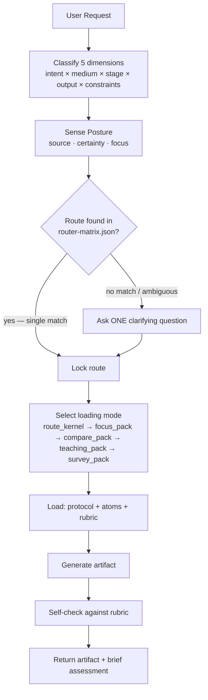
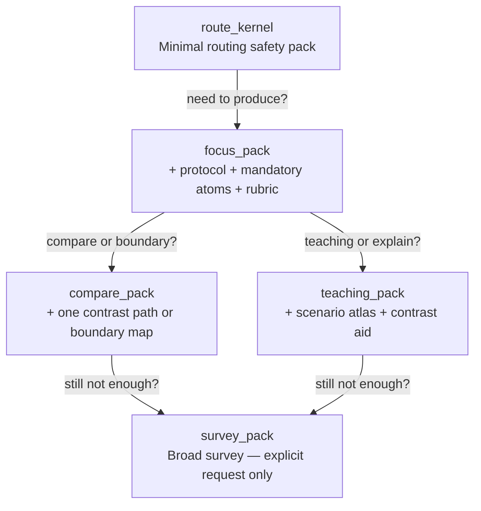

# How To Make Script

Route-first screenplay Agent Skill. Classify the request, load only what's needed, produce the exact output contract requested. No theory dumps, no one-size-fits-all advice.

## Quick Start

```
Request: "Turn this idea into a feature film beat sheet."
         ───────────────┬───────────────
                        ▼
1. Classify → intent=draft, medium=feature_film, stage=structure, output=beat_sheet
2. Route    → skill.structure-beat → wp.structure-beat-outline → rb.outline
3. Load     → protocol + 4 mandatory atoms + rubric (focus_pack)
4. Generate → beat_sheet artifact
5. Self-check → against rb.outline
```

## Routing Pipeline



## The Five Routing Dimensions

| Dimension | Values | Example |
|-----------|--------|---------|
| **Intent** | discover, design, draft, polish, diagnose, adapt | "polish this dialogue" → polish |
| **Medium** | feature_film, episodic, commercial, interactive, etc. | "TVC script" → commercial |
| **Stage** | ideation, premise, structure, scene, dialogue, rewrite, etc. | "I have an idea" → ideation |
| **Output** | 29 contracts in supported-outputs.md | "give me a logline" → logline |
| **Constraints** | genre, tone, audience, budget, platform, IP, voice, etc. | "PG-13 action" → genre:action, rating:PG-13 |

**Order matters.** Each dimension narrows the next. If the request is ambiguous, ask ONE question — the one that changes the route.

## Posture Sensing

Before routing, read the user's creative posture from their language:

| Signal | User Language (ZH) | User Language (EN) | Response |
|--------|-------------------|-------------------|----------|
| **Source** | 感觉、试试看、说不定 | maybe, let's see, explore | Open possibilities |
| | 应该、确保、框架 | should, ensure, framework | Bring structure |
| | 碰撞、放进去、不管 | collide, throw together | Set conditions |
| **Certainty** | 确定、就是这样 | exactly, I know | Execute cleanly |
| | 也可以、或者、两个方向 | maybe this or that | Show tradeoffs |
| | 卡住了、脑子空了、没感觉 | stuck, blank, lost | Offer one small step |
| **Focus** | 人物、角色 | character | Character atoms first |
| | 世界、背景、环境 | world, setting | World atoms first |
| | 事件、情节 | plot, events | Structure atoms first |
| | 观众、感受、体验 | audience, experience | Audience atoms first |
| | 语言、对话、声音 | language, voice | Craft atoms first |

When lost → soften checks, lead with invitation. When exploring → expand possibilities before constraints. When constructing → full protocol and evaluation.

## Context Loading: Climb the Ladder

Start at the bottom. Only climb up when the current level isn't enough.



**Stop expanding when:** route is locked, output contract won't change, next chunk only repeats what's loaded, or you're browsing the repo instead of solving the request.

### Background Bundle Rule

For broad research questions ("how to write a screenplay"), load `bg.screenplay-creation-core` first — then narrow with craft/medium-specific atoms. Never start a broad question with a specific workflow protocol.

## What NOT to Load (Lens Gating)

Specialized lenses load **only when they actually change the answer:**

| Lens | Load When |
|------|-----------|
| Reality lenses | Audience/platform/commissioning/budget/writer-growth constraints present |
| Expression calibration | Producing `voice_style_guide` or explicit tone/register constraint |
| Visual bridge | Producing `visual_language_pack` or `screen_to_video_brief` |
| Team lenses | Designing collaboration — NOT for single-artifact generation |
| Quality gate lenses | Explicit quality/audit request — NOT every generation |
| Audience proxy | Explicit audience simulation request |

## Stop Conditions

Stop expanding context and start generating when any of these are true:
- Route is locked and output contract is final
- Next context chunk only repeats what's already loaded
- You're thinking "what else is in the repo" instead of "what solves this request"
- You have: 1 route anchor + 1 primary reference + at most 1 contrast/boundary case

If adding more context doesn't improve the answer, the problem isn't too little context — it's the wrong context.

## Output Discipline

- Produce the exact format requested. No hybrid formats.
- Append a brief rubric-based self-check: what passed, what's borderline, what's the likely next step.
- If constraints change mid-request, reload only what the new constraints require. Don't restart from zero.
- When multiple paths are valid, use `path_options` with tradeoffs. Let the user choose.

## The Deliverables I Can Produce

Full descriptions in `references/supported-outputs.md`. Format contracts in `references/output-format-contracts.md`.

### Start from an idea
- `logline`
- `premise`
- `synopsis`
- `treatment`

### Structure the story
- `beat_sheet`
- `outline`
- `scene_card`

### Write draft pages
- `scene_draft`
- `screenplay_draft`
- `dialogue_polish`

### Review and improve
- `rewrite_report`
- `quality_gate_report`
- `audience_fit_note`

### Commercial and short-form
- `commercial_script`

### Interactive narrative
- `interactive_branch_map`

### Development strategy
- `development_brief`
- `learning_path`
- `research_background_map`
- `path_options`

### Boundaries and scope
- `boundary_map`
- `scope_correction`

### Pattern reference
- `pattern_reference_pack`

### Continuity and memory
- `story_memory_checkpoint`

### Style and visual language
- `voice_style_guide`
- `visual_language_pack`
- `screen_to_video_brief`

### Team and collaboration
- `team_workflow_blueprint`
- `expert_subagent_cast`

### Audience simulation
- `audience_proxy_report`

## Quick Reference: Key Files

| File | Role |
|------|------|
| `references/router-matrix.json` | All 28 routes with intent/medium/stage/output mapping |
| `references/routing-policy.md` | Route selection rules and tiebreaking |
| `references/supported-outputs.md` | All 29 output descriptions (ZH) |
| `references/output-format-contracts.md` | Format contracts for machine-checked outputs |
| `references/skill-directory.md` | Complete sub-skill index |
| `docs/agent-quick-reference.md` | Agent quick-reference card (EN) |
| `docs/agent-quick-reference-zh.md` | Agent quick-reference card (ZH) |
| `docs/context-loading-policy.md` | Loading mode details and expansion rules |
| `knowledge/00-ontology/` | Conceptual maps and taxonomies |
