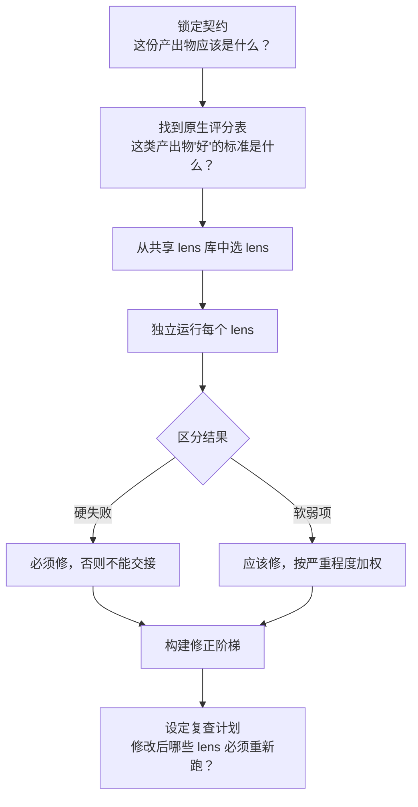
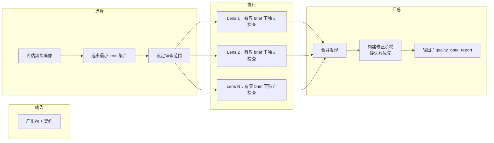

# 自适应质检

不同产出物的失败方式不同。剧本里的一场烂戏，和一份烂的配音指南、一份烂的制作简报，问题根源完全不同。本文说明质检如何按场景自适应，而非对一切跑同一份固定清单。

## 质检决策流程

你不该对所有东西跑同一份检查表。你该为眼前的产出物选出最合适的审视角度（lens）。

## Lens 库

七个可复用的审视角度。你不需要每次都全用——挑出覆盖风险的最小集合。

| Lens | 检查什么 |
|---|---|
| `contract_fit` | 产出物是否符合其声明的契约、格式和范围？ |
| `mechanics_pressure` | 在场景级执行压力下，手艺是否撑得住？ |
| `continuity_invariants` | 那些不可妥协的贯穿线是否完整？ |
| `expression_integrity` | 声音、语域、表达是否一致？ |
| `operational_feasibility` | 这东西能按描述拍出来、做出来、交付吗？ |
| `delivery_handoff` | 能交给下一阶段（编剧、导演、制作）了吗？ |
| `boundary_risk` | 是否踩到了硬边界（品牌、合规、平台政策）？ |

## Lens 选择与应用流水线

每个 lens 在有界 brief 下独立运行。lens 之间不传原始发现，只传提炼后的指标到汇总阶段。这保证每个 lens 专注，一个嘈杂的 lens 不会淹没其他。

## 四种审查范围

不让审查比实际需要更重：

| 范围 | 什么时候用 |
|---|---|
| `full_audit` | 交付级产出物。每个相关 lens，全深度跑。 |
| `lens_targeted` | 你已经知道风险在哪。只跑特定 lens。 |
| `range_limited` | 只检查产出物的一部分（如前三个场景）。 |
| `recheck` | 确认上次审查发现的具体问题是否已修复。 |

## 质量关卡 vs 改稿报告

这两个输出解决不同问题。

**用 `rewrite_report` 当你要：**
- 找出哪个手艺层出了问题（结构、对白、节奏）
- 在故事和文本开发中排改稿优先级
- 告诉团队先改什么、为什么

**用 `quality_gate_report` 当你要：**
- 交付或交接前跑结构化审查
- 预检非故事类产出物（配音指南、制作简报、团队方案、项目表面）
- 修改后跑定向复查
- 区分硬关卡失败（必须修）和加权弱项（应该修）

**执行顺序：**
1. 先跑产出物原生评分表。
2. 再从共享 lens 库叠上需要的 lens。

## 关联文件

- 工作流：[wp.quality-gate-report](../knowledge/20-workflows/wp-quality-gate-report.md)
- 评分表：[rb.quality-gate-report](../knowledge/60-rubrics/rb-quality-gate-report.md)
- Lens 定义：[references/check-lens-matrix.json](../references/check-lens-matrix.json)
