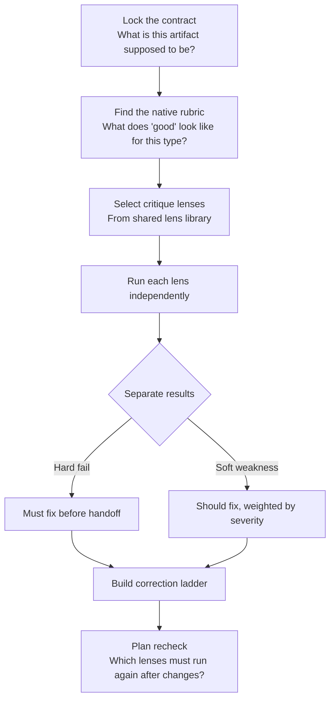
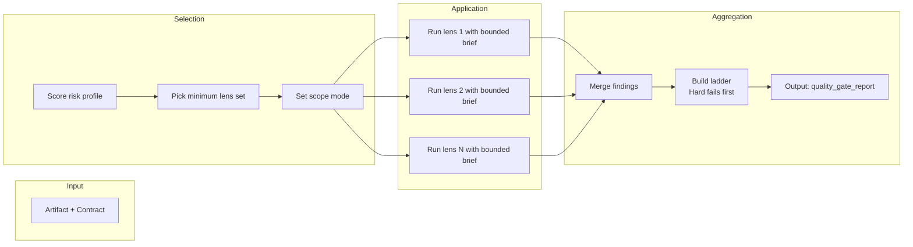

# Adaptive Quality Checking

Different artifacts fail in different ways. A screenplay's bad scene is not the same problem as a bad voice guide or a bad production brief. This page explains how quality checks adapt to what you are reviewing.

## How a Quality Gate Works

You don't run the same checklist on everything. You pick the right lenses for the artifact in front of you.

## The Lens Library

Seven reusable critique perspectives. You do not use all of them every time. Pick the minimum set that covers the risk.

| Lens | What it checks |
|---|---|
| `contract_fit` | Does the artifact match its stated contract, format, and scope? |
| `mechanics_pressure` | Does the craft hold up under scene-level execution pressure? |
| `continuity_invariants` | Are the non-negotiable throughlines intact? |
| `expression_integrity` | Is the voice, tone, and register consistent? |
| `operational_feasibility` | Can this be produced, shot, or delivered as described? |
| `delivery_handoff` | Is this ready to hand off to the next stage? |
| `boundary_risk` | Does the artifact cross any hard boundary (brand, compliance, platform policy)? |

## Lens Selection and Application Pipeline

Each lens runs independently under a bounded brief. Lenses don't share raw findings -- they pass only distilled metrics to the aggregation step. This keeps each lens focused and prevents one noisy lens from drowning out the others.

## Scope Modes

Four scope levels keep reviews from being heavier than necessary:

| Mode | When to use |
|---|---|
| `full_audit` | Delivery-grade artifacts. Every relevant lens, full depth. |
| `lens_targeted` | You know the risk area. Run specific lenses only. |
| `range_limited` | Check a bounded portion (e.g., first three scenes). |
| `recheck` | Verify specific issues from a prior review are resolved. |

## Quality Gate vs. Rewrite Report

These two outputs serve different jobs.

**Use `rewrite_report` when:**
- You need to identify which craft layer is failing (structure, dialogue, pacing)
- You need to prioritize rewrite moves inside story and text development
- The team needs to know what to revise first and why

**Use `quality_gate_report` when:**
- You need a structured audit before delivery or handoff
- You are preflighting non-story artifacts (voice guides, production briefs, team plans)
- You are running a targeted recheck after changes
- You need to separate hard gate failures (must-fix) from weighted weaknesses (should-fix)

**The intended stack:**
1. Start with the artifact's native rubric.
2. Supplement with shared lenses from the lens library.

## Related

- Workflow: [wp.quality-gate-report](../knowledge/20-workflows/wp-quality-gate-report.md)
- Rubric: [rb.quality-gate-report](../knowledge/60-rubrics/rb-quality-gate-report.md)
- Lens definitions: [references/check-lens-matrix.json](../references/check-lens-matrix.json)
