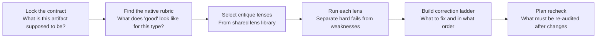

# Adaptive Quality Checking

Different artifacts fail in different ways. A screenplay's bad scene is not the same kind of problem as a bad voice guide or a bad production brief. This page explains how quality checks adapt to what you are reviewing, instead of running the same checklist for everything.

## The Core Idea

A good quality check does not apply a universal checklist. It picks the right critique lenses for the artifact in front of it.

Here is the general flow:

The shared lens library contains reusable critique perspectives. You do not have to use all of them for every review. Pick the ones that match the artifact and the risk profile.

## The Lens Library

These seven lenses are the current reusable vocabulary for shaping an audit:

| Lens | What it checks |
|---|---|
| `contract_fit` | Does the artifact match its stated contract, format, and scope? |
| `mechanics_pressure` | Does the craft hold up under scene-level execution pressure? |
| `continuity_invariants` | Are the non-negotiable throughlines intact? |
| `expression_integrity` | Is the voice, tone, and register consistent? |
| `operational_feasibility` | Can this be produced, shot, or delivered as described? |
| `delivery_handoff` | Is this ready to hand off to the next stage (writer, director, production)? |
| `boundary_risk` | Does the artifact cross any hard boundary (brand, compliance, platform policy)? |

Not every review needs all seven. Choose the minimum set that covers the risk.

## Scope Modes: How Deep to Go

Four scope levels prevent the review from being heavier than it needs to be:

- **full_audit** -- every relevant lens, full depth. Use for delivery-grade artifacts.
- **lens_targeted** -- run specific lenses only. Use when you know the risk area.
- **range_limited** -- check a bounded portion of the artifact (e.g., first three scenes).
- **recheck** -- verify that specific issues from a prior review have been resolved.

## Quality Gate vs. Rewrite Report

These two outputs serve different jobs. Use the right one.

**Use `rewrite_report` when the job is:**
- Identify which craft layer is failing (structure, dialogue, pacing, etc.)
- Prioritize rewrite moves inside story and text development
- Tell the team what to revise first and why

**Use `quality_gate_report` when the job is:**
- Run a structured audit before delivery or handoff
- Preflight non-story artifacts (voice guides, production briefs, team plans, project surfaces)
- Run a targeted recheck after changes
- Separate hard gate failures (must-fix) from weighted weaknesses (should-fix)

**The intended stack:**
1. Start with the artifact's native rubric (the one built for that output type).
2. Supplement with shared lenses from the lens library.

## Related Assets

- Workflow: [wp.quality-gate-report](../knowledge/20-workflows/wp-quality-gate-report.md)
- Rubric: [rb.quality-gate-report](../knowledge/60-rubrics/rb-quality-gate-report.md)
- Lens definitions: [references/check-lens-matrix.json](../references/check-lens-matrix.json)
