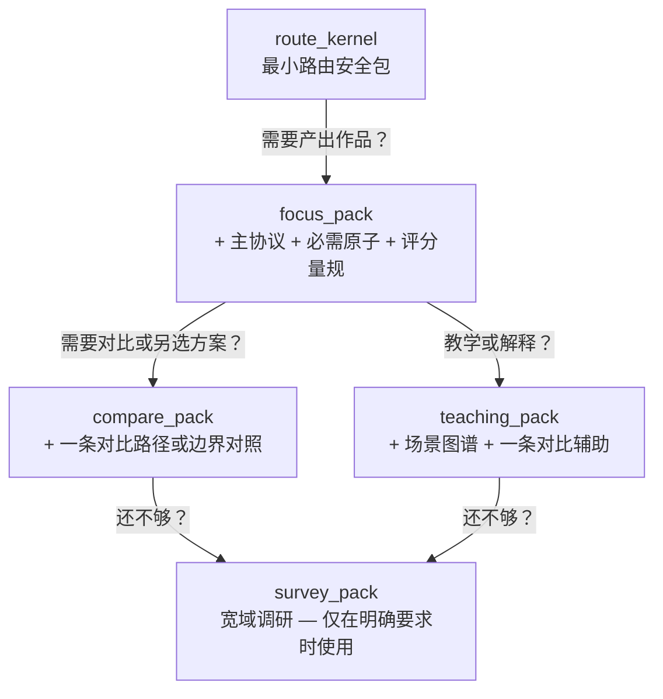

# Agent 快速参考卡

这一页帮你在不纠结、不超载的前提下，又快又稳地做出路由决策。

## 每个请求的入口：先路由，再生成

动手写任何回答之前，先把请求放到对的位置。下面五个维度，顺序很重要——每个维度会帮你收窄下一个维度的范围：

1. **创作意图是什么？** 用户是在发现、设计、草拟、打磨、诊断还是改编？这是最大的分叉口——发现型请求需要开放性问题，打磨型需要精确审查。
2. **什么媒介？** 长片、剧集、广告、互动叙事……每种媒介有自己的戏剧逻辑，一种媒介的规则不能直接套用另一种。
3. **在哪个阶段？** 构思阶段要扩展可能性，大纲阶段要结构精度，对白阶段要耳朵和潜台词。人在哪一步，决定了什么工具最趁手。
4. **要什么产出？** 从 29 种输出契约里选一个。别自创混合格式——一个清晰的产出比三个拼在一起的「全能答案」有价值得多。
5. **有什么约束？** 类型、调性、时长、受众、预算、平台、语言语域……当两个输出看起来都成立时，用约束来打破僵局。

如果请求确实模糊，只问一个问题——那个回答了就能改变路由的问题。不三个，不一张表，就一个。

当多条路径都可行时，不要替用户选，给出 `path_options` 并说明各自的代价。让用户决定，而不是你猜。

## 加载多少上下文：爬梯子

不需要整个知识库。从最底层开始，只有当上一级不够用时才往上爬。

- **route_kernel**：刚好够验证路由是否正确。导航系统，仅此而已。
- **focus_pack**：大多数请求的默认选择。一个协议、它必需的原子、一个评分量规。干净聚焦。
- **compare_pack**：当用户在权衡选项、检查边界、或问「为什么这个而不是那个」时，加一层对比。
- **teaching_pack**：当用户想理解「为什么这样做」而不是只要产出时，加上场景图谱和对比辅助。
- **survey_pack**：只有明确要求做宽域调研时才用。即使如此，也先锚定在一个已声明的背景包上。

## 什么时候停止扩展

满足以下任何一条，就不要加载更多上下文了：

- 路由已锁定，输出契约不会再变。
- 下一块上下文只是在重复已经加载的东西。
- 你的思路开始偏向「仓库里还有什么」，而不是解决实际请求。
- 你已经有了一个路由锚点、一个主要参考、一个对比或边界案例。

如果加了更多上下文答案也没变好，问题不在于上下文不够——你很可能加载了错的东西，而不是太少。

## 什么时候加载专项镜头

这些镜头很强但很窄。只在它们确实能改变结果时才加载：

- **现实透镜**：当请求涉及受众动态、平台约束、委约语境、商业模式或创作者成长模式时加载。纯技艺问题不需要。
- **表达校准包**：当产出 `voice_style_guide` 或请求中明确包含调性、语域、连续性约束时加载。
- **视觉桥接**：产出 `visual_language_pack`、`screen_to_video_brief` 或有明确的跨媒介交付需求时加载。
- **团队镜头**：仅在请求是设计协作方式时加载——不是常规的单产出生成。

## 输出纪律

- 按请求的格式产出，不做混合产物。
- 末尾附上一个简短的、基于评分量规的自检。用户需要知道哪些地方过了、哪些是边缘、下一步可能是什么。
- 如果约束中途变化导致路由或契约改变，只重新加载新约束需要的部分。不要从头再来。
