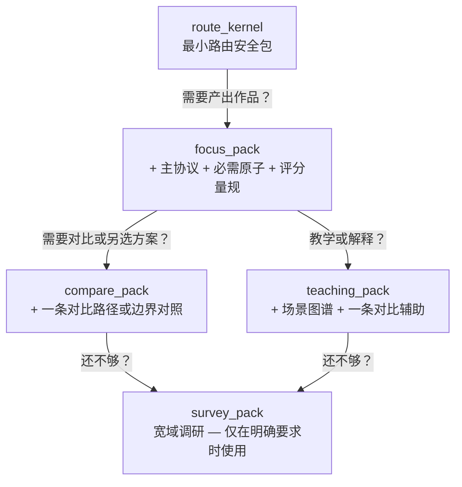

# Agent 快速参考卡

路由决策与上下文加载速查。agent 面对新请求需快定走哪路、加载量时读本文。

## 入口：先路由，再生成

动手前先定位置。五维度，顺序重要——每维收窄下维：

1. **创作意图？** 发现、设计、草拟、打磨、诊断还是改编？最大分叉——发现需开放，打磨需精确。
2. **什么媒介？** 长片、剧集、广告、互动……各有戏剧逻辑，不跨媒套用。
3. **在哪个阶段？** 构思扩可能，大纲要精度，对白要耳朵与潜台词。人在哪步定何工具。
4. **要什么产出？** 29 种输出契约选一。别自创混合——一清产出比三拼"全能答案"有价值。
5. **什么约束？** 类型、调性、时长、受众、预算、平台、语域……两输出都成立时约束破僵局。

请求模，只问一问——那答了能改路由的问。不三，不一表，就一问。

多路可行时不替选，给 `path_options` 并说各代价。用户定。

## 加载量：爬梯

不需全知识库。从底层始，仅上级不够用才上。

- **route_kernel**：刚好验路由对错。导航，仅此。
- **focus_pack**：多数请求默认。一协议、必需原子、一量规。干净。
- **compare_pack**：用户权选项、查边界、问"为何此非彼"时加层对比。
- **teaching_pack**：用户想理解"为何这样"非只要产出时，加场景图谱与对比辅助。
- **survey_pack**：仅明要宽域调研时用。即使如此，先锚声明背景包。

## 何时停扩

满足任一就不加：

- 路由已锁，输出契约不变。
- 下块上下文只复已有。
- 思路偏"库里还有什么"非解实求。
- 已有路由锚点、一主参考、一对比或边界案例。

加更多答案未好转，问题非不够——许加载错物，非太少。

## 何时加载专镜

这镜强而窄。仅实改结果时加：

- **现实透镜**：请求涉受众动态、平台约束、委约语境、商业模式或创作者成长时加。纯技艺不需。
- **表达校准包**：产出 `voice_style_guide` 或请求明含调性、语域、连续性约束时加。
- **视觉桥接**：产出 `visual_language_pack`、`screen_to_video_brief` 或有明跨媒交付需求时加。
- **团队镜头**：仅请求设计协作方式时加——非常规单产出。

## 输出纪律

- 按请求格式产，不混。
- 末附简短量规自检。用户需知哪些过、哪些边缘、下步可能。
- 约束中变致路由或契约改，只重载新约束需部。不从头来。
