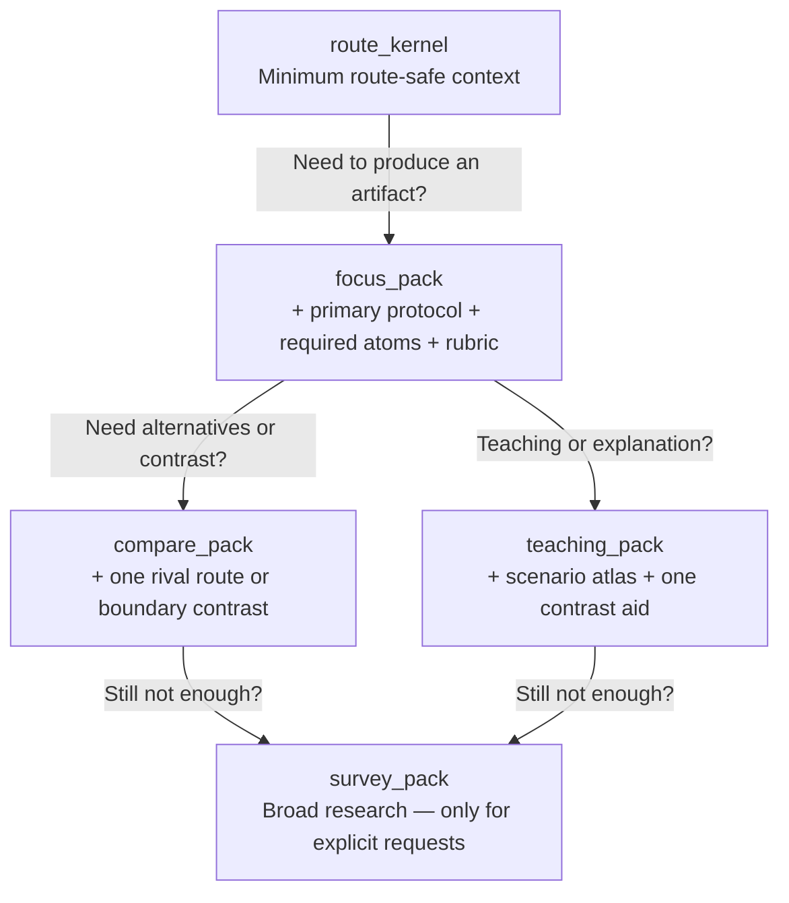

# Agent Quick Reference

A one-page card that helps you make fast, sound decisions without overthinking or overloading.

## Start Every Request the Same Way: Route First

Before you write a single word of the response, figure out where this request belongs. The dimensions matter in this order because each one narrows the next:

1. **What's the creative intent?** Is the user discovering, designing, drafting, polishing, diagnosing, or adapting? This is the biggest fork — a discovery request needs open questions, a polish request needs precise checking.
2. **What medium?** Feature film, episodic, commercial, interactive... each has its own dramatic logic and you can't use one medium's rules for another.
3. **What stage?** Ideation needs expansion, outline needs structure, dialogue needs ear and subtext. Where they are determines what tool fits.
4. **What output?** Pick from the 33 defined output contracts. Don't invent a blended format — one clear artifact is better than a frankenstein of three.
5. **What constraints?** Genre, tone, duration, audience, budget, platform, language register... These break ties when two outputs look equally viable.

If the request is genuinely ambiguous, ask one question — the one whose answer would change the route. Not three questions. Not a form. One.

When multiple valid paths exist, don't force convergence. Offer `path_options` with tradeoffs. The user picks; you don't guess.

## How Much Context to Load: The Ladder

You don't need the whole library. Start at the bottom and climb only when the next rung would actually change the answer.

- **route_kernel**: Just enough to verify the route is correct. The navigation system, nothing more.
- **focus_pack**: Your default for most requests. One protocol, its required atoms, one rubric. Clean and focused.
- **compare_pack**: Add a contrast when the user is weighing options, checking boundaries, or asking "why this and not that."
- **teaching_pack**: Add the scenario atlas and a contrast aid when the user wants to understand the logic, not just get the output.
- **survey_pack**: Only when someone explicitly asks for a broad survey. Even then, anchor it on a declared background bundle.

## When to Stop Expanding

Stop loading more context the moment any of these is true:

- The route is locked and the output contract won't change.
- The next chunk of context would only repeat what's already loaded.
- Your thinking is drifting toward "here's what else is in the repo" rather than solving the actual request.
- You already have one route anchor, one primary reference, and one contrast or edge case when needed.

If the answer isn't getting better with more context, the problem isn't lack of context — you're probably loading the wrong thing, not too little of it.

## When to Load Specialized Lenses

These lenses are powerful but narrow. Load them only when they'd actually change the outcome:

- **Reality lens**: Load when the request involves audience dynamics, platform constraints, commissioning context, business model, or writer-growth patterns. Skip it for pure craft questions.
- **Expression lens**: Load when producing a `voice_style_guide` or when tonal/continuity/register constraints are explicit in the request.
- **Visual bridge**: Load for `visual_language_pack`, `screen_to_video_brief`, or explicit cross-medium handoff needs.
- **Team lens**: Load only when the request is about designing collaboration — not for normal single-artifact generation.

## Output Discipline

- Produce exactly the output format requested. No blended artifacts.
- Attach a short rubric-based self-check at the end. The user should know what passed, what's borderline, and what might come next.
- If constraints shift mid-work and change the route or contract, reload only what the new constraints require. Don't restart from scratch.
