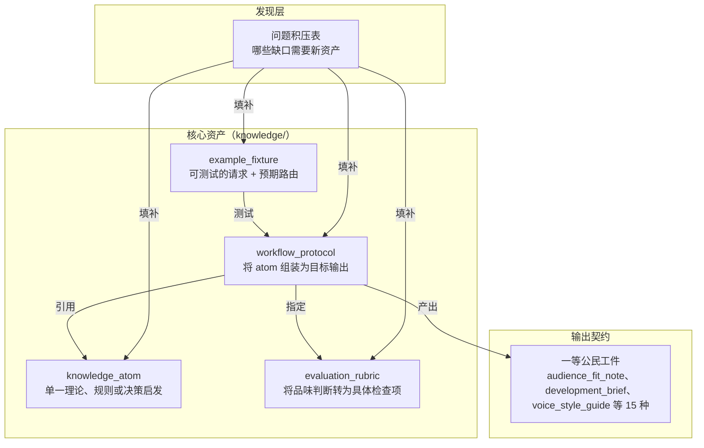

# 内容模型

本文定义仓库的知识架构。四种核心资产、一组输出契约、一个发现层，让仓库在无单一大脑的前提下保持一致性。

## 整体关系



## 文件格式

每份可复用知识是一个带 JSON frontmatter 的 Markdown 文件：

```markdown
---
{
  "id": "ka.story-goal",
  "type": "knowledge_atom",
  "title": "故事目标"
}
---
# 人读正文
```

JSON frontmatter 是机器契约——助手扫描它来查找、加载和关联资产。Markdown 正文面向人。两者必须一致。

这个格式刻意保持简单：GitHub 上直接可读、人工好编辑、工具链无重依赖。

## 四种核心资产

### knowledge_atom

最小的可复用创作单元。一个 atom 只装一件事：一个理论、一个策略、一条规则、一种失败模式或一个决策启发。

atom 要够具体以驱动单次判断，也够窄以避免拖入无关内容。如果涵盖多个松散关联的概念，拆开。

### workflow_protocol

稳定的创作工作流契约。定义多个 atom 如何组合成一个目标输出。回答四问：输入什么、输出什么、分几步、何时停止。

路由确定后，protocol 是 agent 行为的主驱动。每个 protocol 必须声明其依赖的 rubric 和关联的 atom。

### evaluation_rubric

将定性品味判断转为可执行的审查维度和硬失败规则。好的 rubric 让修改决策具体而非模糊。必须紧凑到能在回答阶段直接用作自查清单。

### example_fixture

编码一个真实用户请求及其应走的路由。fixture 服务路由选择测试，而非仅测内容生成。每个 fixture 必须声明预期路由。

## 输出契约

这些是 protocol 可产出的结构化输出。列在这里让 agent 能直接推理它们，而非将逻辑藏在散文中。

| 契约 | 用途 |
|---|---|
| `audience_fit_note` | 内容与受众需求匹配 |
| `development_brief` | 先定开发策略再写正文 |
| `learning_path` | 将编剧成长结构为可检查的练习路径 |
| `path_options` | 展示多条有效创作方向 |
| `boundary_map` | 区分硬边界与可谈判空间 |
| `scope_correction` | 收窄过度泛化的主张而不删除它 |
| `pattern_reference_pack` | 为特定任务打包参考模式 |
| `story_memory_checkpoint` | 保存故事状态并做版本化 |
| `voice_style_guide` | 使声音、语域和连续性明确 |
| `visual_language_pack` | 处理跨语言镜头词汇 |
| `screen_to_video_brief` | 桥接剧本写作与下游制作 |
| `team_workflow_blueprint` | 建模多 agent 协作结构 |
| `expert_subagent_cast` | 定义有界专家子代理 |
| `quality_gate_report` | 交接前运行自适应自检 |
| `research_background_map` | 将大范围理论请求映射到可调用的 atom |

## 资产规则

- 每项资产必须有稳定的 `id`。
- 每个被引用的 `id` 必须解析到存在的资产。
- 每个 protocol 必须声明其 rubric 和关联 atom。
- 每个 fixture 必须声明其预期路由。
- 如果资产无法自动验证，继续拆分直到可以。
- 如果产出依赖受众、行业、历史或作者成长约束，编入 protocol 和 fixture 约束，而非散落在临时提示文本中。
- 如果规则不是普遍真理，编入其前提、边界条件或 rival route。
- 如果挑战削弱了某个主张但没摧毁其核心，优先 scope_correction，而非删除它或翻转成新的绝对论断。
- 参考样本用于教学时，配上失败对照组和 non-dogma 注释。
- 请求复杂时，明确决定加载多少上下文，而非默认扩大内容包。

## 发现层：问题积压表

新增资产前，先查问题积压表。它将缺口导向四种具体结果：新 atom、新 protocol、新 rubric 或新 fixture。

- [面向助手的 intake](./socratic-question-backlog-en.md)
- [面向实践者的 intake](./socratic-question-backlog-zh.md)

## 配套文档

- [现实透镜](./reality-lenses-zh.md)
- [认识论立场](./epistemic-stance-zh.md)
- [探索与评审](./exploration-vs-review.md)
- [场景图谱](./scenario-atlas-zh.md)
- [上下文加载策略](./context-loading-policy-zh.md)
- [语义治理](./shared/semantic-governance-zh.md)
- [渐进披露策略](./progressive-disclosure-policy-zh.md)
