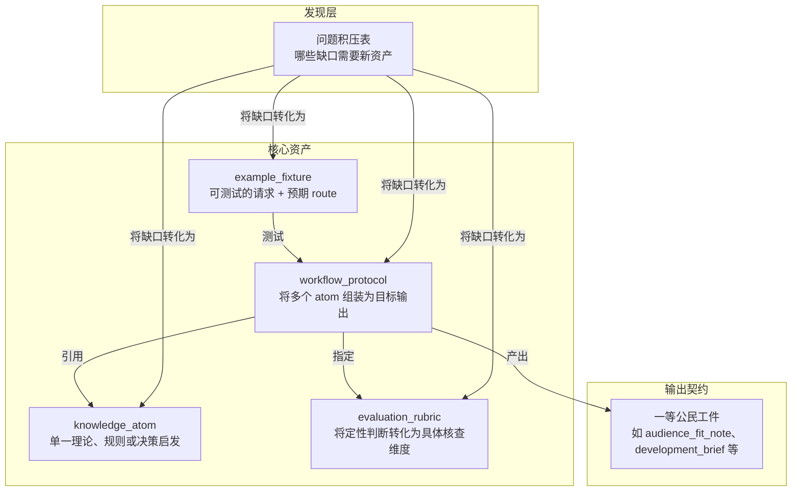

# 内容模型

定义仓库知识架构——可复用剧本知识如何组织为文件、AI 助手如何加载、仓库如何在无单一大脑前提下保持一致。需理解四种核心资产类型、输出契约或发现层运作方式时读本文。

四种核心资产、一组输出契约、一个发现层：



## 文件格式

每可复用知识单元是带 JSON frontmatter 的 Markdown：

```markdown
---
{
  "id": "ka.story-goal",
  "type": "knowledge_atom",
  "title": "故事目标",
  "...": "..."
}
---
# Human-readable body
```

JSON frontmatter 是机器契约——助手查、加载、关联资产用。Markdown 正文面向人。两者须一致。

优势：GitHub 直读、人易编辑、Python 工具链依赖轻、助手可扫描 frontmatter 选择性加载。

## 资产类型

### knowledge_atom

最小可复用写作单元。一 atom 只表一事：理论、策略、规则、失败模式或决策启发。

atom 应够具体以驱动明确判断，也够窄以避免牵无关负担。若涉多松散概念，拆分。

### workflow_protocol

稳定创作工作流契约。定义多 atom 如何组合为目标输出。答四问：输入、输出、步骤、停时。

route 定后，protocol 是 AI 行为主驱动层。每 protocol 须声明其依赖 rubric 与 linked atom。

### evaluation_rubric

将定性品味判断转可执行审查维度与硬失败规则。好 rubric 让改策具体非模糊。须够紧凑，应答阶段直用自查清单。

### example_fixture

编码真实请求及应走 route。fixture 服务回归检查——测 route 选择力，非仅内容生成。每 fixture 须声明预期 route。

## 输出契约

一等公民工件类型，protocol 产出结构化输出。列此让助手直推这些逻辑，非藏于泛文。

- `audience_fit_note`
- `development_brief`
- `learning_path`
- `research_background_map`
- `path_options`
- `boundary_map`
- `scope_correction`
- `pattern_reference_pack`
- `story_memory_checkpoint`
- `voice_style_guide`
- `visual_language_pack`
- `screen_to_video_brief`
- `team_workflow_blueprint`
- `expert_subagent_cast`
- `quality_gate_report`

这些契约使助手能明推受众需求、委托语境与作者成长，非模糊处理。使仓库能表多路径并存、边界逻辑与对照教学，非假所有好答案能压为一规范工件。

各契约职责：
- 表达契约：让声音、语域与连续性成为明确质量维度。
- 视觉语言契约：理顺跨语言镜头词汇。
- 屏幕到视频桥接层：分离剧本写作与下游制作语法。
- 团队契约：建模多智能体协作。
- 专家阵容契约：允许有限范围专家子代理，不膨胀为永久团队。
- 质量关卡契约：实现自适应自审。
- 研究背景契约：让剧本理论需求成为一等公民。

注册表驱动背景包存 `references/` 非 `knowledge/`。非第五种核心资产，是机器可检查文档包，映广研究领域至可调 atom、输出与加载规则。

## 资产规则

- 每资产须有稳定 `id`。
- 每被链 `id` 须解至现存资产。
- 每 protocol 须声明 rubrics 与 linked atoms。
- 每 fixture 须声明预期 route。
- 资产无法自验则继拆至可验。
- 输出依赖受众、行业、历史或作者成长约束时，编入 protocol 与 fixture 约束，不写临时提示。
- 规则非普遍真理时，编其前提、边界条件或 rival route，不限藏文。
- 挑战削弱 claim 但未毁核心，优先 scope correction，不删 claim 或翻新绝对论。
- 参考样本用于教学，须配失败对照与 non-dogma 注记，避仓库悄将样本当模板。
- 请求复杂，明决加载量，不默扩内容包。

内容模型优化有界加载、route 稳定性与可重复输出行为。也为高质量分歧留空间——仓库需 rival path、待定边界与反例驱修正。

## 发现层：问题积压表

增资产前先查问题积压表。发现层，非唯一真源。将缺口导向四明确结果：新 atom、新 protocol、新 rubric、新 fixture 或案例说明。

- [面向助手的 intake](./socratic-question-backlog-en.md)
- [面向实践者的 intake](./socratic-question-backlog-zh.md)

## 配套文档

与以下配读可得全图：

- [现实透镜](./reality-lenses-zh.md)
- [认识论立场](./epistemic-stance-zh.md)
- [探索与审查](./exploration-vs-review.md)
- [场景图谱](./scenario-atlas-zh.md)
- [上下文加载策略](./context-loading-policy-zh.md)
- [语义治理](./shared/semantic-governance-zh.md)
- [渐进披露策略](./progressive-disclosure-policy-zh.md)
- [私有参考蒸馏策略](./shared/private-reference-distillation-policy-zh.md)
