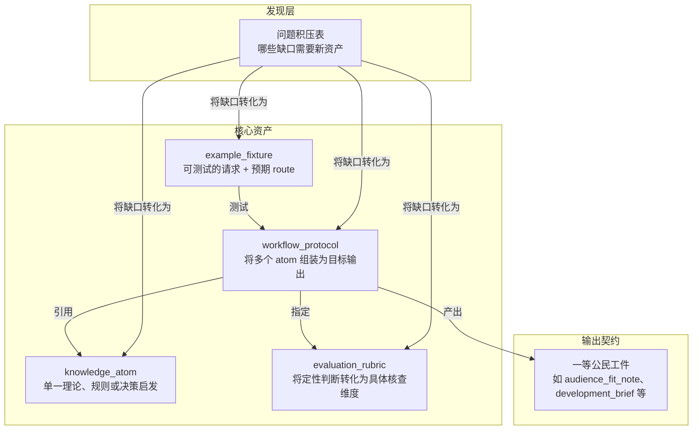

# 内容模型

这是本仓库的知识架构——可复用的剧本写作知识如何组织成文件，AI 助手如何加载它们，以及整个仓库在不依赖单一大脑记忆所有内容的情况下如何保持一致性。

模型由四种核心资产、一组输出契约和一个发现层组成。整体关系如下：



## 文件格式

每个可复用的知识单元是一个带 JSON frontmatter 的 Markdown 文件：

```markdown
---
{
  "id": "ka.story-goal",
  "type": "knowledge_atom",
  "title": "故事目标",
  "...": "..."
}
---
# Human-readable body
```

JSON frontmatter 是面向机器的契约——助手通过它查找、加载和关联资产。Markdown 正文是面向人类的说明。两者必须保持一致。

这种格式简洁实用：可在 GitHub 上直接阅读、人类易于编辑、对 Python 工具链依赖轻、助手可按需扫描 frontmatter 选择性加载。

## 资产类型

### knowledge_atom

最小的可复用写作知识单元。一个 atom 只表达一件事：一个理论、策略、规则、失败模式或决策启发。

atom 应足够具体，能驱动一次明确的判断；也应足够窄，避免一加载就把无关的负担带进答案。如果一个 atom 涉及多个松散关联的概念，请拆分它。

### workflow_protocol

稳定的创作工作流契约。protocol 定义多个 atom 如何组合成一个目标输出。它回答四个问题：输入是什么、输出是什么、经过哪些步骤、何时停止。

一旦 route 被选中，protocol 就是 AI 行为的主要驱动层。每个 protocol 必须声明其依赖的 rubric 和 linked atom。

### evaluation_rubric

把定性的品味判断转化为可执行的审查维度和硬性失败规则。好的 rubric 让修改决策更具体，而不是停留在模糊评价。它应足够紧凑，在回答阶段直接作为自查清单使用。

### example_fixture

编码一个真实的用户请求以及它应走的 route。fixture 服务于回归检查——它测试的是 route 选择能力，而不仅仅是内容生成。每个 fixture 必须声明其预期 route。

## 输出契约

这些是一等公民的工件类型，是 protocol 产出的结构化输出。把它们列在这里，是为了让助手能直接推理这些逻辑，而不是把逻辑藏在泛泛的文字中。

- `audience_fit_note`
- `development_brief`
- `learning_path`
- `research_background_map`
- `path_options`
- `boundary_map`
- `scope_correction`
- `pattern_reference_pack`
- `story_memory_checkpoint`
- `voice_style_guide`
- `visual_language_pack`
- `screen_to_video_brief`
- `team_workflow_blueprint`
- `expert_subagent_cast`
- `quality_gate_report`

这些契约存在的目的，是让助手能明确推理受众需求、委托语境和作者成长，而不是把这些因素模糊处理。它们让仓库能够表达多路径并存、边界逻辑和对照式教学，而不是假装所有好答案都能压缩成一个规范工件。

每个契约有各自的职责：表达契约让 voice、register 和连续性成为明确的质量维度；视觉语言契约处理跨语言镜头词汇；屏幕到视频桥接层把剧本写作和下游制作语法分开；团队契约建模多智能体协作；专家阵容契约允许有限范围的专家 subagent 而不膨胀成永久团队；质量关卡契约实现自适应自我审查；研究背景契约让广泛的剧作理论需求成为一等公民。

注册表驱动的背景包存放在 `references/` 目录而非 `knowledge/` 目录。它们不是第五种核心资产类型，而是机器可检查的文档包，将广泛的研究领域映射到可调用的 atom、输出和加载规则。

## 资产规则

- 每个资产必须有稳定的 `id`。
- 每个被链接的 `id` 必须能解析到现有资产。
- 每个 protocol 必须声明其 rubrics 和 linked atoms。
- 每个 fixture 必须声明其预期 route。
- 如果某个资产无法自动验证，就继续拆分直到可以验证为止。
- 如果某个输出依赖受众、行业、历史或作者成长约束，应把这种依赖编码进 protocol 和 fixture 约束，而不是写成临时提示词。
- 如果某条规则不是普遍真理，应编码它的前提、边界条件或 rival route，而不是把限制藏在文字里。
- 如果一次挑战削弱了一条 claim 但没有摧毁其核心，应优先做 scope correction，而不是删除 claim 或将其翻转成新的绝对论。
- 如果参考样本用于教学，应同时配一个失败对照和一个 non-dogma 注记，避免仓库把样本悄悄当成模板。
- 如果请求很复杂，应明确决定要加载多少上下文，而不是无声地扩大内容包。

内容模型优化的是有边界的加载、route 稳定性和可重复的输出行为。它也保留高质量分歧的空间——仓库需要存放 rival path、待定边界和反例驱动的修正。

## 发现层：问题积压表

在新增资产之前，先查看问题积压表。它是发现层，不是唯一真实来源。它的作用是把缺口导向四种明确结果之一：新 atom、新 protocol、新 rubric、新 fixture 或案例说明。

- [面向助手的 intake](./socratic-question-backlog-en.md)
- [面向实践者的 intake](./socratic-question-backlog.md)

## 配套文档

将本文与以下文档配套阅读，可获得完整图景：

- [现实透镜](./reality-lenses-zh.md)
- [认识论立场](./epistemic-stance-zh.md)
- [探索与审查](./exploration-vs-review.md)
- [场景图谱](./scenario-atlas-zh.md)
- [上下文加载策略](./context-loading-policy-zh.md)
- [语义治理](./shared/semantic-governance-zh.md)
- [渐进披露策略](./progressive-disclosure-policy-zh.md)
- [私有参考蒸馏策略](./shared/private-reference-distillation-policy-zh.md)
