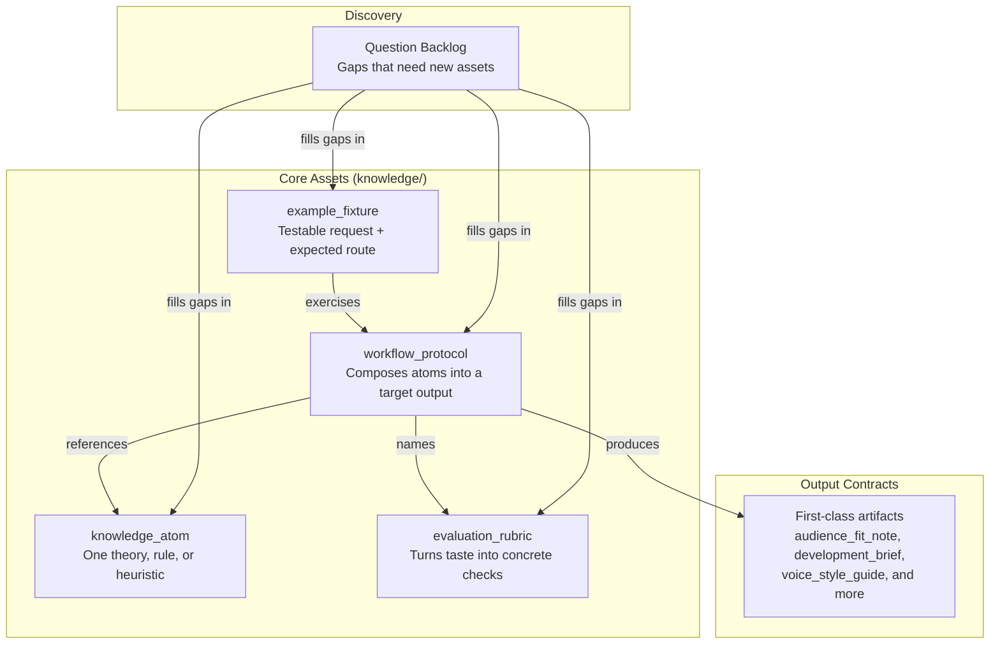

# Content Model

This is the repository's knowledge architecture. Four asset types, one set of output contracts, and one discovery layer keep the repo coherent without one person holding everything in their head.

## How It All Fits



## File Format

Every reusable piece of knowledge is a Markdown file with JSON frontmatter:

```markdown
---
{
  "id": "ka.story-goal",
  "type": "knowledge_atom",
  "title": "Story Goal"
}
---
# Human-readable body
```

The JSON frontmatter is the machine contract -- agents scan it to find, load, and link assets. The Markdown body is for humans. Keep them aligned.

This format is intentionally simple: readable on GitHub, easy to edit by hand, no heavy tooling dependencies.

## The Four Asset Types

### knowledge_atom

The smallest reusable craft unit. One atom = one thing: a theory, a tactic, a rule, a failure mode, or a decision heuristic.

An atom must be specific enough to drive a single decision, and narrow enough that loading it doesn't drag in unrelated ideas. If it covers multiple loosely-connected concepts, split it.

### workflow_protocol

A stable creative workflow contract. A protocol defines how atoms compose into a target output. It answers: what comes in, what comes out, what steps happen, and when to stop.

Once a route is selected, the protocol drives agent behavior. Every protocol names its rubrics and linked atoms.

### evaluation_rubric

Converts qualitative taste into review dimensions and hard-fail rules. A good rubric makes rewrite decisions concrete. It must be compact enough to serve as a self-check at answer time.

### example_fixture

Encodes a realistic user request and the route it should follow. Fixtures test route selection, not just content generation. Each fixture names its expected route.

## Output Contracts

These are the structured outputs protocols can produce. They are listed here so agents can reason about them directly instead of burying the logic in prose.

| Contract | Purpose |
|---|---|
| `audience_fit_note` | Match content to audience demand |
| `development_brief` | Define development strategy before writing |
| `learning_path` | Structure writer growth as checkable exercises |
| `path_options` | Present multiple valid creative directions |
| `boundary_map` | Separate hard boundaries from negotiable space |
| `scope_correction` | Narrow an overbroad claim without deleting it |
| `pattern_reference_pack` | Bundle reference patterns for a specific task |
| `story_memory_checkpoint` | Save and version story state |
| `voice_style_guide` | Make voice, register, and continuity explicit |
| `visual_language_pack` | Handle cross-lingual shot vocabulary |
| `screen_to_video_brief` | Bridge screenplay to downstream production |
| `team_workflow_blueprint` | Model multi-agent collaboration structure |
| `expert_subagent_cast` | Define bounded specialist subagents |
| `quality_gate_report` | Run adaptive self-checks before handoff |
| `context_loading_plan` | Decide how much surrounding context to load per task |
| `subagent_dispatch_plan` | Schedule and hand off work across subagents |
| `project_surface_map` | Track canonical truth and runtime mirrors |
| `research_background_map` | Map broad theory requests to callable atoms |

## Asset Rules

- Every asset has a stable `id`.
- Every linked `id` resolves to an existing asset.
- Every protocol names its rubrics and linked atoms.
- Every fixture names its expected route.
- If an asset can't be validated automatically, split it until it can.
- If an output depends on audience, industry, history, or writer-development constraints, encode that in protocol and fixture constraints, not in ad-hoc prompt text.
- If a rule is not universal, encode its assumptions, boundary conditions, or rival routes.
- If a challenge weakens a claim without killing its core, prefer `scope_correction` over deleting it or flipping to a new absolute.
- If a reference sample is used for teaching, pair it with a failure contrast and a non-dogma note.
- If a request is complex, decide how much context to load explicitly instead of silently widening the bundle.

## Discovery: The Question Backlog

Before creating new assets, check the question backlog. It turns gaps into one of four concrete outcomes: a new atom, a new protocol, a new rubric, or a new fixture.

- [Agent-facing intake](./socratic-question-backlog-en.md)
- [Practitioner-facing intake](./socratic-question-backlog-zh.md)

## Related

- [Reality Lenses](./reality-lenses.md)
- [Epistemic Stance](./epistemic-stance.md)
- [Exploration vs Review](./exploration-vs-review.md)
- [Scenario Atlas](./scenario-atlas.md)
- [Context Loading Policy](./context-loading-policy.md)
- [Semantic Governance](./shared/semantic-governance.md)
- [Progressive Disclosure Policy](./progressive-disclosure-policy.md)
- [How to Create a Screenplay Research (EN)](./how-to-create-a-screenplay-research.md)
- [How to Create a Screenplay Research (ZH)](./how-to-create-a-screenplay-research-zh.md)
