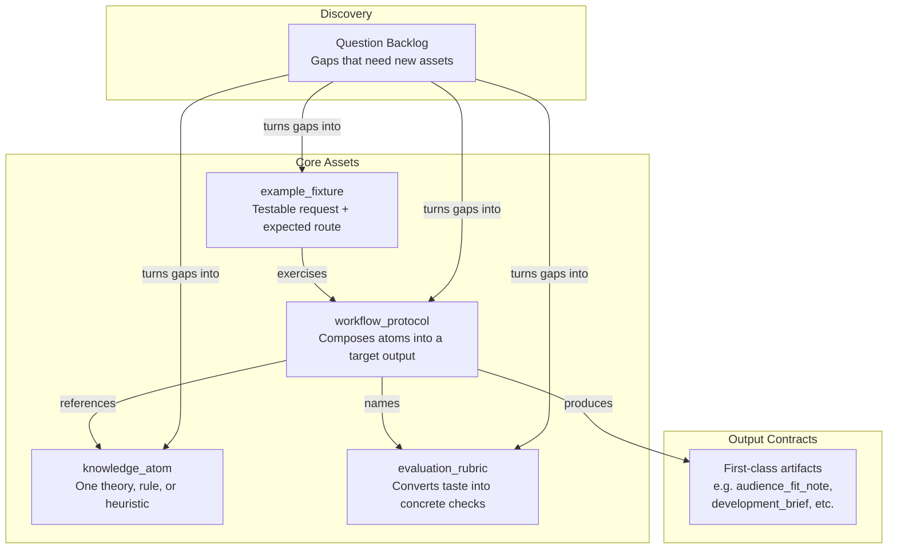

# Content Model

This is the repository's knowledge architecture -- how reusable screenplay craft lives in files, how agents load it, and how the repo stays coherent without needing one person to hold everything in their head.

The model has four building blocks, a set of output contracts, and a discovery layer for what's missing. Here is how they fit together:



## File Format

Every reusable piece of knowledge is a Markdown file with JSON frontmatter:

```markdown
---
{
  "id": "ka.story-goal",
  "type": "knowledge_atom",
  "title": "Story Goal",
  ...
}
---
# Human-readable body
```

The JSON frontmatter is the machine contract -- agents use it to find, load, and link assets. The Markdown body is the human explanation. Keep both aligned.

This format is intentionally simple: readable on GitHub, easy to edit by hand, no heavy dependencies for Python tooling, and agents can load selectively by scanning frontmatter.

## Asset Types

### knowledge_atom

The smallest reusable craft unit. One atom captures one thing: a theory, a tactic, a rule, a failure mode, or a decision heuristic.

An atom should be specific enough to drive a single decision, and narrow enough that loading it does not drag unrelated baggage into the answer. If an atom covers multiple loosely connected ideas, split it.

### workflow_protocol

A stable creative workflow contract. A protocol defines how multiple atoms compose into a target output. It answers: what comes in, what comes out, what steps happen, and when to stop.

Once a route is selected, the protocol is the main driver of agent behavior. Each protocol must name the rubrics and atoms it depends on.

### evaluation_rubric

Converts qualitative taste into review dimensions and hard-fail rules. A good rubric makes rewrite decisions concrete instead of vague. It should be compact enough to serve as a self-check at answer time.

### example_fixture

Encodes a realistic user request and the route it should follow. Fixtures exist for regression checks -- they exercise route selection, not just content generation. Each fixture must name its expected route.

## Output Contracts

These are first-class artifact types that the repo can produce. They are not core asset types -- they are the structured outputs that protocols produce. Listing them here means agents can reason about them directly instead of burying the logic in prose.

- `audience_fit_note`
- `development_brief`
- `learning_path`
- `research_background_map`
- `path_options`
- `boundary_map`
- `scope_correction`
- `pattern_reference_pack`
- `context_loading_plan`
- `story_memory_checkpoint`
- `voice_style_guide`
- `visual_language_pack`
- `screen_to_video_brief`
- `team_workflow_blueprint`
- `expert_subagent_cast`
- `subagent_dispatch_plan`
- `project_surface_map`
- `quality_gate_report`

These contracts exist so agents can reason explicitly about audience demand, commissioning context, and writer capability growth. They let the repo express multiple valid paths, boundary logic, and contrastive teaching, rather than defaulting to one canonical artifact for every answer.

Each contract has a specific job: the expression contract makes voice, register, and continuity explicit; the visual-language contract handles cross-lingual shot vocabulary; the screen-to-video bridge separates screenplay writing from downstream production syntax; the team contract models multi-agent collaboration; the expert-cast contract enables bounded specialist subagents without permanent team bloat; the dispatch-plan contract makes scheduling and handoffs visible; the project-surface contract handles canonical truth and runtime mirrors; the quality-gate contract enables adaptive self-checks; and the research-background contract makes broad screenplay theory requests first-class.

Registry-backed background bundles live in `references/` rather than `knowledge/`. They are machine-checkable doc bundles that map broad research surfaces to callable atoms, outputs, and loading rules.

## Asset Rules

- Every asset must have a stable `id`.
- Every linked `id` must resolve to an existing asset.
- Every protocol must name its rubrics and linked atoms.
- Every fixture must name its expected route.
- If an asset cannot be validated automatically, split it until it can.
- If an output depends on audience, industry, history, or writer-development constraints, encode that dependency in the protocol and fixture constraints, not in ad-hoc prompt text.
- If a rule is not universal, encode its assumptions, boundary conditions, or rival routes instead of hiding the limitation in prose.
- If a challenge weakens a claim without killing its core, prefer a scope correction over deleting the claim or flipping it into a new absolute.
- If a reference sample is used for teaching, pair it with a failure contrast and a non-dogma note so the repo does not silently turn samples into templates.
- If a request is complex, decide how much surrounding context to load explicitly instead of silently widening the bundle.

The content model is optimized for bounded loading, route stability, and repeatable output behavior. It also preserves productive disagreement by giving the repository places to store rival paths, deferred boundaries, and counterexample-driven corrections.

## Discovery: The Question Backlog

Before creating new assets, check the question backlog. It is a discovery layer, not a source of truth. Its job is to turn gaps into one of four concrete outcomes: a new atom, a new protocol, a new rubric, or a new fixture or case note.

- [Agent-facing intake](./socratic-question-backlog-en.md)
- [Practitioner-facing intake](./socratic-question-backlog-zh.md)

## Related Documents

Pair this file with the following docs for the full picture:

- [Reality Lenses](./reality-lenses.md)
- [Epistemic Stance](./epistemic-stance.md)
- [Exploration vs Review](./exploration-vs-review.md)
- [Scenario Atlas](./scenario-atlas.md)
- [Context Loading Policy](./context-loading-policy.md)
- [Semantic Governance](./shared/semantic-governance.md)
- [Progressive Disclosure Policy](./progressive-disclosure-policy.md)
- [Private Reference Distillation Policy](./shared/private-reference-distillation-policy.md)
- [How to Create a Screenplay Research (EN)](./how-to-create-a-screenplay-research.md)
- [How to Create a Screenplay Research (ZH)](./how-to-create-a-screenplay-research-zh.md)
