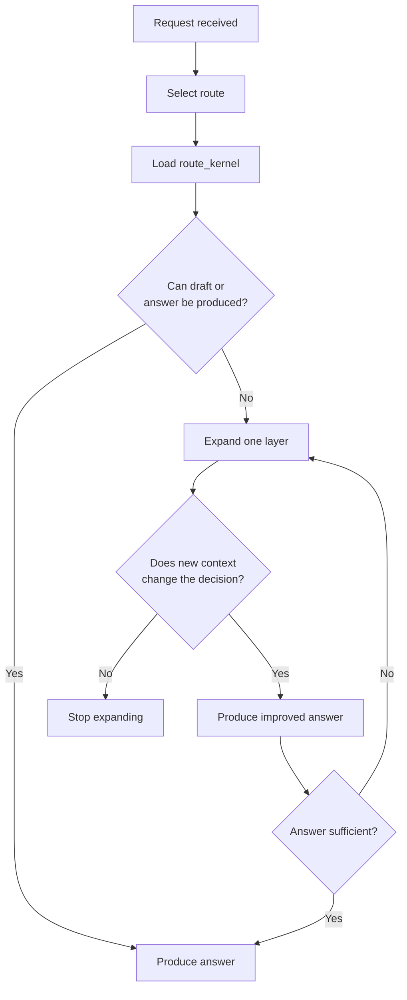
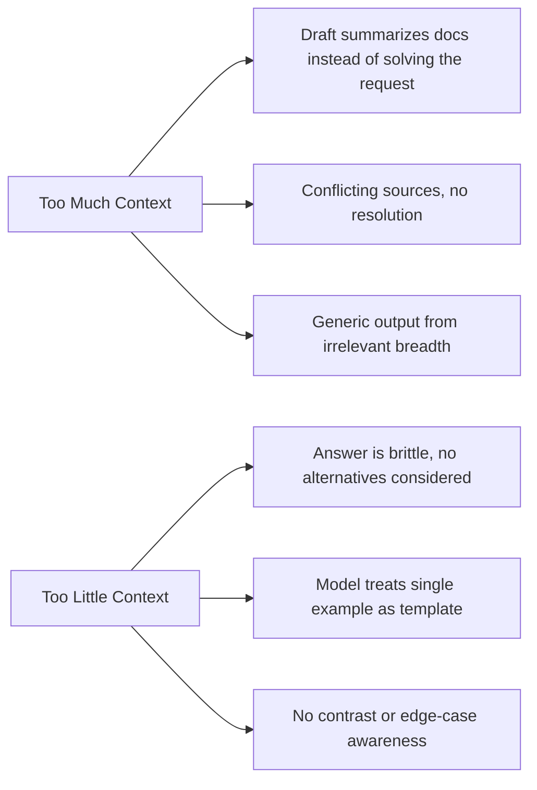

# Context Loading Policy

A route tells the agent *what* to do. This policy tells it *how much context to load* before doing it.

The goal is simple: give the agent enough to produce a correct, creative answer, but not so much that it starts summarizing the repo instead of solving the request.

## Principles

- **Route first, load second.** Never choose context before you know the route.
- **Start small.** Begin with the bare minimum and expand only when necessary.
- **Expand one layer at a time.** Do not jump from a route to the whole library.
- **Prefer contrast over volume.** One strong counterexample teaches more than ten similar ones.
- **Stop early.** The moment additional context stops changing the answer, stop loading.

Context is a tool, not a reward. Loading more does not make the answer better -- it makes the context window smaller for what matters.

## Loading Modes

There are five modes, each a bounded bundle of references. Start at the top and expand only when justified.

| Mode | When To Use | What It Loads | Stop When |
|---|---|---|---|
| `route_kernel` | Any request that needs a correct route | Root skill, routing policy, selected output contract, selected route entry | Route and output contract are fixed |
| `focus_pack` | Single artifact generation or narrow rewrite | Primary protocol, primary rubric, linked atoms, one scenario card or case note | Additional context would only restate the same decision |
| `compare_pack` | Alternatives, counter-paths, boundary questions, why-not analysis | Focus pack + one rival route or boundary reference | The added material confirms the chosen route or changes the tradeoff analysis |
| `teaching_pack` | Explanation, learning, comparison, reference guidance | Scenario atlas, one primary reference pack, one contrastive example, one relevant case note | The explanation can name the pattern, the failure mode, and the boundary |
| `survey_pack` | Explicit broad survey or research-style request | One declared background bundle, scenario atlas, multiple representative packs, relevant case studies | The survey has enough breadth to map the space |

### Quick Trigger Guide

A user's language signals which mode is needed:

| User Says | Suggested Mode |
|---|---|
| "compare", "alternative", "counter-path", "why not", "boundary", "scope" | `compare_pack` |
| "teach", "explain", "why this works", "show me examples" | `teaching_pack` |
| "survey", "all known", "full taxonomy", "deep mapping" | `survey_pack` |
| "rewrite", "diagnose", "fix this draft" | `focus_pack`, sometimes `compare_pack` |
| "resume later", "story handoff", "continuity checkpoint" | `focus_pack` + smallest checkpoint bundle |
| "audience fit", "development brief", "learning path" | `focus_pack` + relevant reality lens |
| "voice style", "character voice", "IP continuity", "make it feel alive" | `focus_pack` + expression lens |
| "multi-agent workflow", "writers' room design", "team topology" | `focus_pack` + relevant team lens |
| "self-check", "quality gate", "preflight", "acceptance review" | `focus_pack` + smallest quality-gating bundle |

## When To Expand

Expand to the next layer only when a new layer can still change the answer:

- The request is hybrid or multi-scenario
- The user asks for alternatives, counterexamples, or why one path is better
- The draft shows route mismatch, failure layers, or boundary confusion
- The task requires audience fit, commissioning fit, or learning paths
- The task needs voice calibration, register control, or continuity protection
- The task needs team-mode selection, handoff design, or review-gate design
- The user explicitly asks for teaching, comparison, or a broader survey

## When To Stop

Stop loading as soon as one of these is true:

- The route is stable and the output contract is fixed
- The new material only repeats what is already loaded
- The next asset would add detail but not change the decision
- The bundle already contains one route anchor, one supporting reference, and one edge-case or contrast

If the request is narrow, stop at the first bundle that can support a correct answer. If the request is broad, stop at the smallest bundle that can still explain the tradeoffs.

## How To Spot Context Problems

**Symptoms of overload:**
- The answer starts summarizing docs instead of solving the request
- Multiple loaded sources conflict but the response does not resolve the conflict
- The response becomes generic because the model spent its budget on irrelevant breadth

**Symptoms of underload:**
- The response becomes brittle because it loaded only one favorite example and no contrast
- The model begins treating reference fragments as templates instead of reference paths
- The response misses obvious alternatives or boundary cases

## Balance Rules

- Keep one primary route pack in view at all times
- Add at most one adjacent comparison pack unless the user explicitly asks for a wider survey
- For writing guidance, prefer one strong example plus one weak contrast over many similar examples
- For boundary questions, prefer `boundary_map` or `scope_correction` before loading general craft material
- For scenario questions, prefer the scenario atlas and taxonomy before loading many examples
- For broad theory questions, prefer one background bundle before loading multiple adjacent docs
- For pause/resume or continuity pressure, prefer a story memory checkpoint before widening the bundle
- For fit or strategy questions, prefer the relevant reality-lens atoms before broad craft expansion
- For voice or liveness questions, prefer the smallest expression-lens bundle before loading large reference packs

## Recovery

If the load has drifted too wide:
- Drop back to `route_kernel`
- Reload only the primary protocol, rubric, and one supporting reference
- Ask a clarifying question if the route is still ambiguous

If the load is too thin:
- Reload the missing decision layer
- Add one contrastive reference or one boundary note
- Do not solve under-loading by loading the entire repo

If continuity pressure is the only reason the bundle keeps growing:
- Create or refresh a story memory checkpoint instead of widening again

## Deterministic Load Order

To maximize LLM prompt cache hit rate across requests, atoms within each loading pack MUST be emitted in a canonical, deterministic order. This ensures that any two requests loading the same set of atoms produce identical prompt prefix bytes, enabling cache sharing even across different routes.

**Canonical emission sequence per pack:**

1. Protocol body (the selected `wp.*.md` file)
2. Primary rubric (the first `rb.*` listed in the protocol's `rubrics`)
3. Linked atoms — in **alphabetical order** by `ka.*` ID
4. Optional lenses — in **alphabetical order** by lens ID
5. Adjunct bundles — if triggered, loaded after the main pack, in alphabetical order by bundle ID

**Supporting invariants** (enforced by CI and schema):

- All atom `mediums` and `stages` arrays are in schema-enum order
- All protocol `linked_atoms` arrays are alphabetically sorted
- Script-generated output (indexes, manifests) uses `sorted()` for deterministic serialization

**Rationale:** Claude prompt caching operates on prefix matching. When the same bytes appear at the same position in the prompt across multiple requests, subsequent requests get cache hits for the entire shared prefix. Non-deterministic ordering (e.g., loading `ka.scene-function` before `ka.conflict-pressure` in one request but after in another) breaks prefix matching and causes cache misses even when the same knowledge atoms are loaded.

## Operating Summary

The right bundle is the smallest bundle that still lets the model explain the route, justify the decision, and generate a useful answer.
