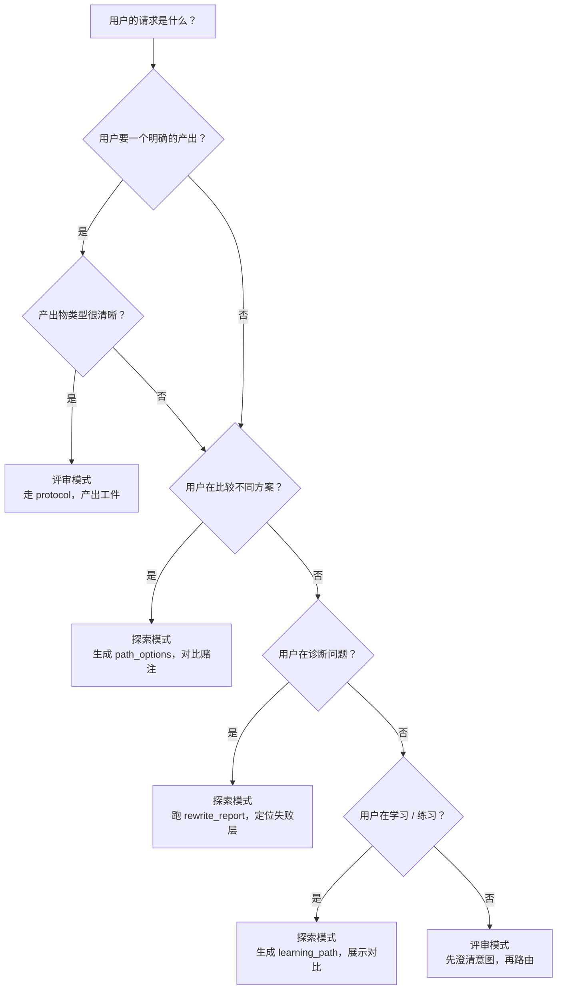

# 探索与评审

创作分成两个阶段。保持它们独立。

1. **探索** -- 拓宽选项空间，大胆尝试，暂停软性合规检查。
2. **评审** -- 对存活方案把关、筛选、验证，对照真实约束。

这是一条排序规则。探索不暂停硬性安全边界。评审不该在探索开始前就掐死它。

## 决策：我现在该探索还是评审？

## 探索怎么做

做这些：
- 生成多条有效路径（`path_options`），每条有真正不同的赌注，而非换皮变体
- 用 `rewrite_report` 定位哪个手艺层在失效，为什么
- 构建 `learning_path`，用具体的、可检查的周练习
- 绘制 `boundary_map`，区分真正不可触碰的 vs. 可谈判的

别做这些：
- 别生成三个换说法但本质一样的版本
- 别把"避免做决定"包装成"探索"
- 别在探索阶段就直接套上评审才该用的硬约束

## 评审怎么做

做这些：
- 先跑产出物原生评分表，再叠共享 lens
- 区分硬关卡失败和加权弱项
- 构建带优先级的修正阶梯
- 输出 `quality_gate_report`，带具体复查计划

别做这些：
- 用户只要一场戏的反馈，你别跑全量审查
- 别让一堆小风格建议淹没硬失败
- 别漏掉复查计划——没有后续的"评审"只是意见，不是质量控制

## 核心规则

不确定用哪个模式时，问自己："我在产出一个答案，还是在映射一个可能性空间？"

一个答案 = 评审。映射可能性 = 探索。

结构化参考在知识原子中：
- [`ka.exploration-review-separation`](../knowledge/10-foundations/ka-exploration-review-separation.md)

该原子包含机器可读的决策规则、反模式和提示原语。
