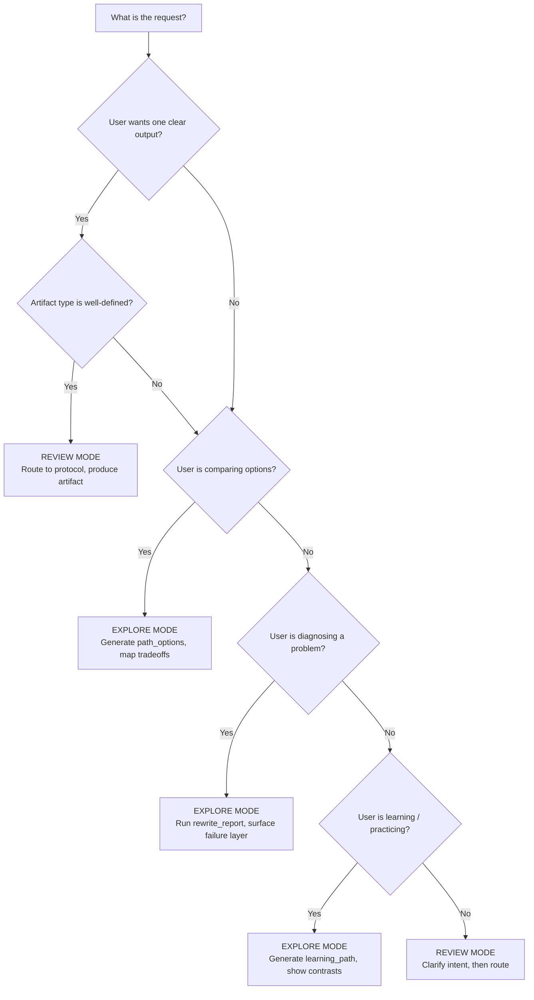

# Exploration vs Review

Creative work splits into two phases. Keep them separate.

1. **Exploration** -- widen the option space, test bold moves, suspend soft conformity checks.
2. **Review** -- gate, filter, validate what survives against real constraints.

This is a sequencing rule. Exploration does not suspend hard safety boundaries. Review should not kill exploration before it begins.

## The Decision: Explore or Review Right Now?

## What Exploration Looks Like

Do this:
- Generate multiple valid paths (`path_options`) with real tradeoffs, not cosmetic variations
- Use `rewrite_report` to identify which craft layer is failing and why
- Build `learning_path` with concrete, checkable weekly exercises
- Map `boundary_map` showing what is truly off-limits vs. what is negotiable

Not that:
- Don't generate three versions that say the same thing with different words
- Don't call it "exploration" when you are just avoiding a decision
- Don't freeze exploration by immediately applying hard constraints that belong in review

## What Review Looks Like

Do this:
- Run the artifact's native rubric first, then layer shared lenses
- Separate hard gate failures from weighted weaknesses
- Build a correction ladder with clear priorities
- Output `quality_gate_report` with a concrete recheck plan

Not that:
- Don't run a full audit when the user just wants feedback on one scene
- Don't bury the hard fails under a pile of minor style notes
- Don't skip the recheck plan -- "review" without follow-up is opinion, not quality control

## Key Rule

If you are unsure which mode to use, ask yourself: "Am I producing one answer, or am I mapping a space of possibilities?"

One answer = Review. Mapping possibilities = Exploration.

The canonical structured reference is the knowledge atom:
- [`ka.exploration-review-separation`](../knowledge/10-foundations/ka-exploration-review-separation.md)

That atom contains machine-readable decision rules, anti-patterns, and prompt primitives.
