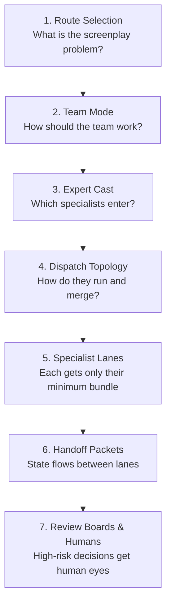

# Multi-Agent Screenplay Architecture

Not every screenplay request needs multiple agents. But when it does, this repository has a structured way to decide how they collaborate -- instead of making it up on the fly.

## Design Position

This repo does not use one universal "writer super-agent" model. Public multi-agent systems and real-world screenplay teams both point the same way:
- Use a central orchestrator when ownership and synthesis matter
- Use specialists when different decisions need different skill bundles
- Use handoffs instead of full-context sharing
- Use human intervention at the costly or ambiguous gates

## The Layer Stack

## Team Modes

| Mode | Best for | Shape | Why |
|---|---|---|---|
| `feature_dev_pod` | Feature development, adaptation-heavy rewrite, pitch-to-outline planning | Hybrid room | Needs strong synthesis, rewrite mandates, producer/director alignment |
| `showrunner_room` | Season-engine work, episode breaking, television development | Supervisor tree | Room can parallelize, but showrunner synthesis must remain central |
| `animation_story_trust` | Animation where story and visual iteration co-evolve | Hybrid room | Story logic, visual storytelling, and production feasibility need explicit loops |
| `brand_content_studio` | Commercial, branded film, shortform campaign work | Hybrid room | Creative, brand, and distribution concerns run in parallel without collapsing into hard sell |
| `interactive_branch_lab` | Game narrative and branching interactive design | Supervisor tree | Narrative, state, and QA loops stay distinct while a narrative director controls scope |
| `franchise_continuity_board` | Existing IP, canon-sensitive adaptation, persona continuity risk | Review board | Canon anchors and identity risks need explicit guardianship before innovation expands |

## Handoff Rule

Every specialist returns a bounded handoff packet, not an essay dump. Minimum fields:

- `working_hypothesis` -- what this lane concluded
- `loaded_bundle_ids` -- what context was loaded to reach that conclusion
- `open_questions` -- what remains unresolved
- `confidence` -- how sure is this specialist?
- `recommended_next_agent` -- who should receive this packet?
- `needs_human_review` -- flag for human attention

## Subagent Rule

Not every team-mode question needs a concrete subagent deployment. Use these three outputs to choose the right level of detail:

| Output | When to use |
|---|---|
| `team_workflow_blueprint` | Choose the collaboration family (the "who" and "how") |
| `expert_subagent_cast` | Choose the participating specialists (the "who exactly") |
| `subagent_dispatch_plan` | Specify live scheduling, review order, and merge logic (the "when exactly") |

This keeps mode, cast, and topology from collapsing into one overstuffed answer.

## Human-in-the-Loop Rule

Human review should not be everywhere. It appears where silent drift is expensive:
- IP continuity and franchise identity
- Audience-fit disputes
- Commissioning or brand-boundary conflicts
- Scope correction at major strategic claims
- Final delivery approval

## Why This Fits the Repo

This design extends what already exists:
- Route-first orchestration stays intact
- Bounded loading remains per role and per step
- Anti-dogma outputs remain important (not all team modes converge the same way)
- Team mode becomes another explicit layer instead of an invisible assumption

## Public Sources Behind This Layer

- WGA room guidance: [Showrunners' Guide to 2023 MBA Writers' Room Provisions](https://www.wga.org/contracts/contracts/mba/showrunners-guide-to-2023-mba-writers-room-provisions) and [Screenwriters Handbook](https://www.wga.org/members/employment-resources/screenwriters-handbook)
- Animation workflows: [Disney Animation Story Artist](https://www.disneyanimation.com/team/story-artist/), [Pixar - Pete Docter](https://www.pixar.com/docter)
- Branded content: [Digitas branded content arm](https://www.digitas.com/en-us/pressroom/newfront-founder-digitas-unveils-branded-content-arm)
- Interactive narrative: [inklewriter](https://www.inklestudios.com/inklewriter/), [ChoiceScript testing](https://www.choiceofgames.com/make-your-own-games/testing-choicescript-games-automatically/)
- Multi-agent orchestration: [OpenAI Practical Guide](https://cdn.openai.com/business-guides-and-resources/a-practical-guide-to-building-agents.pdf), [LangGraph Supervisor](https://langchain-ai.github.io/langgraphjs/reference/modules/langgraph-supervisor.html), [OpenAI Swarm](https://github.com/openai/swarm), [CrewAI human-in-the-loop](https://docs.crewai.com/en/learn/human-in-the-loop), [oh-my-openagent](https://github.com/code-yeongyu/oh-my-opencode)
