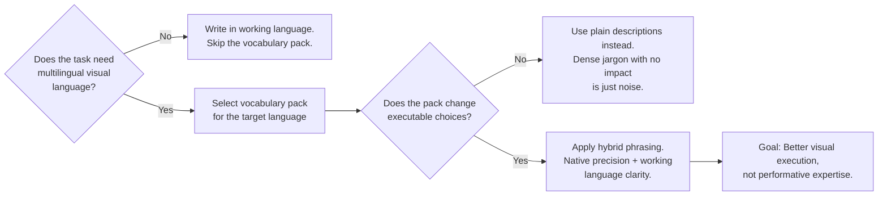

# Multilingual Visual Language Layer

Screenwriting increasingly sits next to previz, video generation, global collaboration, and prompt-driven production. Many failures happen not because the scene is wrong, but because visual intent gets translated into weak, generic, or culturally flat language.

This layer helps a screenplay agent use controlled visual-language packs when the job requires cross-cultural visual communication. It is not a license to stuff foreign terms into every answer.

## When to Use This Layer

Use multilingual visual language only when one of these is true:
- The user explicitly asks for multilingual film vocabulary
- The task involves cross-language collaboration (e.g., a Chinese production team reading an English script)
- The scene must be translated into a visual brief for downstream generation or previz
- The aesthetic contract is hard to express cleanly in the current working language alone

## When NOT to Use It

Do not reach for this layer when:
- The task is a normal English-language scene or outline
- The user has not asked for international terminology
- The aesthetic can be described clearly in the working language

## The Layer Design

**Key rule for every vocabulary pack:** If a term does not change an executable decision (shot choice, lighting, blocking, mood), do not use it. Dense jargon without production impact is noise.

## Languages Currently Anchored

Each language contributes specific densities where it is strongest:

| Language | Strongest contribution |
|---|---|
| Chinese | High-density shot, lighting, and production shorthand |
| Japanese | Aesthetic and pause-oriented concepts for atmosphere and restraint |
| Korean | Melodrama, music-video cadence, and contemporary screen energy |
| Russian | Montage theory, poetic duration, documentary gravity, melancholy textures |
| Spanish | Warm visuality, magical realism, emotionally charged scene color |

## How to Use a Vocabulary Pack

1. Pull only the terms relevant to the current scene or shot. Do not dump the full vocabulary table.
2. Prefer hybrid phrasing: use the precise foreign term where it carries unique meaning, but surround it with working-language context.
3. Apply the pack as a controlled reference: it should sharpen descriptions, not replace them.

This is not about faking cultural expertise. It is about having the right word for a visual concept when the working language does not carry it with the same density.

## Related Assets

- Knowledge atom: `ka.multilingual-visual-vocabulary`
- Knowledge atom: `ka.cultural-aesthetic-registers`
- Knowledge atom: `ka.prompt-delegation-levels`
- Workflow: `wp.visual-language-pack`
- Rubric: `rb.visual-language-pack`
