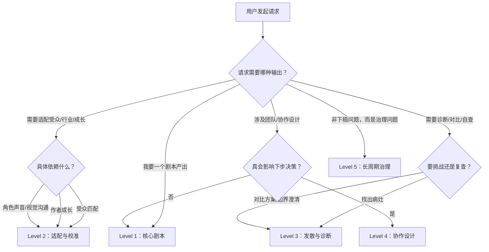

# 渐进式披露策略

本文定义仓库能力的逐级披露规则。它的核心问题是：**"你现在该向用户暴露多少能力？"** 而非"该加载多少上下文？"

原则：不让一个简单请求被全套高级功能一次性淹没。

## 披露流程

## 五个披露等级

### Level 1：核心剧本
用户只要一个创作输出就停在这里。

`logline` `premise` `synopsis` `treatment` `beat_sheet` `outline` `scene_card` `scene_draft` `dialogue_polish` `commercial_script` `interactive_branch_map`

### Level 2：适配与校准
仅当下一步真的依赖受众、行业、作者成长、角色声音或多语言视觉沟通时才升级。

`audience_fit_note` `development_brief` `learning_path` `voice_style_guide` `visual_language_pack` `screen_to_video_brief`

### Level 3：发散与诊断
仅当用户真的要挑战、对比、自检、复查或边界澄清时才进入。

`rewrite_report` `quality_gate_report` `path_options` `boundary_map` `scope_correction` `pattern_reference_pack`

### Level 4：协作设计
仅当 workflow 结构、专家组合或审查顺序会实质改变下步决策时才进入。

`team_workflow_blueprint` `expert_subagent_cast`

### Level 5：长周期治理
仅当问题已不是"下稿怎么写"，而是"单一真相源在哪、运行态在哪、handoff 和 export 怎么分层"时才升级。

`project_surface_map`（内部输出）

## 升级规则

- 不因为仓库"有这项能力"就默认升级。
- 只有当不升级会导致下一步出错、危险或收益极低时，才升级。
- 让你写一场戏，别跳去推荐 team_workflow_blueprint。
- 让你出稿，别硬塞 reference_pack。

## 降级规则

当你升过头了：
- 收回到真正改变下一步的最小产出物。
- 最多保留一个相邻的额外视角。
- 向用户解释为什么更大的 surface 不必要。

渐进式披露不是体验优化。它是防止上下文膨胀、防止协作表演化、防止用户学习成本上升的质量控制。
