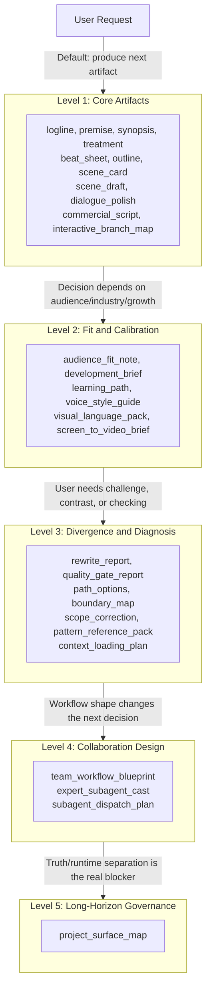

# Progressive Disclosure Policy

This repository should not expose every advanced route on the first pass of an ordinary screenplay request. The design goal is progressive power, not permanent maximalism.

If you show everything upfront, the agent wastes context on irrelevant routes and the user gets choice fatigue. Show only what the current problem needs.

## The Disclosure Ladder

Assets are organized in five levels. Start at the bottom. Promote only when the next decision would otherwise be wrong, unsafe, or low-yield.

### Level 1: Core Screenplay Artifacts

- `logline`, `premise`, `synopsis`, `treatment`
- `beat_sheet`, `outline`, `scene_card`, `scene_draft`
- `dialogue_polish`, `commercial_script`, `interactive_branch_map`

Use these first when the user simply needs the next creative artifact.

### Level 2: Fit and Calibration Lenses

- `audience_fit_note`, `development_brief`, `learning_path`
- `voice_style_guide`, `visual_language_pack`, `screen_to_video_brief`

Escalate here when the next decision depends on audience, industry, growth, voice, multilingual visual communication, or downstream bridge constraints.

### Level 3: Divergence and Diagnosis Surfaces

- `rewrite_report`, `quality_gate_report`
- `path_options`, `boundary_map`, `scope_correction`
- `pattern_reference_pack`, `context_loading_plan`

Escalate here when the user is no longer just asking for the next artifact, but for challenge, contrast, checking, comparison, or route logic.

### Level 4: Collaboration Design

- `team_workflow_blueprint`, `expert_subagent_cast`, `subagent_dispatch_plan`

Escalate here only when workflow shape, specialist composition, or review ordering changes the next decision materially.

### Level 5: Long-Horizon Project Governance

- `project_surface_map`

Escalate here when the real problem is not the next draft, but where truth lives, where runtime artifacts live, and how long-running packets, reviews, and exports should be separated.

## Promotion Rules

- Do not jump to a higher level because the repo has an asset for it.
- Promote only when the next decision would otherwise be wrong, unsafe, or low-yield.
- If the user asks for one artifact, do not answer with a team blueprint unless workflow structure is the real blocker.
- If the user asks for a draft, do not force a contrastive pack unless comparison is the real job.

## Demotion Rules

If a route has escalated too far:
- Collapse back to the smallest artifact that changes the next decision.
- Keep one adjacent lens at most.
- Report why the larger surface was unnecessary.

Progressive disclosure is not a UI nicety. It is a quality-control mechanism against context bloat, performative orchestration, and avoidable user friction.
