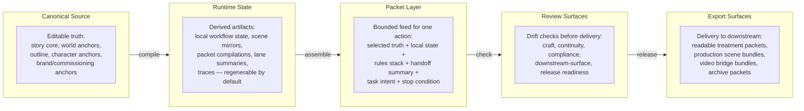

# Project Surface Architecture

This layer answers: where does creative truth live, and how does work move across surfaces?

The repo was already strong on route selection, bounded loading, output contracts, team modes, and subagent casts. What it needed was a clearer model for long-horizon project surfaces:
- Where humans should edit
- What runtime artifacts should be compiled
- How packets should be assembled and inspected
- Where review and export should live

## The Surface Layers

### Canonical Source

Artifacts that humans or planning agents edit directly:
- Story core, world anchors, outline truth
- Character anchors, brand or commissioning anchors
- Continuity anchors

These are the source of truth. Everything else derives from them.

### Runtime State

Derived artifacts used to run the current phase. These should be regenerable by default:
- Local workflow state, scene or chapter state mirrors
- Packet compilation outputs, lane summaries
- Telemetry and traces

If you lose runtime state, you should be able to rebuild it from canonical source.

### Packet Layer

The bounded packet that feeds one concrete action. Think of it as a single meal, not the whole grocery store:
- Selected truth sources, selected local state
- Rules stack, handoff summary
- Current task intent, stop condition

### Review Surfaces

Artifacts used for checking drift before delivery:
- Craft review, continuity review, compliance review
- Downstream-surface review, release or export readiness

### Export Surfaces

Artifacts prepared for downstream humans or tools:
- Readable treatment or script packets
- Production-facing scene or sequence bundles
- Video-bridge or previz bundles
- Archive or sync-safe packets

## Design Rule

Project surfaces should stay explicit, not implicit. If the repo eventually grows a runtime planner, it should inherit these layers rather than invent new ones later.

## Linked Assets

- Workflow: [wp.project-surface-map](../knowledge/20-workflows/wp-project-surface-map.md)
- Rubric: [rb.project-surface-map](../knowledge/60-rubrics/rb-project-surface-map.md)
