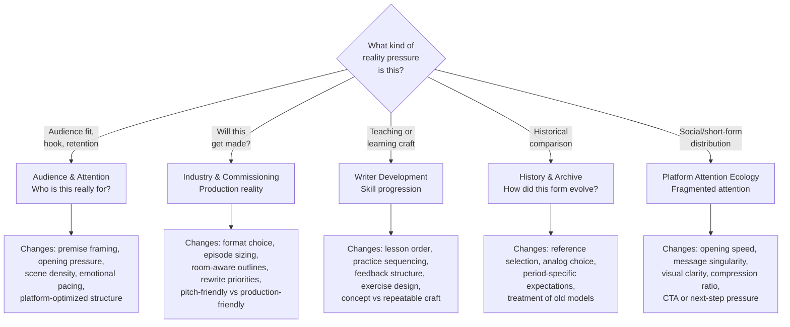

# Reality Lenses

Great screenwriting does not happen in a vacuum. A script needs to survive contact with audiences, production pipelines, commissioning decisions, and real-world attention patterns. These lenses model those external forces.

Use a reality lens when the question is not just "write the story" but "write a story that can survive the real world."

## The Lens Decision Tree

## The Five Lenses

### 1. Audience and Attention

Load this when the request involves audience fit, hook strength, retention, platform behavior, or "who is this really for?"

**What it changes:**
- Premise framing (who will care about this?)
- Opening pressure (how fast does it need to hook?)
- Scene density and emotional pacing
- Whether the script should optimize for streaming, social, broadcast, theatrical, or interactive use

**What it prevents:**
- Writing for a generic viewer who does not exist
- Assuming attention works the same way on every platform
- Treating pace, hook, and payoff as medium-neutral

### 2. Industry and Commissioning

Load this when the request involves staffing, development rooms, writer-producer constraints, platform briefs, deliverables, or "what will actually get made?"

**What it changes:**
- Format choice (feature vs series vs short)
- Episode sizing and room-aware outline depth
- Rewrite priorities based on production stage
- Whether the output should be production-friendly or pitch-friendly

**What it prevents:**
- Generating elegant text that ignores commissioning logic
- Hiding labor assumptions inside the story layer
- Treating AI output as if it were already industry-ready

### 3. Writer Development

Load this when the request is about learning screenwriting, teaching screenwriting, onboarding a junior writer, building skill progression, or diagnosing a growth bottleneck.

**What it changes:**
- Lesson order (scene function before structure, not the reverse)
- Practice sequencing (exercises that build repeatable skill)
- Feedback structure (diagnostic, not just evaluative)
- The distinction between understanding a concept and executing it reliably

**What it prevents:**
- Flattening screenwriting into a single "prompt and output" event
- Teaching structure before the learner can observe scene function
- Confusing taste with trainable skill

### 4. History and Archive

Load this when the request needs historical comparison, lineage, archival research, or "how did this form evolve?"

**What it changes:**
- Which references get selected (period-appropriate, not just canonical)
- How analogies are chosen
- Period-specific expectations (what was technically possible then?)
- How the system treats older models, formats, and production assumptions

**What it prevents:**
- Treating current practice as timeless
- Copying classic structures without noticing what industrial conditions made them work
- Using history as decoration instead of evidence

### 5. Platform Attention Ecology

Load this when the script is meant for social video, short drama, branded content, trailers, or any format where attention is fragmented and distribution is platform-shaped.

**What it changes:**
- Opening speed (how fast does value arrive?)
- Message singularity (one clear takeaway per unit)
- Visual clarity (readable on small screens)
- Compression ratio (how much story per second)
- CTA or next-step pressure

**What it prevents:**
- Writing a feature-film opening for a 15-second slot
- Assuming one script shape works across every surface
- Burying the core message under extra plot

## When to Load These Lenses

Use a reality lens whenever the user asks for one of these:
- Audience research or genre positioning
- Platform adaptation or reformatting
- Industry-facing development notes
- Curriculum or training design
- Rewrite diagnosis involving market fit, fatigue, or "this does not feel current"
- Historical comparison or research

If the user request is purely internal craft generation (writing a scene, polishing dialogue), load only the lenses that directly change the work. Do not attach all five by default.

## Decisions These Lenses Influence

- Whether a premise is strong enough to develop
- Which medium is the right container for the story
- How much information the first scene needs to carry
- Whether the story should optimize for retention, prestige, conversion, or participation
- How much room the format allows for character work versus forward motion
- Whether a rewrite should focus on craft, audience fit, or production fit first
- Whether a learning path should train concept, scene, or rewrite skill first

## Inference Policy

Some claims in this repository are source-backed signals. Others are inferences from those signals.

**Examples:**
- "Streaming and social platforms now dominate attention" is a source-backed signal.
- "Scripts need stronger opening compression on short-form surfaces" is an inference from that signal.
- "Writers need staged practice loops" is an inference from education sources, not a verbatim claim.

When using a reality lens, be able to say which part is source-backed and which part is an operational inference. This keeps the lens honest and the advice actionable.
