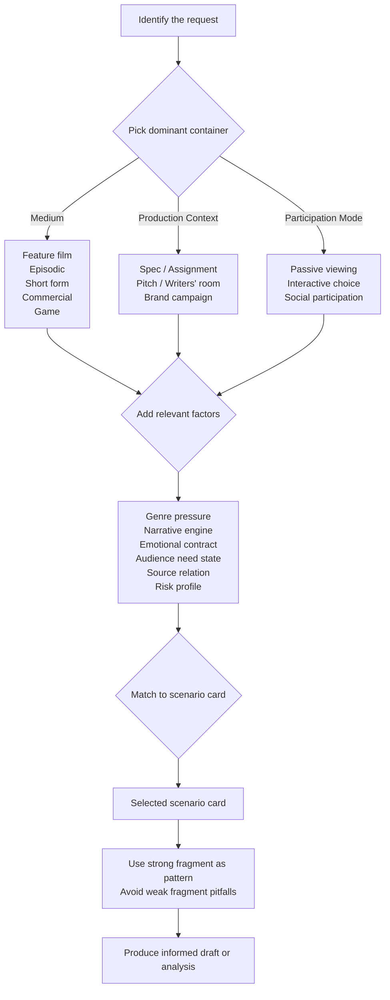

# Scenario Atlas

This atlas classifies screenplay situations by creative factors, not by genre labels. The goal is operational: help an agent identify what kind of screenplay problem it faces, choose the right route, and find the right comparison pattern.

Machine-readable registry: [`../references/scenario-taxonomy.json`](../references/scenario-taxonomy.json)

## How To Use This Atlas

1. Identify the dominant container first: medium, production context, or participation mode.
2. Add only the factors that change the route or the evaluation.
3. Keep multiple scenarios visible if the brief is still open.
4. Use the reference fragment as a success pattern, not a template to copy.
5. If the scenario is hybrid, combine cards rather than forcing a single label.

## Factor Stack

These factors describe the creative shape of any request. A specific combination points to a scenario card below.

| Factor | What It Captures |
|---|---|
| `medium` | What the work is for (feature, episodic, game, commercial, interactive) |
| `format_pressure` | What deliverable shape is needed (premise, beat sheet, scene draft, treatment) |
| `audience_need_state` | What the audience is trying to get (escape, clarity, thrill, warmth, agency) |
| `narrative_engine` | What keeps the story moving (goal-obstacle, mystery-reveal, escalation, relationship-turn) |
| `emotional_contract` | What emotional promise the work makes (awe, fear, warmth, fun, intimacy) |
| `production_context` | What industrial condition shapes the request (spec, assignment, pitch, rewrite) |
| `participation_mode` | How the audience participates (passive, interactive, social) |
| `business_goal` | What the project is meant to achieve (release, conversion, brand lift, pilot development) |
| `genre_pressure` | What genre promise is active (genre conventions that shape expectations) |
| `source_relation` | How the work relates to source material (original, adaptation, franchise) |
| `collaboration_mode` | How the work is being developed (solo, writers' room, committee review) |
| `risk_profile` | How constrained the scenario is (spec, assignment, greenlight pitch) |

## Scenario Cards

Each card gives a signature factor stack, a strong fragment that demonstrates the pattern, a weak fragment that shows the pitfall, and a non-dogma note so you know when to break the rules.

### 1. Feature Film, Original Launch

- **Signature:** `feature_film + premise + goal_obstacle + release + spec`
- **Use when:** an original long-form concept needs a durable central engine.
- **Strong fragment:** "He keeps the fire map in his jacket and walks back into the warehouse after the city declares the collapse contained."
- **Why it works:** gives the protagonist a concrete object, external pressure, and a visible risk.
- **Weak fragment:** "A man has a problem, learns something, and goes home changed."
- **Why it fails:** states theme without a dramatic mechanism.
- **Non-dogma note:** a chamber piece or mood-led film can still work by different rules.

### 2. Episodic Pilot Engine

- **Signature:** `episodic + outline + procedural_loop + trust + pilot_development`
- **Use when:** a series needs a repeatable engine that can generate episodes.
- **Strong fragment:** "Every Monday the mediator opens the rooftop clinic waiting list while the building's power fails again."
- **Why it works:** makes the weekly pressure source legible.
- **Weak fragment:** "The show has interesting people who can have new problems every week."
- **Why it fails:** promises variety without a system.
- **Non-dogma note:** some series should be cumulative rather than repetitive.

### 3. Procedural Case-of-the-Week

- **Signature:** `episodic + beat_sheet + procedural_loop + clarity + writers_room`
- **Use when:** each episode must close cleanly but still feed the larger show.
- **Strong fragment:** "The body is solved by dawn, but the final clue points to a clerk who never appears on camera."
- **Why it works:** gives closure and a tail.
- **Weak fragment:** "There is a mystery and then the team solves it in a satisfying way."
- **Why it fails:** describes effect instead of mechanism.
- **Non-dogma note:** a procedural can still be lyrical or political.

### 4. Short Drama Hook Sprint

- **Signature:** `short_drama + scene_draft + escalation_chain + thrill + assignment`
- **Use when:** the first beat has to hook immediately.
- **Strong fragment:** "She reads the message, smiles once, deletes it, and opens the door anyway."
- **Why it works:** the hook arrives immediately and the reversal is visible.
- **Weak fragment:** "The episode slowly introduces the characters and eventually something surprising happens."
- **Why it fails:** spends too long warming up.
- **Non-dogma note:** some short dramas win through atmosphere rather than twist density.

### 5. Animation World Rule

- **Signature:** `animation + premise + identity_reveal + awe + proof_of_concept`
- **Use when:** a world rule must create both play and conflict.
- **Strong fragment:** "By sunrise, any lie left in the village becomes a visible stain on the speaker's shadow."
- **Why it works:** the rule creates visual storytelling and social pressure.
- **Weak fragment:** "The world is imaginative and full of colorful characters."
- **Why it fails:** describes style but not a dramatic system.
- **Non-dogma note:** animation can also work by realism or restraint.

### 6. Thriller Reveal Chain

- **Signature:** `feature_film + outline + mystery_reveal + fear + spec`
- **Use when:** the story must keep the audience revising hypotheses.
- **Strong fragment:** "The key he stole at noon opens a room that no one in the building admits exists."
- **Why it works:** gives a concrete mystery object and hidden space.
- **Weak fragment:** "The story is tense and keeps you guessing until the end."
- **Why it fails:** names the effect, not the chain.
- **Non-dogma note:** some thrillers are tension-first rather than puzzle-first.

### 7. Romance Recognition

- **Signature:** `feature_film + beat_sheet + relationship_turn + warmth + rewrite`
- **Use when:** mutual recognition, not just attraction, should drive the arc.
- **Strong fragment:** "He corrects her joke in public, then repeats it exactly the way she meant it when the room empties."
- **Why it works:** turns friction into recognition without losing voice.
- **Weak fragment:** "They fall in love after a series of cute moments."
- **Why it fails:** compresses the arc into a generic summary.
- **Non-dogma note:** romance can also be slow burn, mismatch, or irony-led.

### 8. Comedy Setup and Payoff

- **Signature:** `episodic + scene_draft + satirical_mirror + fun + writers_room`
- **Use when:** setup and payoff need to happen inside a small beat window.
- **Strong fragment:** "He prints the apology memo, hands it to the wrong boss, and accidentally gets promoted for honesty."
- **Why it works:** the setup is concrete and the payoff reverses status.
- **Weak fragment:** "The scene has jokes and everyone is funny."
- **Why it fails:** describes tone instead of comic mechanics.
- **Non-dogma note:** comedy can also be deadpan or character-bound.

### 9. Prestige Ambiguity

- **Signature:** `feature_film + treatment + ensemble_pressure + prestige + greenlight_pitch`
- **Use when:** ambiguity is part of the payoff, not a defect.
- **Strong fragment:** "At the dinner table nobody says the word 'war', but every plate is cleared by someone who no longer belongs there."
- **Why it works:** preserves ambiguity while still giving the scene a dramatic action.
- **Weak fragment:** "The story is subtle and meaningful, and the audience should think about it afterward."
- **Why it fails:** relies on prestige language without charge.
- **Non-dogma note:** ambiguity still needs legible causality and pressure.

### 10. Commercial Single Message

- **Signature:** `commercial + commercial_script + goal_obstacle + conversion + brand_campaign`
- **Use when:** the script must create one message, one behavior, one reason to act.
- **Strong fragment:** "One sip, one switch: the commuter finishes his sentence without rubbing his eyes for the first time all day."
- **Why it works:** the benefit is visible in a single action.
- **Weak fragment:** "Our product has many great features and a friendly brand voice."
- **Why it fails:** becomes a feature dump.
- **Non-dogma note:** some campaigns need emotional brand building instead of immediate conversion.

### 11. Branded Film Identity Story

- **Signature:** `branded_film + treatment + relationship_turn + brand_lift + brand_campaign`
- **Use when:** brand value should emerge through story, not slogan.
- **Strong fragment:** "She drives through the flood tunnel not to escape the storm, but to arrive with the tools to rebuild the street."
- **Why it works:** the brand value is dramatized through action.
- **Weak fragment:** "The brand stands for resilience, innovation, and caring about people."
- **Why it fails:** announces the value without making it felt.
- **Non-dogma note:** a branded film can be quiet, funny, or documentary-like.

### 12. Shortform Social Hook

- **Signature:** `shortform_video + scene_draft + escalation_chain + conversion + assignment`
- **Use when:** the first second matters more than exposition.
- **Strong fragment:** "She holds the broken blender to camera, presses one button, and the kitchen goes quiet instead of loud."
- **Why it works:** the proof arrives before explanation.
- **Weak fragment:** "Let me tell you about a product that could improve your routine."
- **Why it fails:** spends the hook budget on setup.
- **Non-dogma note:** some short-form pieces win through intrigue or charisma instead of utility.

### 13. Game Narrative Quest Loop

- **Signature:** `game_narrative + outline + quest_loop + agency + proof_of_concept`
- **Use when:** the story must create repeatable play loops and story consequences.
- **Strong fragment:** "Each relic you return changes the camp, but each camp upgrade closes one road and opens another."
- **Why it works:** the loop changes state and creates tradeoffs.
- **Weak fragment:** "The player goes on quests and learns more about the world."
- **Why it fails:** describes content without a system.
- **Non-dogma note:** some games are built around exploration or social systems instead.

### 14. Branching Interactive Consequence

- **Signature:** `branching_interactive + interactive_branch_map + choice_consequence + agency + writers_room`
- **Use when:** choices must alter state, not just dialogue flavor.
- **Strong fragment:** "If she lies, the guard believes her; if she tells the truth, the guard remembers her face forever."
- **Why it works:** the choice changes future state and future pressure.
- **Weak fragment:** "The player makes interesting choices and sees different scenes."
- **Why it fails:** gives variety without consequence.
- **Non-dogma note:** branching can be shallow, deep, or mostly social.

### 15. Adaptation Translation

- **Signature:** `hybrid + development_brief + identity_reveal + adaptation + platform_hold`
- **Use when:** the source must be translated across container and audience contract.
- **Strong fragment:** "The novel's secret is not the missing letter; it is who keeps rewriting the letter after each death."
- **Why it works:** identifies the core engine to preserve.
- **Weak fragment:** "We should keep the source material accurate and try to be faithful."
- **Why it fails:** praises fidelity without defining it.
- **Non-dogma note:** some adaptations should be close; others should be radical.

### 16. Rewrite Doctor Diagnosis

- **Signature:** `hybrid + rewrite_report + goal_obstacle + clarity + rewrite`
- **Use when:** the first job is to identify the failing layer.
- **Strong fragment:** "The first act is not weak because it is slow; it is weak because the protagonist has no decision that changes the board."
- **Why it works:** names the layer, symptom, and missing function.
- **Weak fragment:** "The draft is bad and needs to be improved."
- **Why it fails:** evaluates without localizing the failure.
- **Non-dogma note:** rewrite notes can prioritize structure, character, tone, or dialogue.

### 17. Dialogue Voice Pass

- **Signature:** `hybrid + dialogue_polish + relationship_turn + intimacy + rewrite`
- **Use when:** voice, subtext, and power dynamics need to separate cleanly.
- **Strong fragment:** "A: You came late. B: I came when it mattered. A: That is not the same thing, and you know it."
- **Why it works:** the exchange has asymmetry, subtext, and pressure.
- **Weak fragment:** "A: I am upset. B: I understand that you are upset."
- **Why it fails:** says the emotion instead of making it audible.
- **Non-dogma note:** some scenes should be sparse and some should be talky.

### 18. Audience Fit Analysis

- **Signature:** `hybrid + audience_fit_note + trust + greenlight_pitch + medium-sensitive`
- **Use when:** the question is who this is for and whether the fit is real.
- **Strong fragment:** "This version serves urban streaming viewers who want suspense plus emotional release, but it risks losing audiences who need broader catharsis."
- **Why it works:** names the segment, the need state, and the fit risk.
- **Weak fragment:** "The audience will probably like this because it is good."
- **Why it fails:** uses taste language instead of evidence.
- **Non-dogma note:** audience fit is a lens, not a command to flatten ambition.

### 19. Development Brief Alignment

- **Signature:** `hybrid + development_brief + ensemble_pressure + platform_hold + assignment`
- **Use when:** the problem is development strategy, not line-level execution.
- **Strong fragment:** "Keep the core conflict, move the reveal earlier, and reserve the deepest twist for the second-quarter restart."
- **Why it works:** connects creative direction to production and release logic.
- **Weak fragment:** "We should make the project stronger and more marketable."
- **Why it fails:** sounds strategic without making the next decision easier.
- **Non-dogma note:** a brief should sharpen choices, not pre-solve every detail.

### 20. Writer Learning Path

- **Signature:** `hybrid + learning_path + procedural_loop + learning + solo`
- **Use when:** the user needs a growth path rather than a single answer.
- **Strong fragment:** "Week 1 writes loglines, week 2 writes scene functions, week 3 rewrites two scenes for different audience need states."
- **Why it works:** turns improvement into staged, testable practice.
- **Weak fragment:** "Practice writing every day and read good scripts."
- **Why it fails:** gives advice without a loop.
- **Non-dogma note:** learning paths should adapt to the writer's current gap.

### 21. Path Options Divergence

- **Signature:** `hybrid + path_options + choice_consequence + learning + design`
- **Use when:** the right answer is several genuinely different bets.
- **Strong fragment:** "Path A centers the relationship, Path B centers the mystery, Path C centers the social system; each wins by a different promise."
- **Why it works:** compares different bets instead of packaging the same one three ways.
- **Weak fragment:** "Here are three versions of the same idea with different wording."
- **Why it fails:** manufactures variety without changing the underlying tradeoff.
- **Non-dogma note:** some tasks should converge fast; path options are a tool for uncertainty.

### 22. Boundary Map and Scope Correction

- **Signature:** `hybrid + boundary_map + goal_obstacle + clarity + committee_review`
- **Use when:** the task is to separate hard-no zones, soft-risk zones, and a narrowed remaining valid core.
- **Strong fragment:** "The rule is not wrong; it is too broad. In festival dramas it survives, in brand work it does not, and the safe zone sits between them."
- **Why it works:** gives an explicit boundary map and preserves what still holds.
- **Weak fragment:** "This rule is good in some cases and bad in others."
- **Why it fails:** stays vague about what survives and where it breaks.
- **Non-dogma note:** boundary mapping should protect creative room, not erase it.

## What This Atlas Is Not

- It is not a checklist that forces every project into one lane.
- It is not a claim that any single fragment is the only successful form.
- It is not a safety policy.
- It is not a replacement for taste or judgment.

The point is to make the scenario shape legible enough that the next creative decision is better grounded.
