# Screenplay to Video Bridge

This repository is still screenplay-first. It is not becoming a general video-generation toolbox. But screenplay work increasingly travels downstream into previz, text-to-video generation, concept clips, ad prototypes, and visual proof-of-concept material. That creates a real translation problem.

## The Problem in One Sentence

A screenplay scene and a video-generation brief are not the same container. If you ignore this distinction, you either produce unusable visual briefs (too much dramatic context, not enough shot logic) or destroy the dramatic purpose of the scene (treating it like a generic prompt).

## What Each Side Carries

```mermaid
flowchart LR
    subgraph Screenplay["Screenplay Layer"]
        SP1["Dramatic purpose"]
        SP2["Character pressure"]
        SP3["Narrative context"]
        SP4["Scene function"]
    end

    subgraph Bridge["What the Bridge Preserves"]
        B1["Dramatic function of source scene"]
        B2["Minimum non-negotiable beats"]
        B3["Bounded control level"]
        B4["Explicit invariants & avoid rules"]
        B5["Clear ownership boundary<br/>(screenplay vs visual container)"]
    end

    subgraph VideoBrief["Video Brief Layer"]
        VB1["Clip-scale action"]
        VB2["Shot logic & timing"]
        VB3["Invariants to preserve"]
        VB4["Rules for what to avoid"]
        VB5["Runtime execution constraints"]
    end

    Screenplay --> Bridge
    Bridge --> VideoBrief
```

The bridge does not convert. It translates. It strips dramatic context down to actionable visual intent, then adds the structural containers that a video-generation system needs (timing, shot sequence, invariants).

## What the Bridge Must Preserve

- The dramatic function of the source scene (what does this scene do for the story?)
- The minimum non-negotiable beat or action proof (what must happen on screen?)
- A bounded control level (how much detail is enough?)
- Explicit invariants and avoid rules (what must stay, what must never happen?)
- Honesty about what belongs to the screenplay and what belongs to the downstream visual container

## What the Bridge Must Avoid

- Copying whole scene text into a prompt-shaped blob
- Treating a short clip like a whole dramatic scene
- Adding every camera move, sound design, and aesthetic idea at once
- Turning model CLI details into the main artifact (keep it vendor-neutral)

## When to Use This Bridge

Use `screen_to_video_brief` when you need to hand a screenplay scene to:
- A text-to-video generation tool
- A previz or storyboard artist
- A concept clip production pipeline

Do not use this bridge for:
- Normal screenplay writing or revision
- Purely textual story development
- Any workflow that stays inside the script container

## Related Assets

- Contract: `screen_to_video_brief`
- Knowledge atom: `ka.screenplay-to-video-boundary`
- Knowledge atom: `ka.video-generation-shot-economy`
- Knowledge atom: `ka.prompt-delegation-levels`
- Workflow: `wp.screen-to-video-brief`
- Rubric: `rb.screen-to-video-brief`
