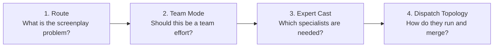

# Subagent Library Architecture

This repository has a layer of specialist subagents for screenplay work. The goal is not more agents. It is better specialization under bounded loading -- use the right number of specialists, not all of them.

## The Layer Order

The four layers must be chosen in order. Each one narrows the next.

**Why this order matters:**
- Choosing cast or topology before route means organizing before knowing what the problem is
- Choosing team mode but not cast means collaborating without knowing who is in the room
- Choosing cast but not topology means having specialists with no plan for how they work together

## Three Kinds of Subagents

### 1. Functional

These own a screenplay craft problem. They are the subject-matter specialists.

Examples: premise pressure, structure and engine, character pressure, scene execution, dialogue and subtext, brand message control, branch/state logic, visual story translation.

### 2. Process Node

These own a workflow position rather than a craft niche. They manage how work moves through the pipeline.

Examples: divergence (explore alternatives), counterexample retention (keep what the primary path rejected), rewrite triage, convergence (synthesize lanes), review, table-read synthesis.

### 3. Reference Persona

These are bounded decision lenses inspired by real creators or studios. They add craft pressure from a recognizable school of practice.

Current personas: prestige moral collision, romantic verbal precision, animation humanist visuality, high-concept clockwork, social satire thriller, luxury restraint brand film, systemic choice design.

**Important constraint:** Personas are not final authority. They inform decisions; they do not override protocol, rubric, or hard boundaries.

## Persona Governance Levels

| Level | What it means |
|---|---|
| `inspired_by` | Borrow workflow shape, craft pressure, or evaluative bias |
| `calibrated_reference` | Allow tighter pressure on decisions or expression, with explicit loading caps and blocked-use rules |
| `forbidden_roleplay` | Never dispatch as a live persona. Covers direct impersonation, quote-like continuation, or identity claims the repo should not make |

**Governing principle:** Borrow decision style. Do not pretend authorship. Do not let persona override protocol, rubric, or hard boundary.

## Dispatch Topologies

These define how specialists work together, share state, and merge their outputs:

| Topology | Best for |
|---|---|
| `orchestrator_specialist_ring` | One central agent delegates to specialists, collects results, synthesizes |
| `writers_room_tree` | A showrunner delegates to lane leads, who delegate further, with upward synthesis |
| `debate_then_merge_board` | Multiple agents argue positions, then a merge agent synthesizes |
| `dual_track_story_visual` | Story and visual tracks run in parallel with periodic cross-sync |
| `variant_strike_grid` | Many variants are generated in parallel, then filtered and merged |
| `branch_state_triangle` | Narrative, state logic, and QA run as three distinct lanes under a narrative director |
| `fresh_task_review_loop` | One implementer, one spec reviewer, one quality reviewer, one convergence owner |

`fresh_task_review_loop` is the direct integration point with subagent-driven development. Use it when "solving the wrong problem beautifully" is a real risk.

## What a Good Run Looks Like

For a hard screenplay task, you should be able to answer:
- Which mode this resembles
- Which cast is minimally necessary
- Which persona lenses are worth loading
- Which topology should run
- Who merges the outputs
- What packet flows between lanes
- Where a human should intervene
- How the system shrinks again when complexity stops paying off

## Scaling Rule

The library grows by composition, not by one-off additions:
- Keep the top-level router stable
- Attach new archetypes under the cast layer
- Attach new scheduling shapes under the topology layer
- Reserve new outputs for genuinely new contracts, not new vibes

## Key Files

- Cast definitions: [references/expert-subagent-library.json](../references/expert-subagent-library.json)
- Topology matrix: [references/subagent-topology-matrix.json](../references/subagent-topology-matrix.json)
- Team modes: [references/team-mode-matrix.json](../references/team-mode-matrix.json)
- Agent roles: [references/agent-team-roles.json](../references/agent-team-roles.json)
- Workflow: [wp.expert-subagent-cast](../knowledge/20-workflows/wp-expert-subagent-cast.md)
- Workflow: [wp.subagent-dispatch-plan](../knowledge/20-workflows/wp-subagent-dispatch-plan.md)
