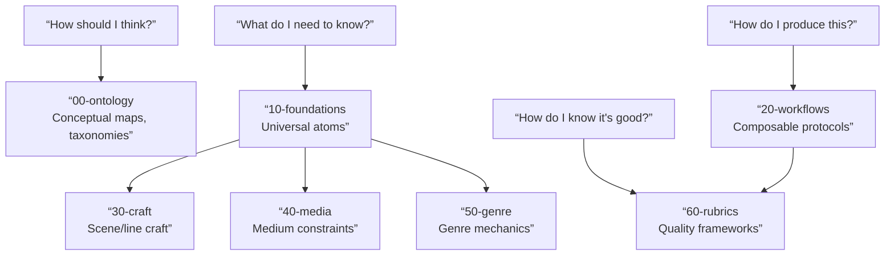

# Ontology Overview

`knowledge/` is organized by function, not by chronology. Each layer answers a different question:

## The Layers

| Layer | Question It Answers | Examples |
|-------|-------------------|----------|
| `00-ontology` | How is this knowledge organized? | Taxonomies, epistemic stance, reality lens map |
| `10-foundations` | What universal principles apply? | Character drive, conflict pressure, scene function, audience need states |
| `20-workflows` | How do I produce a specific output? | Scene writing protocol, beat outline protocol, rewrite diagnosis |
| `30-craft` | How do I write better at the line level? | Dialogue subtext, exposition control, opening job selection |
| `40-media` | How does the medium change the rules? | Feature film vs shortform vs branching interactive |
| `50-genre` | How does genre shape the work? | Comedy loop, thriller pressure, horror reveal structures |
| `60-rubrics` | How do I know if the output is good? | Scene draft rubric, screenplay draft rubric, dialogue polish rubric |

## Two Kinds of Knowledge

This repository contains two distinct categories. They live in the same directory structure but serve different purposes:

**Screenplay Craft** — Knowledge that directly helps produce or evaluate script content. This is what an Agent loads when asked to write, rewrite, or review a screenplay. Character arcs, scene function, dialogue subtext, exposition control, medium constraints, genre mechanics.

**Agent Orchestration** — Knowledge about how to organize the work itself. Context loading budgets, subagent dispatch topologies, team workflow blueprints, handoff packet formats, session execution planning. This loads when an Agent needs to coordinate multi-step or multi-agent work.

A craft workflow (like `wp.scene-writing`) should never pull in orchestration atoms. The manifests enforce this: craft skills link only to craft atoms, orchestration skills link to orchestration atoms. The two categories are designed to stay separate at load time.

从中文使用者角度看，这一层最重要的价值不是”分类整齐”，而是降低后续扩写时的混乱成本。剧本知识一旦不分层，很快就会出现三种常见问题：同一概念在不同文件里反复改写、流程协议和理论正文互相污染、以及新加内容不知道该挂在哪个层级。这个 ontology 的作用，就是先把”概念层””流程层””评分层”分开，再允许每一层持续生长。

对于”如何创作剧本”这种宽问题，当前仓库使用 `references/background-bundles.json` 来承载研究综述和来源地图，而不急着把所有研究都压成新的 core asset type。先把稳定、可验证、可局部加载的部分沉淀成 atom、protocol 或 rubric，其余的留在背景包中等待成熟。

## TODOs：待回答问题

- [ ] 现有 ontology 是否还缺少一个专门容纳“反模式 / 误诊 / 反例”的层级，而不只是把它们散落在各个 atom 中？
- [ ] 对于同时兼具 narrative、commercial、interactive 属性的混合项目，当前分层是否足够表达，还是需要中间层？
- [ ] 哪些内容现在名义上属于 `knowledge/`，实际上更应该提升为 `references/` 里的稳定规则文档？
- [ ] 当前 ontology 是否缺少“研究证据层”，用于收纳行业经验、方法论出处、争议理论与适用边界？
- [ ] 当一个知识单元同时影响 taxonomy、workflow、rubric 时，应该由哪一层持有主定义，哪几层只保留引用？
- [ ] 仓库扩展到更细粒度后，如何防止出现名称不同但语义重复的知识原子？
- [ ] 中文创作者阅读友好性与 Agent 可路由性发生冲突时，ontology 规则应该优先约束哪一侧？
