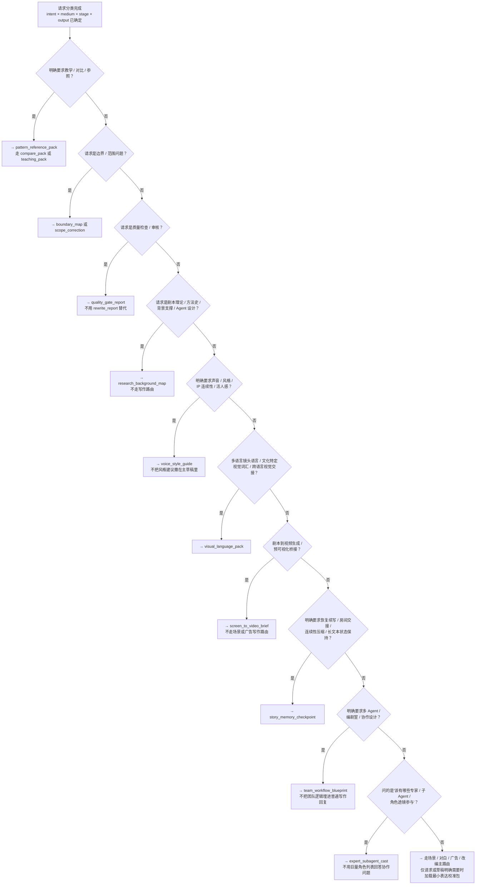

# 路由决策手册

## 这是什么文件

本文件是 Agent 的路由决策手册。它定义了在五个基本维度（`intent` / `medium` / `stage` / `output` / `constraints`）确定之后，如何选择具体的协议（protocol）、加载模式（loading mode）和附属包（adjunct bundle）。

**什么时候加载**：在 SKILL.md 完成维度分类之后、开始生成之前。当一条路由已经锁定，但你需要验证选择是否正确、处理边界情况、或在多条候选路由之间做取舍时，加载本文件。

## 路由锚定公式

```
intent x medium x stage x output → 锁定主路由
constraints → 细化解释、打破平局、控制附属包加载
```

`constraints` 的三重作用：

1. **解释**：说明为什么这条路由适合当前请求。
2. **打破平局**：当两条路由信号强度接近时，由 constraints 决定胜出者。
3. **控制附属加载**：主路由确定后，由 constraints 决定哪些附属包需要额外加载。

## 协议选择决策树

按以下顺序依次判断。每条请求只选一条主协议，命中即停。



## 协议选择规则

### 通用原则

- 一个请求只选一条主协议。不要把所有请求塞进一个大 prompt。
- 每条主协议只配一个主评估标准（rubric）。
- 只加载选定协议关联的原子（atoms），除非用户明确要求教学或对比。
- 多条路由都可能成立时，选更窄的那条，不走通用路由。
- 诚实描述选择理由：constraints 如果只影响了加载范围，不要声称它们决定了整个路由。
- 锁定路由后再选加载模式。不要在加载模式确认前就扩散到相邻参考。

### 教学与对比

- 教学 / 对比 / 参照 → `pattern_reference_pack`，走 `compare_pack` 或 `teaching_pack`。不要把它用作默认写作路由。
- 被问到对比、替代方案、边界，或"为什么不是另一种写法" → 走 `compare_pack`。

### 边界与范围

- 真实问题是约束逻辑或声明收窄 → `boundary_map` 或 `scope_correction`，不要靠拓宽写作素材来应对。
- 请求暴露出范围漂移、声明过宽或焦点模糊 → `scope_correction` 比加更多素材有效。

### 质量把关

- 以下场景走 `quality_gate_report`，不要用 `rewrite_report` 替代：显式自我检查、结构化审计、预检（preflight）、验收审查（acceptance review）、阶段专项检查、定向复查（targeted recheck）、非故事类产物审查。

### 研究与背景

- 剧本理论、方法史、背景支撑、Agent 设计请求 → `research_background_map`。不要把这些请求塞进写作或产物路由。

### 声音与风格

- 明确的声音、风格、IP 连续性、活人感请求 → `voice_style_guide`。不要把风格建议默认撒在主草稿的每个角落。

### 视觉语言

- 多语言镜头语言、文化特定视觉词汇、跨语言视觉交接 → `visual_language_pack`。
- 剧本到视频生成、预可视化桥接 → `screen_to_video_brief`。不要用场景或广告写作路由替代。

### 连续性与记忆

- 中断恢复、房间交接、连续性压缩、长文本状态保持 → `story_memory_checkpoint`。
- 正常剧本输出中，当真实问题是可恢复的连续性而非理论缺失 → 用有边界的 `story_memory_checkpoint`，不要不加限制地扩展上下文。

### 团队协作

- 多 Agent、编剧室、协作设计 → `team_workflow_blueprint`。不要把团队逻辑埋进普通写作回复。
- "该有哪些专家 / 子 Agent / 角色透镜参与" → `expert_subagent_cast`。不要用巨量角色列表回答团队协作问题。

### 附属包加载门控

以下附属包只在它们确实会改变答案时才加载：

| 附属包 | 加载条件 |
|--------|----------|
| 表达校准包（expression lens） | 请求或草稿明确需要时加。不做默认加载。 |
| 视觉语言资产 | 下游视觉沟通或跨语言执行会实质改变下一步决策时。 |
| 团队协作资产 | 协作结构会实质改变下一步决策时。 |
| 专家子代理资产 | 具体角色选择或调度设计会实质改变下一步决策时。 |
| 质量把关资产 | 预检或定向审计会实质改变下一步决策时。 |

## 加载模式选择

路由选定后，按 [`docs/context-loading-policy.md`](../docs/context-loading-policy.md) 决定加载深度。

默认爬梯路径：

1. 从 `route_kernel` 开始。
2. 正常执行扩展到 `focus_pack`。
3. 仅在下一层仍能实质改变路由质量、答案质量或对比质量时继续扩展。
4. 新增素材不再改变下一步决策时立即停止。

## 降级与回退

| 缺失维度 | 处理方式 |
|----------|----------|
| `medium` 未知 | 仅当请求明确不是广告或互动叙事时，用通用叙事路由。否则先问清楚。 |
| `output` 未指定 | 按 `stage` 推断最小可用产物：`ideation → premise`、`structure → beat_sheet`、`scene → scene_draft`、`dialogue → dialogue_polish`、`rewrite → rewrite_report` |
| 路由不明确 | 只问一个问题——那个能改变路由选择的问题。不要问多个。 |
