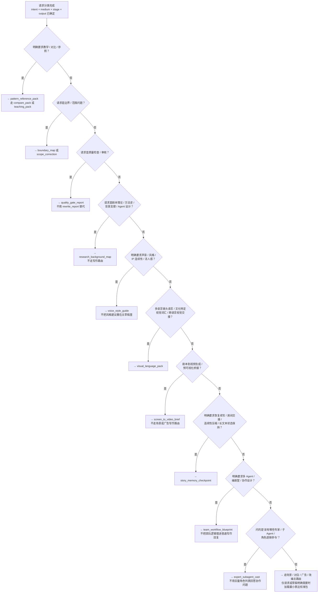

# 路由决策手册

> **语言约定：** 本手册面向中文 Agent 使用。文中反引号包裹的英文字段（如 `boundary_map`、`scope_correction`）为系统标识符，不参与中英混杂判断。

## 这是什么文件

本文件是 Agent 的路由决策手册。它定义了在五个基本维度（`intent` / `medium` / `stage` / `output` / `constraints`）确定之后，如何选择具体的协议（protocol）、加载模式（loading mode）和附属包（adjunct bundle）。

**什么时候加载**：在 SKILL.md 完成维度分类之后、开始生成之前。当一条路由已经锁定，但你需要验证选择是否正确、处理边界情况、或在多条候选路由之间做取舍时，加载本文件。

## 路由锚定公式

```
intent x medium x stage x output → 锁定主路由
constraints → 细化解释、打破平局、控制附属包加载
```

`constraints` 的三重作用：

1. **解释**：说明为什么这条路由适合当前请求。
2. **打破平局**：当两条路由信号强度接近时，由 constraints 决定胜出者。
3. **控制附属加载**：主路由确定后，由 constraints 决定哪些附属包需要额外加载。

## 协议选择决策树

按以下顺序依次判断。每条请求只选一条主协议，命中即停。



## 协议选择规则

### 通用原则

- 一个请求只选一条主协议。不要把所有请求塞进一个大 prompt。
- 每条主协议只配一个主评估标准（rubric）。
- 只加载选定协议关联的原子（atoms），除非用户明确要求教学或对比。
- 多条路由都可能成立时，选更窄的那条，不走通用路由。
- 诚实描述选择理由：constraints 如果只影响了加载范围，不要声称它们决定了整个路由。
- 锁定路由后再选加载模式。不要在加载模式确认前就扩散到相邻参考。

### 改写诊断：文本层 vs 商业因素

当用户说"剧本被拒绝了"或"帮我看为什么过不了"，需要先判断拒绝的类型，再选路由：

- **文本层拒绝**（节奏、结构、人物、对白有问题）→ `rewrite_report`，走 `rewrite-doctor` 协议
- **商业/市场拒绝**（受众错配、预算超限、平台不匹配、类型市场饱和）→ 不走 `rewrite-doctor`。先帮用户识别在什么层面被拒绝：
  1. 如果用户能提供拒绝理由，按理由选路由（受众问题 → `audience_fit_note` 或 `audience_proxy_report`，预算/平台/发行问题 → `development_brief`，范围过大 → `scope_correction`）
  2. 如果用户不知道拒绝原因 → `path_options`，列出可能的商业因素和对应的诊断路径
  3. 如果确实是文本质量问题 → 走正常的 `rewrite_report` 路由
- 不要假设"被拒绝 = 文本有问题"。先问清楚是哪一种拒绝，再决定用什么工具。

### 角色阶段产物降级规则

当请求角色相关产出物（`premise`、`synopsis`、`character-world` 族产出物）但约束中存在以下信号时，应考虑降级：

| 信号 | 降级处理 |
|------|----------|
| `draft_stage=early` 或用户表达"还在探索" | 降为 `premise`（最小可用产出），不做完整角色世界 |
| 角色数量 > 5 且未指定聚焦人物 | 只做核心 2-3 个角色，说明"其他人可以在后续展开" |
| 用户问角色但实际需求是结构 | 标记路由可能错误，建议先做 `beat_sheet` 再回头做角色 |
| `experiential_depth=minimal` | 降为角色卡（名字 + 目标 + 障碍），不做全量角色世界 |

降级不是降质量——是在合理范围内给最有用的东西。全量角色世界只有在用户明确需要且故事阶段支持时才做。

### 教学与对比

- 教学 / 对比 / 参照 → `pattern_reference_pack`，走 `compare_pack` 或 `teaching_pack`。不要把它用作默认写作路由。
- 被问到对比、替代方案、边界，或"为什么不是另一种写法" → 走 `compare_pack`。

### 边界与范围

- 真实问题是约束逻辑或声明收窄 → `boundary_map` 或 `scope_correction`，不要靠拓宽写作素材来应对。
- 请求暴露出范围漂移、声明过宽或焦点模糊 → `scope_correction` 比加更多素材有效。

**`boundary_map` vs `scope_correction` 的区别（重要）：**

这是两条容易混淆的路由，但解决的问题完全不同：

| | `boundary_map` | `scope_correction` |
|---|---|---|
| **解决的问题** | 生产约束与硬边界 | 知识声明过宽 |
| **触发条件** | 用户说预算、档期、平台限制、权限约束 | 用户说"故事太大"、"不知道怎么做小"、声明过宽 |
| **产出的东西** | 硬边界/软约束/探索区/审查区四域地图 | 收窄后的声明 + 保留的存活核心 + 下游更新影响 |
| **不解决什么** | 不解决"故事太大"的问题 | 不解决"预算 500 万能不能拍"的问题 |
| **经典场景** | "500万预算，45天周期，能拍什么" | "这个科幻故事太大了，怎么缩小" |
| **误用风险** | 把生产边界当成故事范围修正 | 把故事范围修正当成生产边界管理 |

**生产约束 → `boundary_map` / 声明收窄 → `scope_correction`**。两者并存时，先用 `boundary_map` 建框架，再用 `scope_correction` 收窄。

### 质量把关

- 以下场景走 `quality_gate_report`，不要用 `rewrite_report` 替代：显式自我检查、结构化审计、预检（preflight）、验收审查（acceptance review）、阶段专项检查、定向复查（targeted recheck）、非故事类产物审查。

### 研究与背景

- 剧本理论、方法史、背景支撑、Agent 设计请求 → `research_background_map`。不要把这些请求塞进写作或产物路由。

### 声音与风格

- 明确的声音、风格、IP 连续性、活人感请求 → `voice_style_guide`。不要把风格建议默认撒在主草稿的每个角落。

### 视觉语言

- 多语言镜头语言、文化特定视觉词汇、跨语言视觉交接 → `visual_language_pack`。
- 游戏过场动画、互动叙事的视觉语言设计也走这条路。游戏叙事和互动媒介的场景视觉沟通需求与其他媒介没有本质区别——只是「画面感」的锚定方式不同。
- 剧本到视频生成、预可视化桥接 → `screen_to_video_brief`。不要用场景或广告写作路由替代。

### 连续性与记忆

- 中断恢复、房间交接、连续性压缩、长文本状态保持 → `story_memory_checkpoint`。
- 正常剧本输出中，当真实问题是可恢复的连续性而非理论缺失 → 用有边界的 `story_memory_checkpoint`，不要不加限制地扩展上下文。

### 多角色弧线汇总

当用户要求「总结所有角色的弧线」或「对比不同人物的成长轨迹」时，没有专用的单路由。这是一个组合需求的典型案例：

1. **如果已有 checkpoint**：加载最新的 `story_memory_checkpoint`，从中提取角色状态快照，然后按 `rb.character-world` 的维度组织对比（不必走完整的 character-world 协议，只需要用它的评判框架）。
2. **如果没有 checkpoint**：先产出一个轻量 `story_memory_checkpoint`（锁住当前状态），再从中提取角色汇总。
3. **如果只需要最核心 2-3 个角色**：走 `character-world` 协议，用 `focus_characters` 约束锁住范围。不要做全量角色分析。
4. **如果需要同类型中的角色弧线对比**（例如「这两个侦探角色的弧线有什么不同」）：走 `pattern_reference_pack` → `compare_pack` 加载模式。

关键原则：多角色弧线汇总不是一个新的输出类型——它是把 `story_memory_checkpoint`（状态压缩）和 `character-world`（角色评判框架）组合使用的场景。不要因为它没有专属路由就去造一个新路由。

### 团队协作

- 多 Agent、编剧室、协作设计 → `team_workflow_blueprint`。不要把团队逻辑埋进普通写作回复。
- "该有哪些专家 / 子 Agent / 角色透镜参与" → `expert_subagent_cast`。不要用巨量角色列表回答团队协作问题。

### 附属包加载门控

以下附属包只在它们确实会改变答案时才加载：

| 附属包 | 加载条件 |
|--------|----------|
| 表达校准包（expression lens） | 请求或草稿明确需要时加。不做默认加载。 |
| 视觉语言资产 | 下游视觉沟通或跨语言执行会实质改变下一步决策时。 |
| 团队协作资产 | 协作结构会实质改变下一步决策时。 |
| 专家子代理资产 | 具体角色选择或调度设计会实质改变下一步决策时。 |
| 质量把关资产 | 预检或定向审计会实质改变下一步决策时。 |

## 加载模式选择

路由选定后，按 [`docs/context-loading-policy.md`](../docs/context-loading-policy.md) 决定加载深度。

默认爬梯路径：

1. 从 `route_kernel` 开始。
2. 正常执行扩展到 `focus_pack`。
3. 仅在下一层仍能实质改变路由质量、答案质量或对比质量时继续扩展。
4. 新增素材不再改变下一步决策时立即停止。

## 降级与回退

| 缺失维度 | 处理方式 |
|----------|----------|
| `medium` 未知 | 仅当请求明确不是广告或互动叙事时，用通用叙事路由。否则先问清楚。 |
| `output` 未指定 | 按 `stage` 推断最小可用产物：`ideation → premise`、`structure → beat_sheet`、`scene → scene_draft`、`dialogue → dialogue_polish`、`rewrite → rewrite_report` |
| 路由不明确 | 只问一个问题——那个能改变路由选择的问题。不要问多个。 |
| 所有维度未知 | 不要同时猜测四个未知维度。先问媒介（电影/剧集/短视频），这一个答案能缩小所有其他维度。如果用户也回答不了，提供 `learning_path` 或 `research_background_map` 作为温和入口。 |
| 输入极简或空 | 检查上一轮对话中是否已有可复用的路由。如果没有，不要产出任何产物——说"我需要多一点信息才能开始"。 |

## 约束可行性门控

在路由时，不仅解释约束，也要检查约束是否会导致不可执行的请求。

### 检测矛盾约束

当请求中存在内在矛盾时，先标记再路由，不要默默消解矛盾：

- **规模矛盾**："短片 + 游戏版" → 短片规模和互动游戏的复杂度需要完全不同的故事结构。拉出 `path_options`，让用户选一个方向。
- **体裁矛盾**："写实主义 + 歌舞片" → 两种体裁对场景密度和因果逻辑的要求不同。问清楚优先级。
- **资源矛盾**："无限预算的 30 秒广告" → 无限预算通常指向长片或品牌微电影。确认真正的媒介是什么。

### 标记不可能约束

当约束在操作层面不可行时，诚实告知并给出实用路径：

- **时间不可行**："三天写完 120 页剧本" → 提议先出节拍表（`beat_sheet`）和前 10 页，足够判断方向。
- **长度不可行**："500 字以内的互动分支地图，含 20 个选择点" → 建议缩减选择点数，或升级为大纲（`outline`）格式。

约束标记不是拒绝用户——是帮用户在合理范围内得到最有用的产出物。

### 常见需求错位拦截

有时候用户要求的产出物不是他们真正需要的东西。以下高频模式应在**路由前**拦截，问一个重定向问题，让用户选择。

| 用户的请求 | 信号 | 真正可能的问题 | 重定向问题 |
|-----------|------|--------------|-----------|
| 打磨对白 (`dialogue_polish`) | 用户没说这场戏的核心冲突是什么，或没有已写好的场景 | 对白问题往往来自冲突结构问题——无冲突的场景，对白怎么改都像说明书 | "在打磨对白之前——这场戏的核心冲突是什么？如果冲突还没立住，先做场景结构的诊断会更有效。" |
| 做节拍表 (`beat_sheet`) | 用户没有 premise，或没说主角的核心欲望 | 从零直接跳结构，节拍容易变成"事情列表"而非"因果链条" | "节拍表需要一个明确的故事引擎来驱动。要不要先把核心前提钉死——主角想要什么，什么阻挡他？" |
| 做质量审查 (`quality_gate_report`) | 用户没有已写好的草稿或段落 | 质量门控需要对照合约检查文本——没有文本就无从检查 | "质量审查需要你已经有写好的内容。先给我一段你已经写好的场景、大纲或剧本，我才能检查。" |
| "帮我写个剧本" | 零约束信号，无媒介、无类型、无素材 | 用户不知道这个工具能做什么，或者不知道从哪里开始 | "先跟我聊聊你的故事——主角是谁？他/她想要什么？我们从一个前提开始，一步步搭。" |
| 做前提 (`premise`) | 用户当前对话中已有完整 beat sheet 或 outline，现在才回头要前提 | 可能在走回头路——前提通常写在前面，已经有了大纲再写前提，可能需要不同的收敛方式 | "你已经有大纲了。是觉得现在的核心概念还不够清晰，需要重新收敛？还是想在大纲基础上补充一个简短的 pitch 版本？" |

**拦截规则：**
- 拦截是**提问**，不是**拒绝**。永远让用户决定走哪条路。
- 如果用户坚持原请求 → 走原路由。如果用户接受重定向 → 走新路由。
- 拦截不改变路由矩阵。它只是在进入路由前的对话中多问一句。
- 低调处理：大多数请求不需要拦截。只在上述 5 个模式触发时才介入。

### 多轮路由恢复

在跨轮次对话中，路由决策不是每次从零开始。以下是多轮路由恢复的正式规则：

#### 路由保留规则

| 条件 | 行为 |
|------|------|
| 用户引用之前的产出物（"改一下"、"继续"、"这个东西"） | 锁定上一个路由的 skill_id / protocol_id / rubric_id，不重新分类 |
| 用户提供新输入但未改变媒介/阶段/意图 | 保留路由，仅作为新约束增量处理 |
| 用户说"帮我看一下"、"检查一下" | 从草稿路由升级到诊断路由（intent: draft → diagnose），协议可能切换 |
| 用户说"也给我做 X" | 新增并行路由，不替换当前路由 |

#### 约束 Delta 检测

每次新轮次的约束变化只触发增量加载，不触发全量重载：

1. **检测变化**：对比当前轮次的约束键集与前一轮次的约束键集
2. **Delta = {added_keys, removed_keys, changed_values}**
3. **Added keys** → 加载新约束关联的原子（如新增 `tone: comedy` → 加载 ka.tone-writing-moves）
4. **Removed keys** → 卸载旧约束关联的原子，记录在过渡日志中
5. **Changed values** → 视为 removed + added，先卸载旧值关联原子，再加载新值关联原子

#### 升级 vs 替换

媒介变更是路由升级，意图变更是路由替换：

- **媒介变更（Upgrade）**：`new_medium != old_medium` → 新协议 + 新媒体原子，保留角色/世界状态。产出物按新媒体约束重新生成。
- **意图变更（Replace）**：`new_intent != old_intent` → 新协议 + 新评估标准 + 全量重载。不保留任何未锁定的原子。

**意图变更的特殊情况：diagnose → draft（基于诊断产出物写入）**：当用户说"根据诊断结果，重写这场戏"或在诊断后立即发出写入请求时，意图变更规则有一个例外——诊断产出物中的关键发现（failure pattern、root cause、prioritized action list）应作为锁定约束继承到新的草稿路由中。正常意图变更规则卸载所有非锁定原子是正确的——但诊断发现 IS 锁定上下文，因为用户明确说"根据诊断结果"。Agent 应在路由替换前从诊断输出中提取这些锁定约束，并将它们作为新路由的隐式 `creative_problem` 或 `lens_focus` 约束注入。不这样做会在用户刚收到诊断报告后制造信息断层。
- **Both 变更**：先执行意图变更（替换），再在新路由上执行媒介变更（升级）。

## 路由后链路（E2E Handoff）

当用户需要多步产出物（例如 念头 → 前提 → 人物 → 节拍表 → 场景草稿）时：

1. **每步锁定独立路由**。不要把所有步塞进一个大 prompt。
2. **显式传递前步产物**。在进入新协议前，加载上一步的产出物作为输入上下文。
3. **在关键边界插入 story_memory_checkpoint**。以下情况建议插入检查点：
   - 从 premise 跨到 structure（故事引擎可能变化）
   - 从 character 跨到 scene（人物连续性需要锁定）
   - 暂停后恢复（恢复上下文可能已过期）
4. **非叙事来源的前处理**。当来源是小说、诗歌、新闻等非剧本形式时，先提取戏剧性前提（dramatic premise），再走改编路由。不要直接把诗歌当剧本输入。

   **提取步骤**（不是改编，是前提发现）：
   - 来源为小说/散文/新闻时：必须先提取戏剧性前提（protagonist + goal + obstacle + stakes），再进入改编路由。这不是改编——是从非结构化叙事中寻找戏剧引擎。
   - 来源为诗歌时：识别情感节奏和意象作为潜在的戏剧锚点。不要强行套用"主角-目标-障碍"公式；先让诗歌的情感运动和画面感引导前提发现。
   - 来源为新闻时：识别事实背后的人类冲突。新闻的表面是事件，但驱动事件的是人的欲望、恐惧和制度矛盾。把后者提取为前提，而非直接改编新闻标题。
   - 无法提取前提时（如抽象诗歌、纯概念散文）：诚实标记"未能提取到可用的戏剧性前提"，不要伪造一个虚假的戏剧性前提来填空。提供 `path_options` 告知用户接下来可以怎么走（例如：是否愿意换一个切入点、是否愿意提供一个更具体的角色或情境来启动）。

5. **上步产物传递**。在 E2E 链中加载新协议时，必须包含"上步产物摘要"。Agent 应在开始新步骤前简要回顾前一步产出了什么，再进入新协议。

   **示例**："Based on the premise we just developed（protagonist: retired firefighter, goal: reclaim his reputation, obstacle: official cover-up, stakes: his daughter's custody hearing in 30 days），let me now design the character world..."

   **中文示例**："基于我们刚确立的前提（主角：退休消防员；目标：恢复名誉；障碍：官方掩盖；风险：女儿三十天后的抚养权听证会），现在来设计人物世界……"

   **传递要求**：
   - 摘要只需列出关键锁定项（protagonist、goal、obstacle、stakes、genre promise、已锁的风格或媒介约束），不需要全文搬运。
   - 如果前一步有未解决的开放问题，一并列出，让新步骤知道继承的风险。
   - 不要在摘要中重新分析或质疑已锁定的决策——除非新协议的输出不可避免地与上步锁定项冲突。

## 范围方向

范围修正（`scope_correction`）默认是收窄工具——当声明过大时收窄。但不能把需要扩展的请求也往里塞：

- **需要收窄** → `scope_correction`：故事太大、声明过宽、焦点模糊
- **需要扩展** → 直接走下一步写作路由（例如从 premise 到 beat sheet），不要用 `scope_correction` 替代
- **不确定该收窄还是扩展** → 先出 `path_options`，列出两条路让用户选
